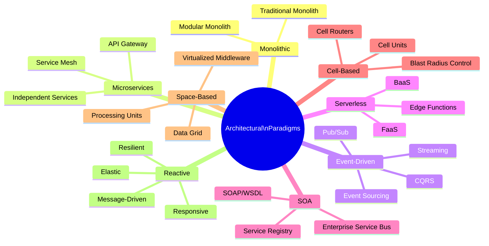
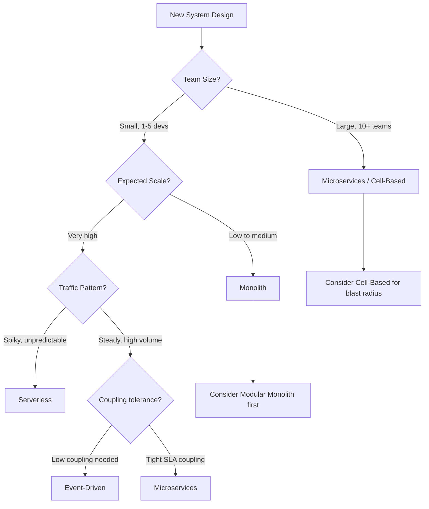

# Architectural Paradigms

An architectural paradigm is the fundamental organizing structure of a software system — it defines how components are decomposed, how they communicate, and how the system evolves. Choosing the right paradigm is one of the most consequential and costly-to-reverse decisions in system design.

## Overview

## Paradigm Selection Guide

## Topics in This Section

| File | Topic | Key Concepts |
|------|-------|--------------|
| [01_monolithic_architecture.md](01_monolithic_architecture.md) | Monolithic | Modular monolith, strangler fig, vertical slicing |
| [02_microservices_architecture.md](02_microservices_architecture.md) | Microservices | Service boundaries, API gateway, service mesh |
| [03_event_driven_architecture.md](03_event_driven_architecture.md) | Event-Driven | CQRS, event sourcing, pub/sub, choreography |
| [04_serverless_architecture.md](04_serverless_architecture.md) | Serverless | FaaS, cold starts, event triggers, cost model |
| [05_soa.md](05_soa.md) | SOA | ESB, service contracts, governance |
| [06_cell_based_architecture.md](06_cell_based_architecture.md) | Cell-Based | Blast radius, cell routers, isolation |
| [07_space_based_architecture.md](07_space_based_architecture.md) | Space-Based | In-memory grid, processing units, elastic scale |
| [08_reactive_architecture.md](08_reactive_architecture.md) | Reactive | Reactive manifesto, backpressure, actor model |
