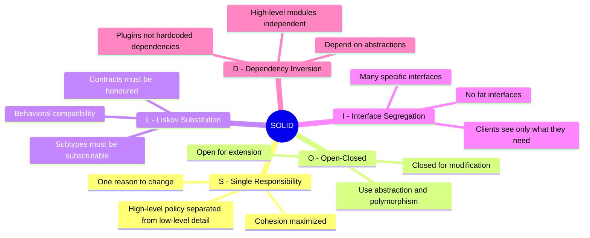
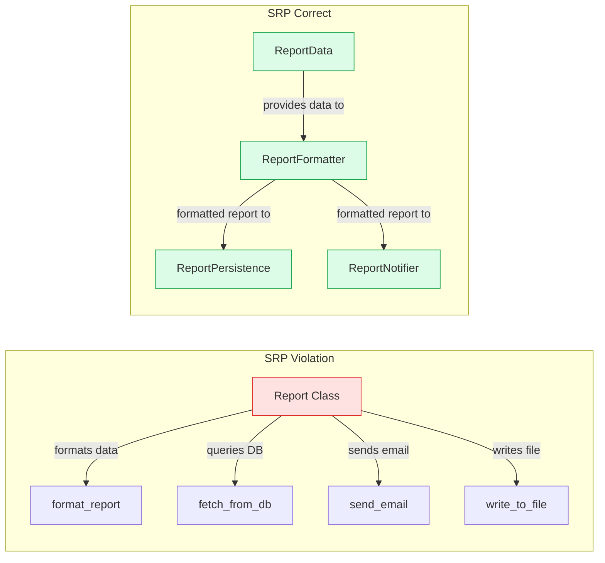
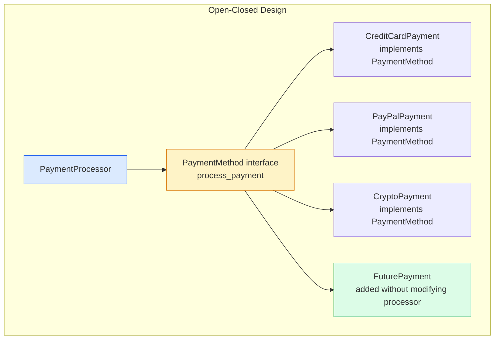

# SOLID Principles

SOLID is an acronym for five object-oriented design principles introduced by Robert C. Martin that, when applied together, produce code that is easy to maintain, extend, and test. Each principle addresses a specific dimension of coupling and cohesion in software design.

## The Five Principles



## Single Responsibility Principle (SRP)



## Open-Closed Principle (OCP)



## Dependency Inversion Principle (DIP)

```mermaid
graph TD
    subgraph Violation[DIP Violation - Tight Coupling]
        OrderSvcV[OrderService]
        MySQLV[MySQLUserRepository\nconcrete class]
        OrderSvcV -->|directly depends on| MySQLV
        style OrderSvcV fill:#fee2e2,stroke:#dc2626
        style MySQLV fill:#fee2e2,stroke:#dc2626
    end

    subgraph Correct[DIP Correct - Depend on Abstraction]
        OrderSvcC[OrderService]
        RepoInterface[UserRepository\nabstract interface]
        MySQLImpl[MySQLUserRepository]
        DynamoImpl[DynamoDBUserRepository]
        MockImpl[MockUserRepository\nfor testing]

        OrderSvcC -->|depends on| RepoInterface
        RepoInterface <|--|MySQLImpl
        RepoInterface <|--|DynamoImpl
        RepoInterface <|--|MockImpl

        style OrderSvcC fill:#dcfce7,stroke:#16a34a
        style RepoInterface fill:#fef3c7,stroke:#d97706
    end
```

## Key Concepts

- **Single Responsibility Principle (SRP)**: A class should have only one reason to change. "Reason to change" maps to a specific stakeholder or actor whose requirements would necessitate a modification. Separating concerns by actor ensures changes to one concern don't introduce bugs in another.

- **Open-Closed Principle (OCP)**: Software entities should be open for extension (new behaviour can be added) but closed for modification (existing code should not change). Achieved through abstractions — high-level policies depend on interfaces, not concrete implementations. Adding a new payment type should not require modifying the PaymentProcessor.

- **Liskov Substitution Principle (LSP)**: Objects of a subclass must be usable wherever objects of the parent class are expected, without the caller needing to know the difference. Violations occur when a subclass weakens preconditions, strengthens postconditions, or throws exceptions the parent doesn't. The classic violation: Square extending Rectangle is wrong if Square overrides setWidth to also change height.

- **Interface Segregation Principle (ISP)**: Clients should not be forced to depend on interfaces they don't use. A "fat" interface (one with many methods) forces implementors to provide stub implementations for irrelevant methods. Prefer many small, focused interfaces over one large one.

- **Dependency Inversion Principle (DIP)**: High-level modules should not depend on low-level modules — both should depend on abstractions. Abstractions should not depend on details; details should depend on abstractions. This enables swapping implementations (databases, external services) without modifying business logic, and is the foundation of testability.

## Trade-offs

| Principle | Benefit | Cost |
|-----------|---------|------|
| SRP | High cohesion, focused changes | More classes, more files to navigate |
| OCP | Safe extension without regression | Requires upfront abstraction design |
| LSP | Correct polymorphism | Constrains subclass design freedom |
| ISP | Minimal coupling | More interfaces to manage |
| DIP | Testability, swappability | Indirection complexity, DI framework overhead |

## When to Apply

- Apply SOLID aggressively in long-lived production code that multiple engineers maintain
- Relax SOLID for scripts, prototypes, and throwaway code where change frequency is low
- DIP is the most universally valuable — it is the foundation of unit testing
- OCP and ISP become critical when you have many implementors of an abstraction (plugins, strategies)
- SRP is hardest to apply correctly — the right "reason to change" depends on understanding the domain actors
