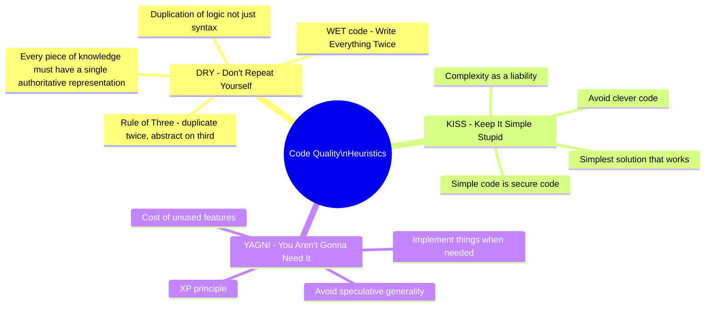
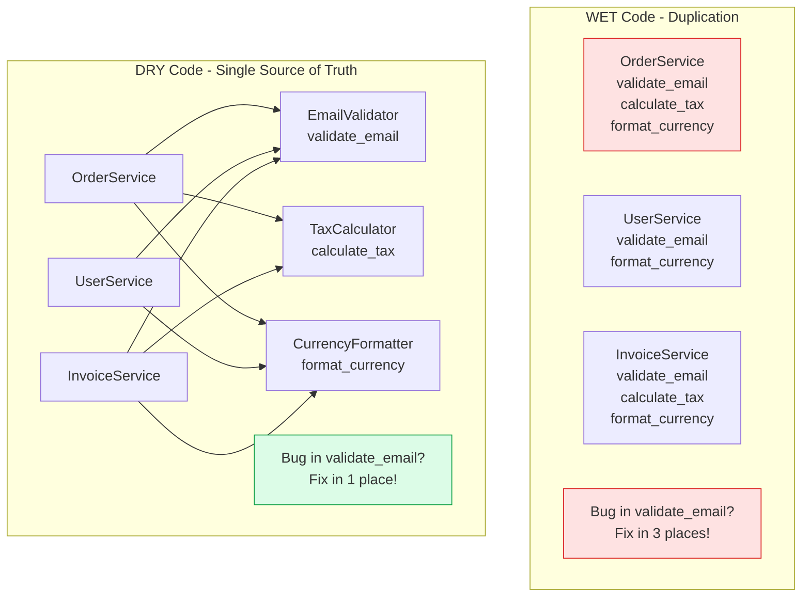
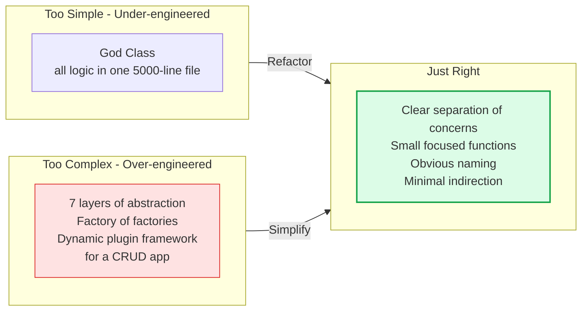
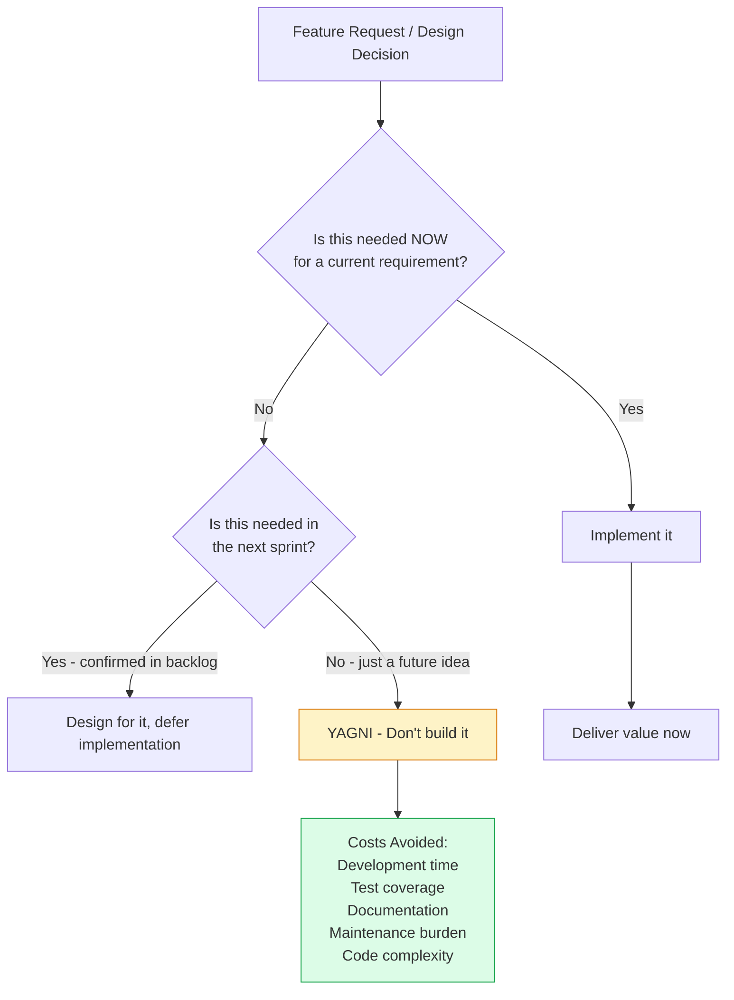

DRY, KISS, and YAGNI are three complementary code quality heuristics that guide engineers toward simpler, more maintainable code. Each addresses a common failure mode in software development: unnecessary duplication (DRY), accidental complexity (KISS), and premature scope expansion (YAGNI).

## The Three Heuristics

## DRY - The Duplication Problem

## KISS - Complexity Spectrum

## YAGNI - The Speculative Feature Problem

## Key Concepts

- **DRY (Don't Repeat Yourself)**: Every piece of knowledge must have a single, unambiguous, authoritative representation in the system. DRY applies to logic, not just syntax — two pieces of code that happen to look alike but represent different business concepts are NOT a DRY violation. The "Rule of Three" is a practical guide: duplicate once (accepting the copy), abstract on the third occurrence.

- **WET Code**: The opposite of DRY — "Write Everything Twice" or "We Enjoy Typing". WET code scatters business rules across many locations, making bugs harder to fix (you must find and update all copies) and rules harder to understand (no single authoritative source).

- **KISS (Keep It Simple, Stupid)**: Prefer the simplest solution that correctly solves the problem. Complexity is a liability — every layer of abstraction, every design pattern, every configuration option has a cognitive cost for future maintainers. Simple code is also more secure (fewer edge cases, less attack surface) and more testable.

- **Accidental vs Essential Complexity**: Essential complexity is inherent to the problem domain (unavoidable). Accidental complexity is introduced by the solution — over-engineering, premature optimization, unnecessary abstraction. KISS is primarily about eliminating accidental complexity.

- **YAGNI (You Aren't Gonna Need It)**: Don't implement functionality until it is actually needed. Speculative generality — building extensibility points "just in case" — adds code that must be maintained, tested, and documented while delivering no current value. The cost of adding a feature when needed is almost always lower than the cost of maintaining a feature that's never used.

- **The Duplication vs Coupling Trade-off**: Sometimes the choice is between duplication (WET) and tight coupling (pulling two unrelated things into a shared abstraction). Prefer duplication when the two pieces of code evolve independently and only happen to look similar today.

## Trade-offs

| Principle | Over-application Risk | Under-application Risk |
|-----------|----------------------|------------------------|
| DRY | Wrong abstractions couple unrelated concepts | Bug-fixing requires updating many places |
| KISS | Under-engineered, non-scalable solutions | Unmaintainable complexity, clever hacks |
| YAGNI | Missing extensibility causes expensive refactors | Dead code, unnecessary maintenance burden |

## When to Apply

- **DRY**: Apply when the same business rule or calculation appears in more than two places. Do not apply mechanically to any code that happens to look similar.
- **KISS**: Apply always — question every layer of indirection and ask "what does this complexity buy us?"
- **YAGNI**: Apply during feature planning and code review — regularly delete unused code paths and configuration options that were added speculatively.
- The three principles are most powerful together: KISS prevents over-engineering, YAGNI prevents premature features, and DRY prevents knowledge fragmentation.