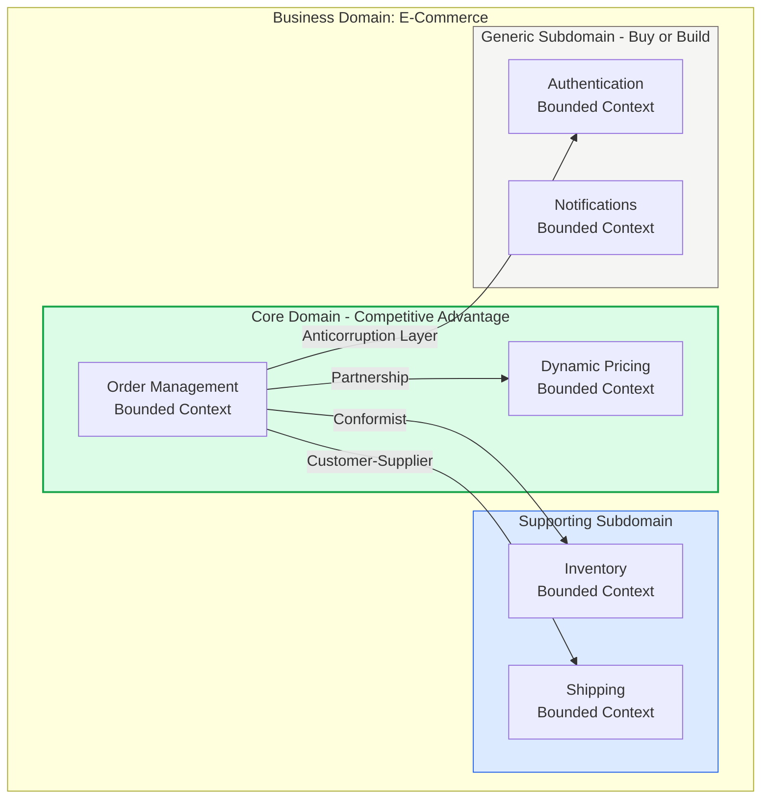
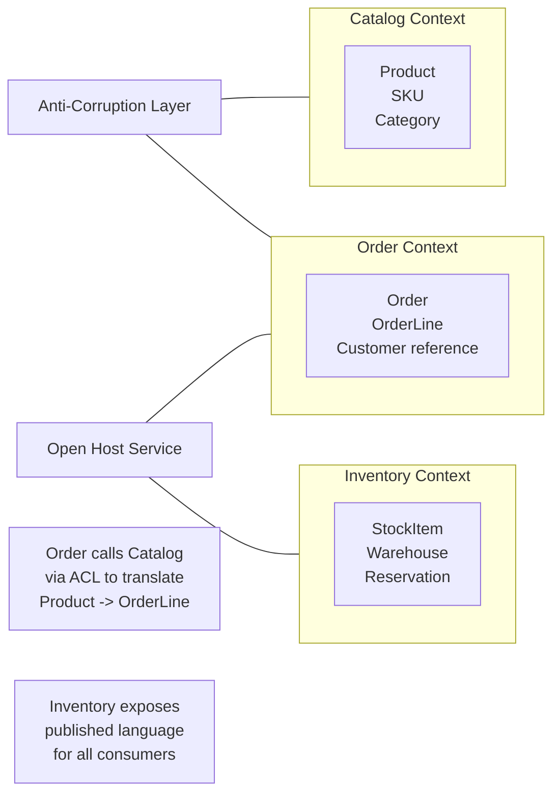
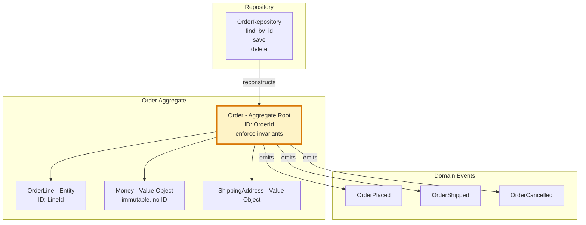
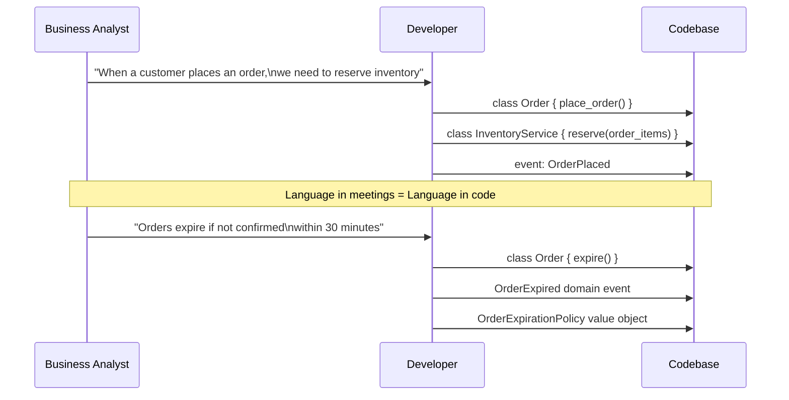

Domain-Driven Design is an approach to software development that places the business domain model at the center of the design process. DDD provides a set of strategic and tactical patterns that help align software structure with business concepts, enabling complex domains to be modeled accurately and evolved safely.

## Strategic DDD

## Bounded Context Map

## Tactical DDD Building Blocks

## Ubiquitous Language in Practice

## Key Concepts

- **Ubiquitous Language**: A shared vocabulary developed between domain experts and developers that is used consistently in conversations, documentation, and code. Method names, class names, and event names should use the same words a domain expert would use. Prevents the translation tax between business intent and implementation.

- **Bounded Context**: An explicit boundary within which a particular domain model applies and has a consistent meaning. The word "Order" in the Order Context and the Shipping Context may refer to completely different objects with different attributes and behaviours. Bounded contexts make this explicit rather than forcing a single unified model.

- **Context Map**: A diagram showing all bounded contexts in a system and the relationships between them. Relationship types include: Partnership (two teams coordinate), Customer-Supplier (upstream/downstream dependency), Conformist (downstream adopts upstream's model), Anti-Corruption Layer (downstream translates), Open Host Service (published language for many consumers), and Published Language (shared schema/API specification).

- **Aggregate**: A cluster of domain objects treated as a single unit of consistency. The Aggregate Root is the only object that external code can reference directly — access to internal entities goes through the root. The aggregate enforces all invariants for the objects within its boundary.

- **Entity**: An object with a distinct identity that persists over time. Two entities with the same attribute values are not the same entity — they have different identities. Example: two Customer objects with the same name are different customers.

- **Value Object**: An object defined entirely by its attributes with no conceptual identity. Two value objects with the same attributes are interchangeable. Value objects are immutable. Example: Money(100, USD) is equivalent to any other Money(100, USD).

- **Domain Event**: An immutable record of something significant that happened in the domain, named in past tense. Events are the mechanism through which aggregates communicate side effects to the rest of the system without tight coupling.

- **Repository**: An abstraction over the persistence mechanism that provides collection-like semantics for aggregates. The domain layer depends on the repository interface; the infrastructure layer provides the implementation.

- **Domain Service**: Business logic that doesn't naturally belong to a single entity or value object. A TransferService that moves money between two Accounts is a domain service — the logic belongs to neither Account alone.

## Trade-offs

| Aspect | DDD | Simpler Approach |
|--------|-----|-----------------|
| Model accuracy | High — matches domain reality | Lower — often DB-driven |
| Learning curve | Steep | Low |
| Team alignment | Excellent (ubiquitous language) | Varies |
| Upfront design cost | High | Low |
| Maintenance cost | Lower long-term | Higher as complexity grows |
| Suitable domain | Complex, core business logic | Simple CRUD, generic subdomains |

## When to Use

**Apply DDD when:**
- The domain is complex with intricate business rules and invariants
- The system is expected to evolve significantly over time
- Multiple teams need to work on different parts of the domain independently
- Domain experts are accessible and engaged in the design process

**Avoid full DDD for:**
- Generic subdomains (auth, notifications, storage) — buy or use off-the-shelf
- Simple CRUD applications with minimal business logic
- Short-lived prototypes or throwaway systems
- Teams without domain expert access — DDD without domain knowledge produces inaccurate models