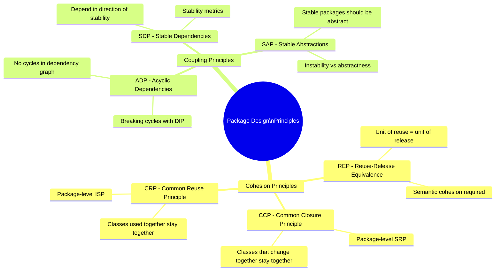
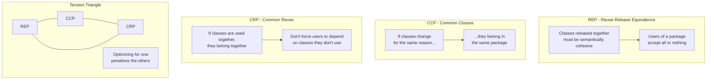
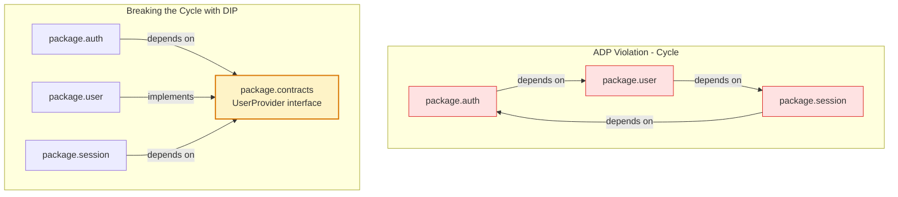
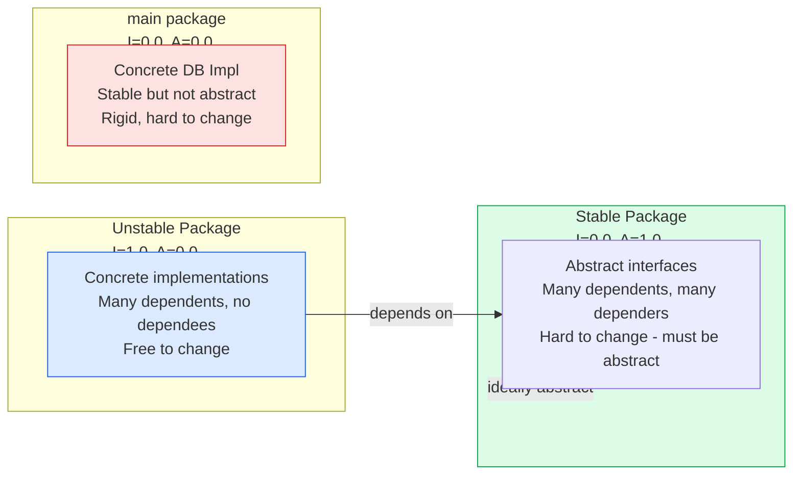

Package and module design principles, formalized by Robert C. Martin, govern how to group classes and components into cohesive, stable, and reusable packages. Poor package structure causes ripple-effect changes, makes testing difficult, and prevents independent deployment of components.

## The Six Principles

## Cohesion: REP, CCP, CRP

## Acyclic Dependencies Principle (ADP)

## Stability Metrics and SAP

## Key Concepts

- **REP (Reuse-Release Equivalence Principle)**: The granule of reuse is the granule of release. A package must be released as a versioned unit — everything in it is released together. This forces semantic cohesion: classes that don't belong together by meaning shouldn't share a package just for convenience.

- **CCP (Common Closure Principle)**: Classes that change for the same reasons should be in the same package. This is the package-level equivalent of SRP. When a requirement changes, ideally only one package needs to change — reducing the number of packages that need to be re-released, re-tested, and re-deployed.

- **CRP (Common Reuse Principle)**: Don't force users of a package to depend on things they don't need. When you depend on a package, you depend on all of it — so put only classes that are always used together into the same package. This is the package-level ISP.

- **ADP (Acyclic Dependencies Principle)**: The dependency graph of packages must have no cycles. Cycles prevent independent builds and releases — to build package A you need B which needs C which needs A. Break cycles using DIP (extract an interface package that both sides depend on) or by merging the cyclic packages.

- **SDP (Stable Dependencies Principle)**: A package should only depend on packages that are more stable than itself. Stability is measured as I = Fan-out / (Fan-in + Fan-out) where I=0 means maximally stable (many things depend on it, it depends on nothing) and I=1 means maximally unstable. Depending on something more changeable than yourself makes your package fragile.

- **SAP (Stable Abstractions Principle)**: A package's abstractness should be proportional to its stability. Stable packages (many dependents) should be abstract (interfaces, abstract classes) so that they can be extended without modification. Concrete stable packages (the Zone of Pain) are rigid and hard to change without breaking everything.

## Trade-offs

| Principle | Benefit | Cost of Violation |
|-----------|---------|-------------------|
| REP | Clear release units | Semantic incoherence, confusing APIs |
| CCP | Fewer packages to change per requirement | Large packages with mixed concerns |
| CRP | Minimal transitive dependencies | Many small, hard-to-discover packages |
| ADP | Independent builds and deployments | Circular compile-time dependencies |
| SDP | Stable dependency hierarchy | Fragile packages depending on unstable ones |
| SAP | Stable packages can be extended | Concrete stable packages cannot evolve |

## When to Apply

- Apply package design principles when a codebase grows beyond a single team or has multiple independently deployable components
- ADP is non-negotiable for large codebases — cycles must be detected and broken by CI
- Use SDP and SAP to guide where interfaces and abstractions should live versus concrete implementations
- The tension between REP, CCP, and CRP shifts over a project's lifetime — early projects optimise for CCP (change together), mature projects shift toward REP (independent release) and CRP (minimal dependencies)