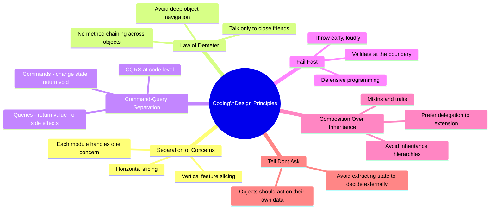
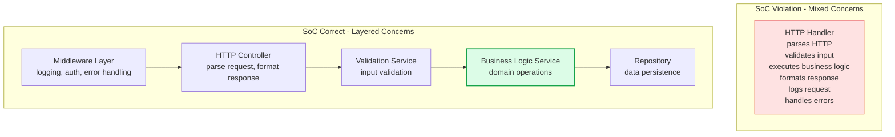
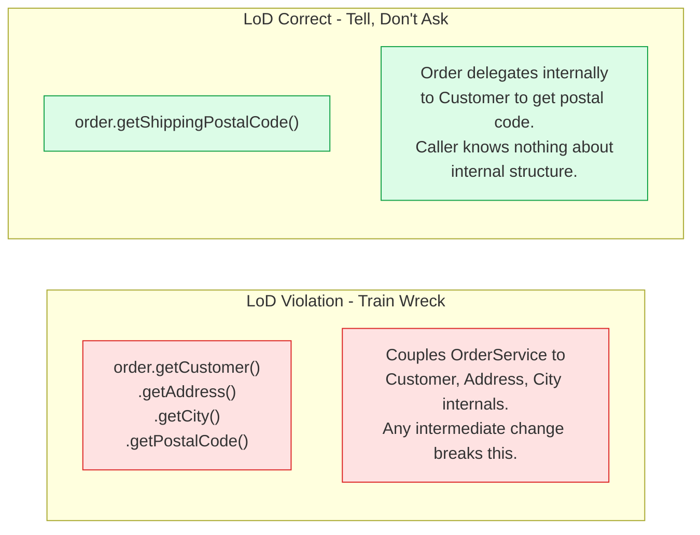
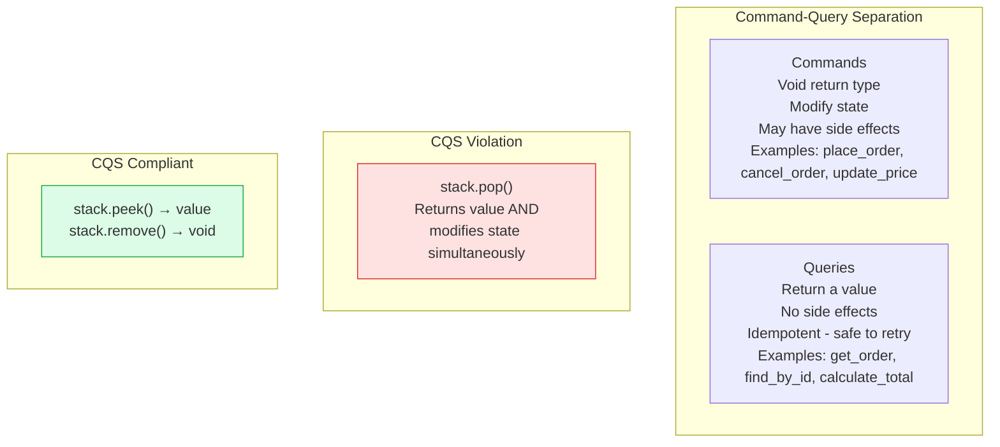
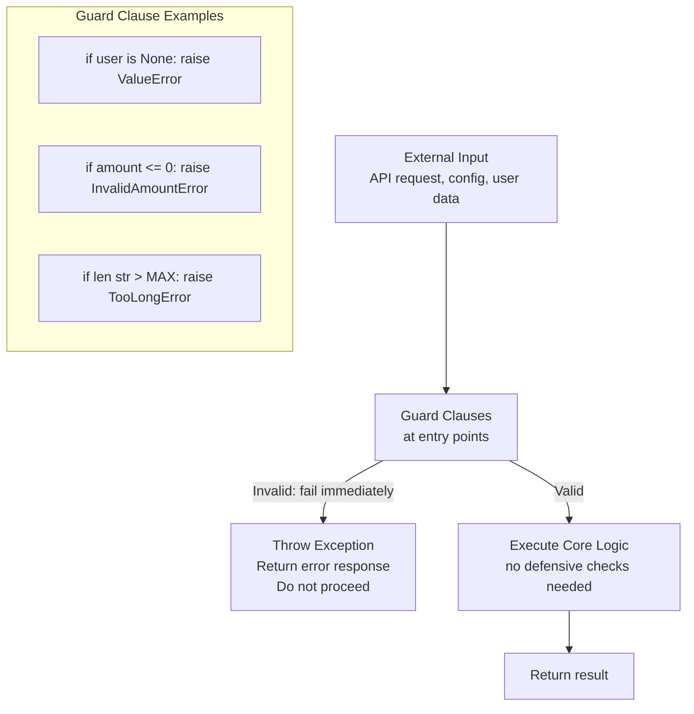
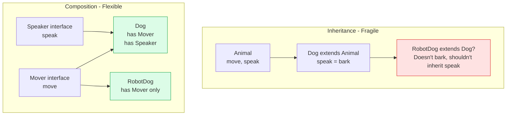

# Coding Design Principles

Beyond SOLID and package design, a set of lower-level coding principles guides the design of individual functions, classes, and interactions. These principles — Separation of Concerns, Law of Demeter, Command-Query Separation, Fail Fast, and Composition over Inheritance — are the everyday vocabulary of clean code.

## Overview

## Separation of Concerns (SoC)

## Law of Demeter

## Command-Query Separation (CQS)

## Fail Fast Pattern

## Composition Over Inheritance

## Key Concepts

- **Separation of Concerns (SoC)**: Each module, class, or function should address a single concern — a distinct dimension of a problem. Concerns can be horizontal (layers: UI, business logic, data) or vertical (features: ordering, billing, shipping). Mixing concerns (business logic in the HTTP handler, SQL in the domain object) creates tight coupling and makes each concern harder to change, test, or replace independently.

- **Law of Demeter (LoD)**: A method should only call methods on: itself, objects passed as parameters, objects it creates, and its direct component objects. This prevents "train wreck" chains (a.b().c().d()) that couple a class to the internal structure of objects several hops away. Violations create fragile code where changing any intermediate object breaks distant callers.

- **Command-Query Separation (CQS)**: Functions should be either commands (they change state, return void) or queries (they return a value, have no side effects) — never both. This makes code easier to reason about: you can call a query any number of times without side effects, and commands have predictable boundaries of effect.

- **Fail Fast**: Validate inputs at the earliest possible point and throw an exception immediately when invalid inputs are detected. Don't propagate invalid state deep into the system where the error becomes confusing. Guard clauses at the boundaries of functions and services eliminate the need for defensive checks throughout the core logic.

- **Composition Over Inheritance**: Prefer building complex behaviour by composing simple objects (delegation) rather than by creating deep inheritance hierarchies. Inheritance is a strong form of coupling — subclasses depend on parent internals and changes to the parent break subclasses. Composition is more flexible, easier to test, and avoids the fragile base class problem.

- **Tell, Don't Ask**: Rather than asking an object for its data and making decisions externally, tell the object what to do and let it decide internally. This keeps behaviour with the data it operates on, preventing the data/behaviour split that leads to anaemic domain models.

## Trade-offs

| Principle | Benefit | Cost |
|-----------|---------|------|
| SoC | Independent changeability of concerns | More files, more abstraction |
| LoD | Reduced coupling, easier refactoring | More wrapper methods needed |
| CQS | Predictable side effects | Cannot use return value of mutating operations |
| Fail Fast | Earlier error detection, cleaner core logic | More upfront validation code |
| Composition | Flexibility, testability | More objects, delegation boilerplate |
| Tell Don't Ask | Encapsulation, coherent objects | Requires rich domain model |

## When to Apply

- Apply these principles consistently in production codebases, starting with the most impactful: Fail Fast (immediate debugging benefit) and SoC (testability)
- LoD is especially important in deeply nested object graphs — enforce with linting tools where possible
- CQS becomes critical when building concurrent systems where interleaved reads and writes cause race conditions
- Composition is almost always preferable to inheritance beyond one level of hierarchy
