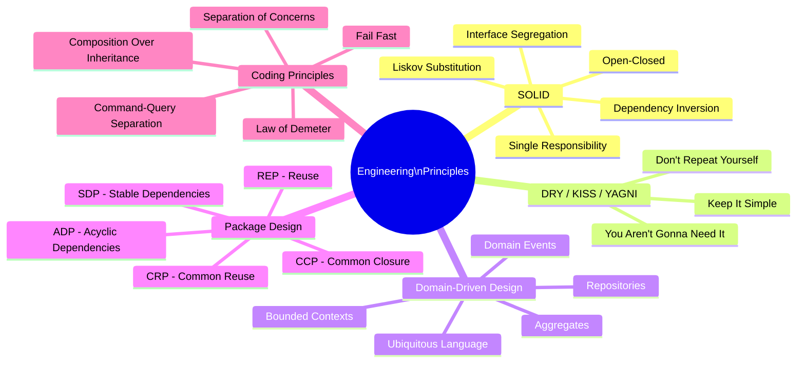
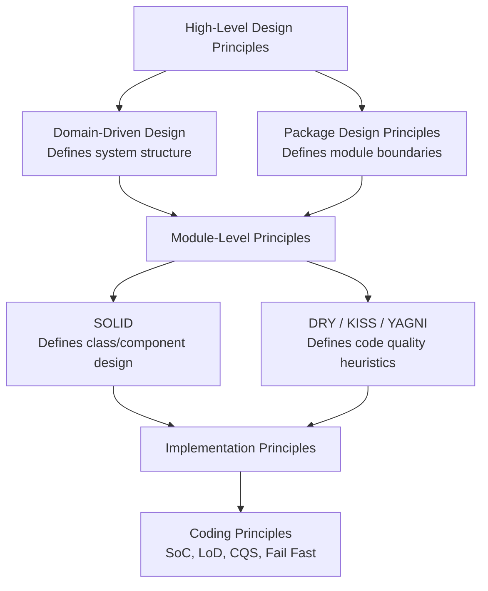

# Software Engineering Principles

Software engineering principles are the foundational rules and heuristics that guide the design of code at all levels — from individual functions to entire system modules. Mastery of these principles separates software that is easy to change, test, and understand from code that accrues technical debt.

## Overview

## How Principles Relate

## Topics in This Section

| File | Topic | Key Concepts |
|------|-------|--------------|
| [01_solid_principles.md](01_solid_principles.md) | SOLID | SRP, OCP, LSP, ISP, DIP |
| [02_dry_kiss_yagni.md](02_dry_kiss_yagni.md) | DRY / KISS / YAGNI | Code quality heuristics |
| [03_domain_driven_design.md](03_domain_driven_design.md) | DDD | Bounded contexts, aggregates, ubiquitous language |
| [04_package_module_design.md](04_package_module_design.md) | Package Design | REP, CCP, CRP, ADP, SDP, SAP |
| [05_coding_design_principles.md](05_coding_design_principles.md) | Coding Principles | SoC, LoD, CQS, fail fast, composition |
