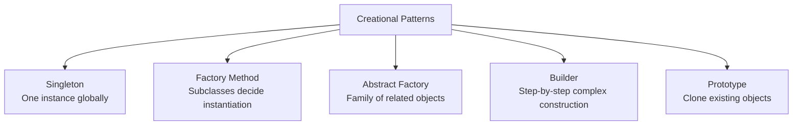
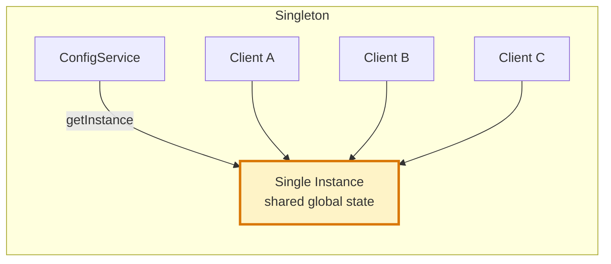
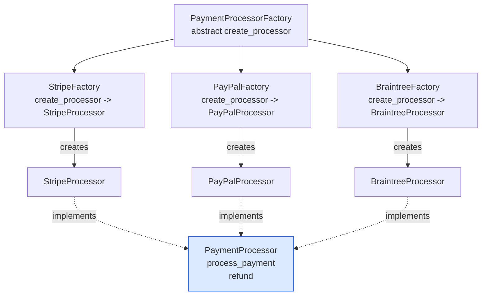
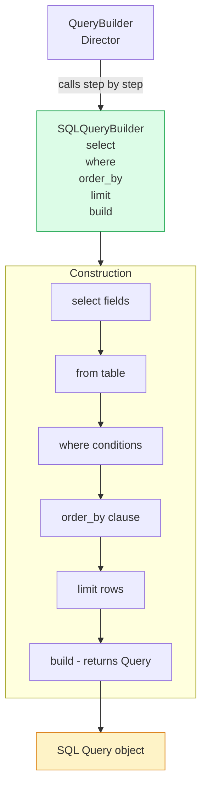
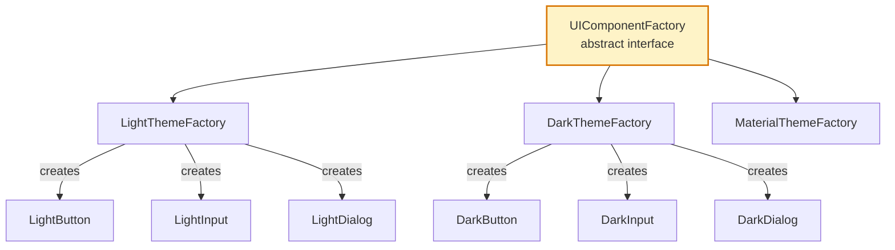

# Creational Patterns

Creational design patterns abstract the object creation process, making it more flexible and decoupled from the concrete classes being instantiated. They allow systems to be independent of how objects are created, composed, and represented.

## Pattern Overview

## Singleton Pattern

## Factory Method Pattern

## Builder Pattern

## Abstract Factory Pattern

## Key Concepts

- **Singleton**: Ensures only one instance of a class exists in the process, providing a global access point. Used for shared resources like configuration, connection pools, and logging services. The main risk is hidden global state that makes testing difficult. Thread-safe implementation requires double-checked locking or class-level initialization.

- **Factory Method**: Defines an interface for creating an object but lets subclasses decide which class to instantiate. Defers instantiation to subclasses while the creator works with the product through an interface. Useful when the exact type of object to create is determined by subclass context.

- **Abstract Factory**: Provides an interface for creating families of related objects without specifying their concrete classes. All objects produced by a factory are designed to work together. Commonly used for cross-platform UI components, database driver families, or cloud provider SDK abstraction.

- **Builder**: Separates the construction of a complex object from its representation, allowing the same construction process to create different representations. Useful when an object has many optional parameters (avoids telescoping constructors) or when construction involves many steps that must be executed in sequence.

- **Prototype**: Creates new objects by copying (cloning) an existing object. Useful when creating a new object is expensive (requires database lookup, network call, heavy computation) and an existing instance can serve as a template. Requires careful handling of deep vs. shallow copy semantics.

## Trade-offs

| Pattern | Use Case | Risk |
|---------|----------|------|
| Singleton | Shared global resource | Hidden coupling, testability issues |
| Factory Method | Subclass-driven instantiation | Proliferation of subclasses |
| Abstract Factory | Family of related objects | Adding new products requires changing all factories |
| Builder | Complex objects with many optional fields | Verbose builder class to maintain |
| Prototype | Expensive object creation | Deep copy complexity, clone semantics |

## When to Use

- **Singleton**: Logging, configuration, thread pools, registry services — where exactly one instance is semantically correct and global access is required
- **Factory Method**: When a class cannot anticipate the class of objects it must create, or when subclasses should specify the objects they create
- **Abstract Factory**: When the system must be independent of product creation, composition, and representation — common in platform-abstraction layers
- **Builder**: When constructing complex objects step-by-step, especially when optional parameters would create many constructor overloads
- **Prototype**: When instantiation is more expensive than copying, or when you need to copy an object's state without coupling to its class
