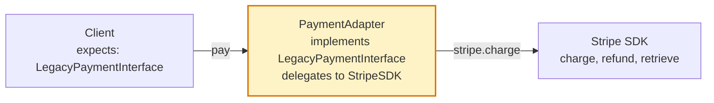
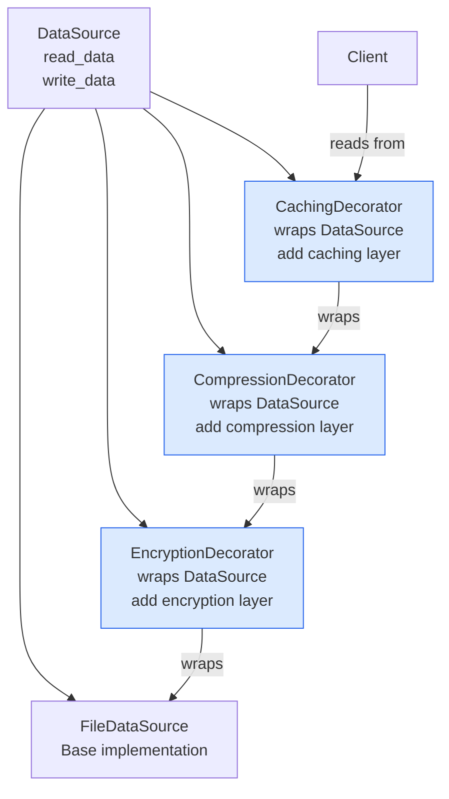
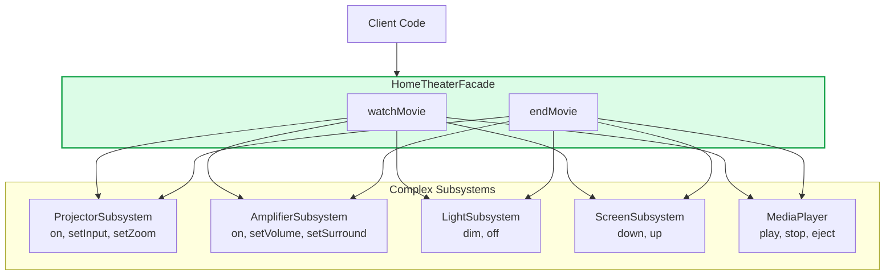
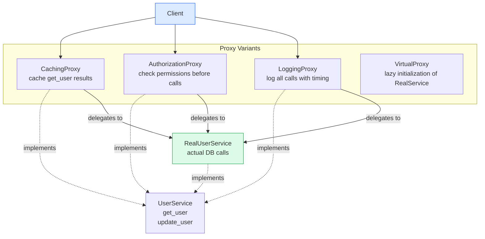

# Structural Patterns

Structural design patterns describe how classes and objects can be combined to form larger structures. They use inheritance and composition to realize new functionality, making it possible to combine interfaces or implementations flexibly.

## Adapter Pattern



## Decorator Pattern



## Facade Pattern



## Proxy Pattern



## Composite Pattern

```mermaid
graph TD
    Component[FileSystemComponent\nget_size\nlist]

    File[File\nleaf node\nget_size = file size]
    Directory[Directory\ncomposite node\nget_size = sum of children]
    SymLink[Symbolic Link\nget_size = target size]

    File -.->|implements| Component
    Directory -.->|implements| Component
    SymLink -.->|implements| Component

    Root[/ root directory] --> Bin[/bin directory] --> Bash[bash file]
    Root --> Home[/home directory] --> User[/user directory] --> Config[.config file]

    style Directory fill:#fef3c7,stroke:#d97706
    style File fill:#dcfce7,stroke:#16a34a
```

## Key Concepts

- **Adapter**: Converts the interface of a class into another interface that clients expect. Allows incompatible interfaces to work together without modifying source classes. There are two variants: class adapter (uses inheritance, requires multiple inheritance support) and object adapter (uses composition, more flexible).

- **Bridge**: Decouples an abstraction from its implementation so that both can vary independently. Where Adapter makes unrelated classes work together, Bridge is designed up-front to keep abstraction and implementation in separate class hierarchies (e.g., Shape abstraction with drawing implementation).

- **Composite**: Composes objects into tree structures to represent part-whole hierarchies. Clients treat individual objects and compositions uniformly. The key insight: leaf nodes and container nodes share the same interface, so clients don't need to distinguish between them.

- **Decorator**: Attaches additional responsibilities to an object dynamically. Provides a flexible alternative to subclassing for extending functionality. Decorators wrap the component and add behaviour before/after delegation. They can be stacked — multiple decorators chain.

- **Facade**: Provides a simplified interface to a complex subsystem. Doesn't prevent direct access to the subsystem but provides a higher-level interface that makes the subsystem easier to use. Reduces coupling between subsystem and clients.

- **Flyweight**: Uses sharing to support large numbers of fine-grained objects efficiently. Separates intrinsic state (shared, immutable) from extrinsic state (context-specific, not shared). Example: character objects in a text editor share a single flyweight per character type; position is extrinsic.

- **Proxy**: Provides a surrogate for another object to control access. Types include: virtual proxy (lazy initialization), remote proxy (local representative for a remote object), protection proxy (access control), caching proxy, and logging proxy.

## Trade-offs

| Pattern | Benefit | Cost |
|---------|---------|------|
| Adapter | Integrates incompatible interfaces | Extra indirection layer |
| Bridge | Independent evolution of abstraction/implementation | More up-front design |
| Composite | Treat individual and composite uniformly | Can make design too general |
| Decorator | Flexible feature composition | Many small objects, hard to debug |
| Facade | Simplified API for complex subsystem | Can become a god object |
| Flyweight | Memory efficiency for many objects | Complexity of state separation |
| Proxy | Transparent cross-cutting concerns | Indirection, potential performance overhead |

## When to Use

- **Adapter**: Integrating third-party libraries with mismatched interfaces, legacy system integration
- **Decorator**: Adding logging, caching, auth, or metrics to services without modifying them
- **Facade**: Simplifying SDK/library interfaces for application use
- **Proxy**: Implementing lazy loading, access control, or transparent caching
- **Composite**: Tree structures — file systems, org charts, UI component trees, expression trees
