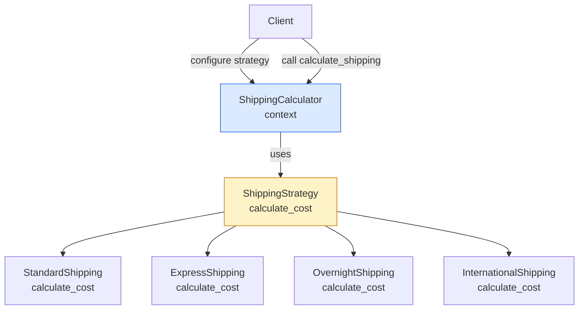
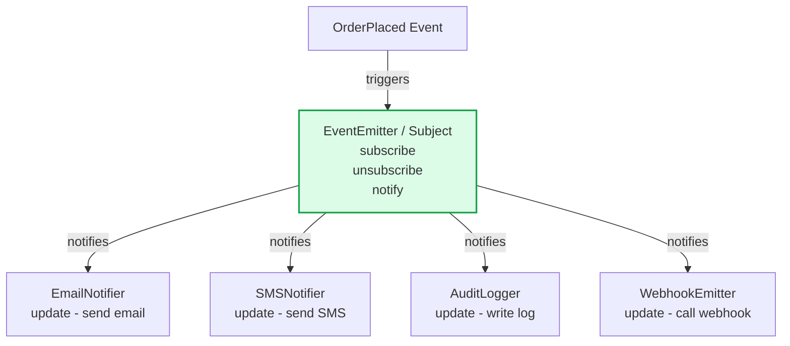
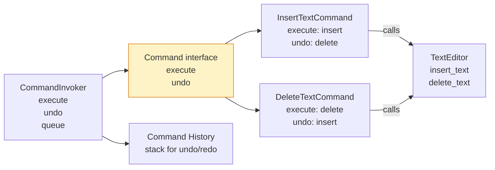
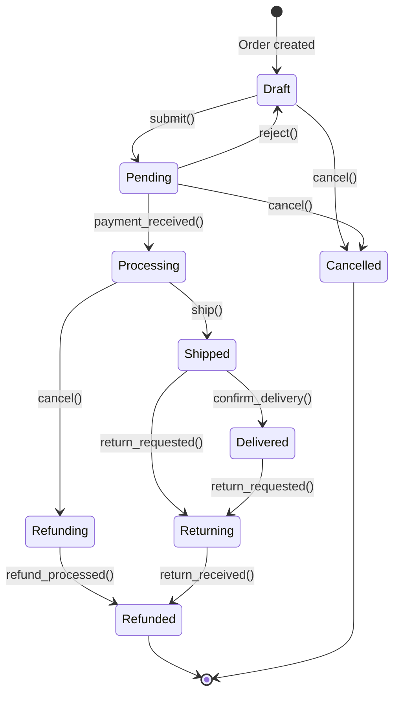
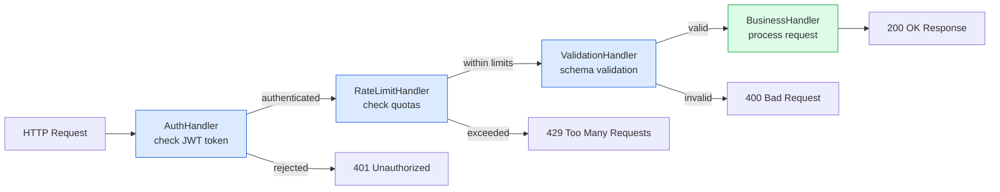
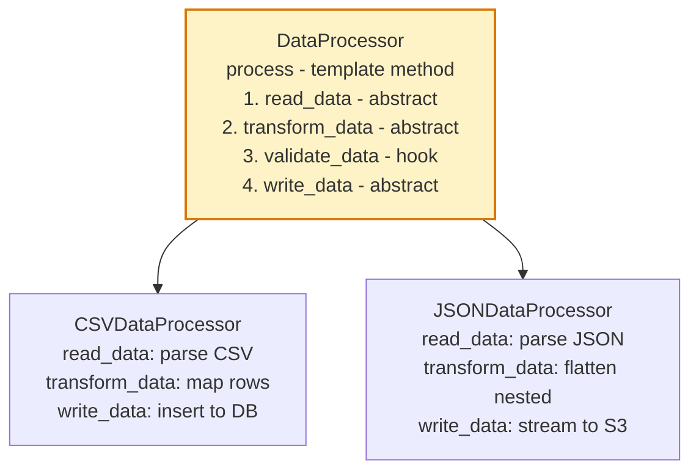

Behavioral design patterns describe how objects interact and distribute responsibilities. They focus on algorithms, responsibility assignment, and communication patterns between objects — making the collaboration between objects flexible and extensible.

## Strategy Pattern

## Observer Pattern

## Command Pattern

## State Pattern

## Chain of Responsibility Pattern

## Template Method Pattern

## Key Concepts

- **Strategy**: Defines a family of algorithms, encapsulates each one, and makes them interchangeable. The strategy pattern lets the algorithm vary independently from clients that use it. Used when you have multiple ways of doing something (sorting, pricing, shipping calculation) and need to switch between them at runtime.

- **Observer**: Defines a one-to-many dependency — when the subject changes state, all dependents (observers) are notified and updated automatically. Enables loose coupling between the event source and its handlers. The foundation of event-driven programming and reactive systems.

- **Command**: Encapsulates a request as an object, enabling parameterization, queuing, logging, and undo/redo operations. The command object contains the receiver, the action, and its parameters. Command queues enable job processing systems; command history enables undo stacks.

- **State**: Allows an object to alter its behaviour when its internal state changes. The object will appear to change its class. State encapsulates state-specific behaviour in separate state objects, eliminating large conditional blocks based on state flags.

- **Chain of Responsibility**: Passes a request along a chain of handlers, where each handler decides whether to process the request or pass it to the next handler. Decouples the sender of a request from its receivers. Used for middleware pipelines, event handling chains, and approval workflows.

- **Template Method**: Defines the skeleton of an algorithm in a base class, deferring some steps to subclasses. Subclasses can override specific steps without changing the algorithm's structure. The Hollywood Principle: "Don't call us, we'll call you" — the abstract class calls subclass methods.

- **Mediator**: Defines how a set of objects interact. Promotes loose coupling by keeping objects from referring to each other explicitly. A mediator centralises complex communications between objects. Used in air traffic control metaphor — planes communicate via tower, not directly.

- **Iterator**: Provides a way to access elements of an aggregate object sequentially without exposing its underlying representation. Enables uniform traversal of different data structures (arrays, trees, graphs) via a common interface.

## Trade-offs

| Pattern | Benefit | Cost |
|---------|---------|------|
| Strategy | Runtime algorithm switching | Clients must know all strategies |
| Observer | Loose coupling between events and handlers | Unexpected order of notifications |
| Command | Undo/redo, queuing, logging | Proliferation of command classes |
| State | Eliminates state-based conditionals | Many state classes |
| Chain of Responsibility | Flexible handler assignment | Request may go unhandled |
| Template Method | Code reuse, algorithmic consistency | Tight coupling to base class |

## When to Use

- **Strategy**: When you have multiple conditional branches selecting algorithm variants — replace them with polymorphism
- **Observer**: When changes in one object require updating others and you don't know how many objects need to change
- **Command**: When you need transactional behaviour, undo/redo, command queuing, or remote execution
- **State**: When an object's behaviour depends on its state and must change at runtime
- **Chain of Responsibility**: When more than one handler may handle a request and the handler isn't known a priori