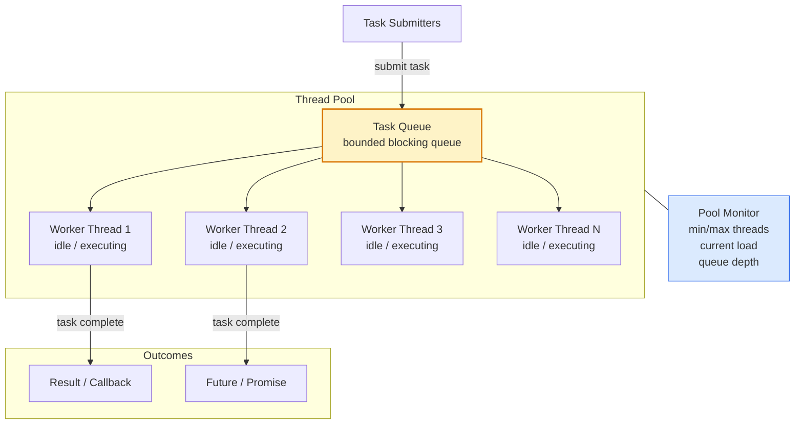
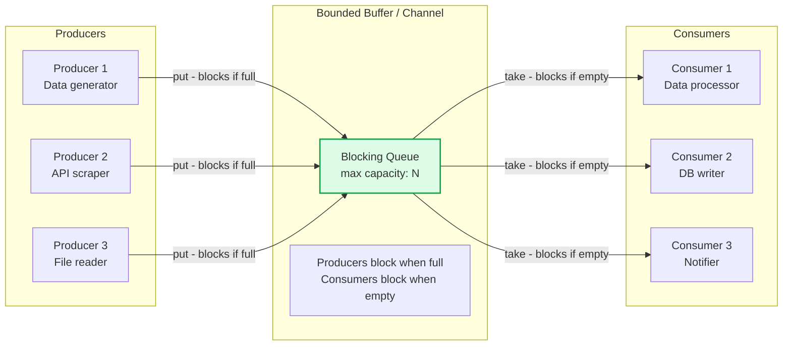
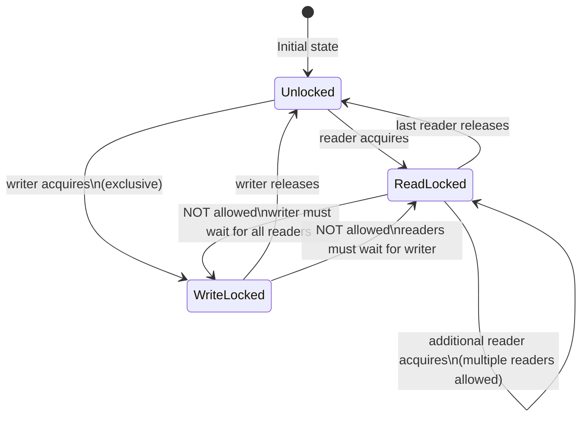
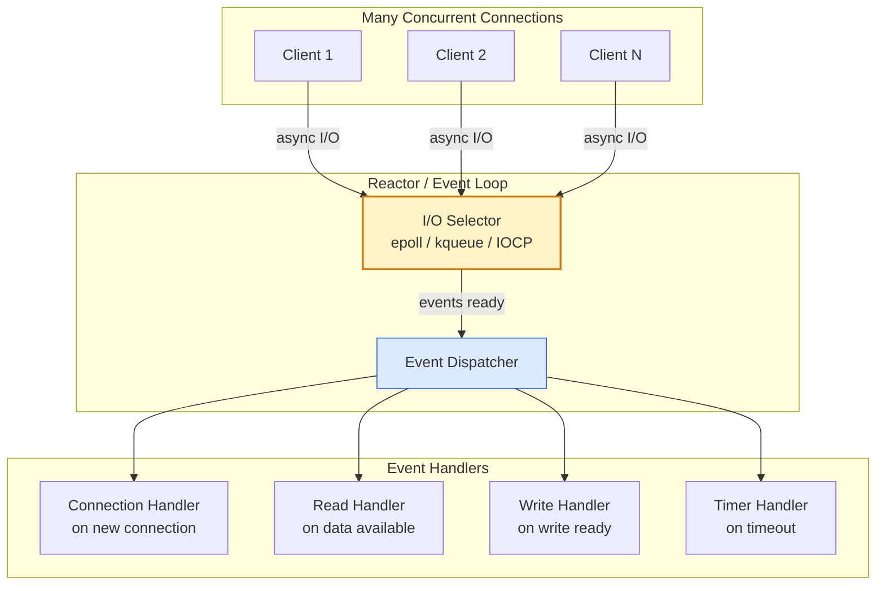
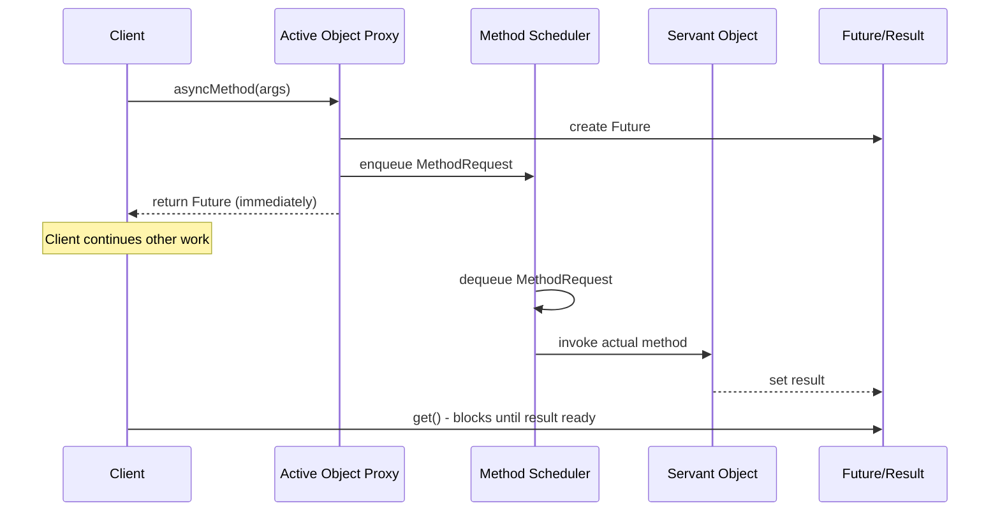

# Concurrency Patterns

Concurrency patterns provide reusable solutions to the challenges of writing correct, efficient multi-threaded and asynchronous programs. They address thread management, safe data sharing, producer-consumer coordination, and event handling in concurrent environments.

## Thread Pool Pattern

## Producer-Consumer Pattern

## Read-Write Lock Pattern

## Reactor Pattern

## Active Object Pattern

## Key Concepts

- **Thread Pool**: Maintains a pool of worker threads that can be reused to execute tasks, avoiding the overhead of creating and destroying threads for each task. Key parameters: core pool size (always-on threads), maximum pool size (burst capacity), queue capacity (buffer), and rejection policy (what to do when queue is full: reject, caller runs, discard oldest).

- **Producer-Consumer**: Decouples the production of data from its consumption using a bounded buffer. Producers add items to the buffer and block when full; consumers take items and block when empty. This back-pressure mechanism prevents producers from overwhelming consumers. Implemented with blocking queues (Java), channels (Go), or asyncio queues (Python).

- **Read-Write Lock**: Allows concurrent reads (multiple readers simultaneously) but exclusive writes (only one writer, no readers). Appropriate when reads far outnumber writes and the data structure is safe for concurrent reading. Trade-off: writer starvation if reads are continuous; write-preferring variants exist.

- **Reactor (Event Loop)**: A single-threaded event loop that demultiplexes I/O events from many connections and dispatches them to registered handlers. All handlers must be non-blocking — blocking a handler blocks the entire event loop. Foundation of Node.js, Netty, Nginx, and Python asyncio.

- **Proactor**: Like Reactor but initiates asynchronous I/O operations and receives completion notifications. The OS performs the I/O and notifies the application when complete, rather than the application polling for readiness (as in Reactor). Used by Windows IOCP.

- **Active Object**: Decouples method execution from method invocation for objects in their own thread of control. Method calls return immediately with a Future; the actual execution happens asynchronously. Provides a clean interface to asynchronous execution without callback hell.

- **Monitor Object**: Synchronizes concurrent execution of methods on an object and allows only one method to run within the object at a time. Methods acquire the monitor lock on entry and release on exit. Java synchronized methods implement this pattern.

## Trade-offs

| Pattern | Benefit | Cost |
|---------|---------|------|
| Thread Pool | Resource control, thread reuse | Tuning complexity, queue saturation |
| Producer-Consumer | Decoupled rates, back-pressure | Buffer sizing, deadlock risk |
| Read-Write Lock | High read throughput | Writer starvation, complexity |
| Reactor | High concurrency, low threads | No blocking I/O allowed |
| Active Object | Clean async API | Future management complexity |

## When to Use

- **Thread Pool**: Any server application handling concurrent requests — use a well-tuned thread pool instead of spawning threads per request
- **Producer-Consumer**: Data pipeline stages where processing rates differ between stages
- **Read-Write Lock**: Shared data structures with frequent reads and rare writes (caches, configuration)
- **Reactor**: High-concurrency network servers where the bottleneck is I/O concurrency, not CPU
- **Active Object**: When you need to provide a synchronous-looking interface to asynchronous execution
