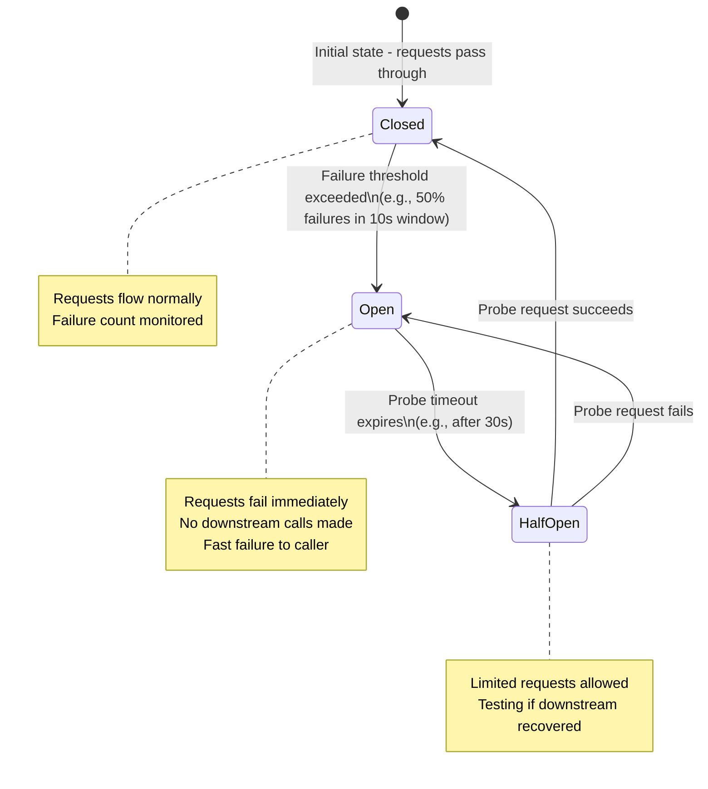
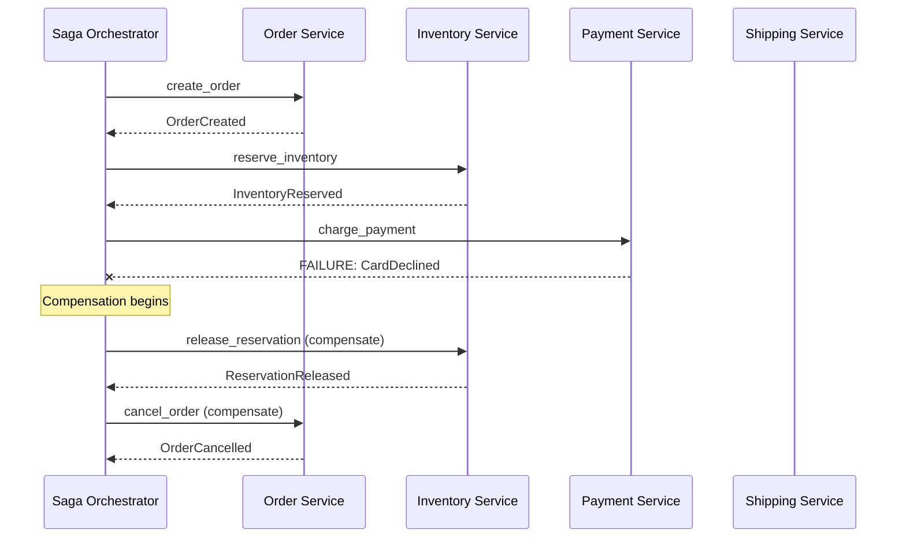
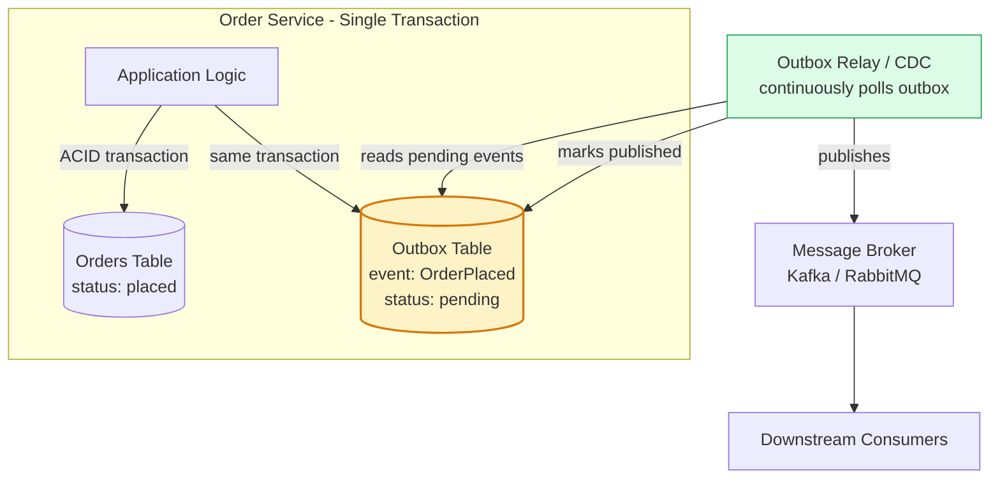
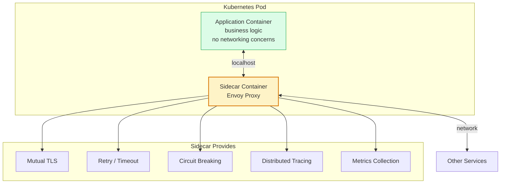
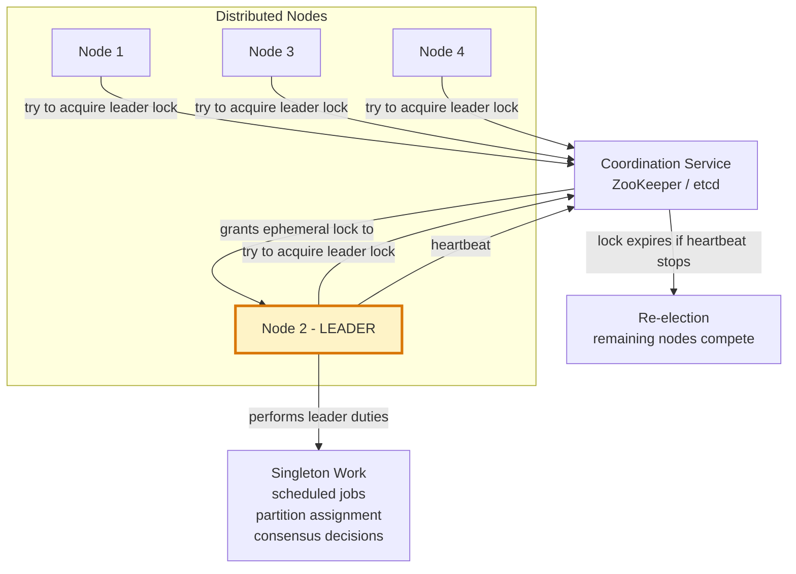

Distributed systems patterns solve the unique challenges of building reliable, consistent, and resilient software across multiple processes and machines — where networks are unreliable, clocks are unsynchronized, and failures are partial and silent.

## Circuit Breaker Pattern

## Saga Pattern

## Outbox Pattern

## Sidecar Pattern

## Leader Election Pattern

## Key Concepts

- **Circuit Breaker**: Wraps a remote call and monitors for failures. When failures exceed a threshold, the circuit "opens" and subsequent calls fail immediately without attempting the downstream call. After a timeout, the circuit enters "half-open" and probes whether the downstream has recovered. Prevents cascading failures — a slow or failing downstream service drains the calling service's thread pool.

- **Saga**: A sequence of local transactions, each publishing an event or message that triggers the next step. If any step fails, the saga executes compensating transactions (undo actions) for all preceding steps. Replaces distributed ACID transactions in microservices with eventual consistency. Two flavours: choreography (event-driven, decentralized) and orchestration (coordinator controls flow).

- **Outbox Pattern**: Solves the "dual write" problem — the impossibility of atomically writing to a database and publishing a message. Instead, the application writes both the business data and the event to the same database in a single ACID transaction. A separate relay process (or CDC pipeline) reads the outbox table and publishes events. Guarantees at-least-once event delivery.

- **Sidecar**: Deploys a helper process alongside the application in the same execution unit (pod, VM). The sidecar handles cross-cutting concerns (service mesh proxying, logging, configuration) without modifying the application. The application uses the sidecar via localhost, treating it as a transparent intermediary.

- **Ambassador**: A specialized sidecar that acts as a proxy to external services, abstracting connection details, retry logic, and circuit breaking from the application. The application talks to the ambassador on localhost; the ambassador handles the complexities of reaching the actual service.

- **Bulkhead**: Isolates different parts of a system into pools so that failure in one pool does not exhaust resources for another. Named after ship compartments that contain flooding. Implemented as separate thread pools per downstream dependency — if one dependency is slow, only its pool fills, not the entire service's thread pool.

- **Leader Election**: Ensures only one node in a cluster performs a particular task at a time (singleton work). Uses a distributed coordination service (ZooKeeper, etcd, Consul) where nodes compete for an ephemeral lock. If the leader fails to renew its heartbeat, the lock expires and a new election occurs.

## Trade-offs

| Pattern | Problem Solved | Complexity Introduced |
|---------|---------------|----------------------|
| Circuit Breaker | Cascading failures | State management, tuning thresholds |
| Saga | Cross-service consistency | Compensation logic, partial failure |
| Outbox | Dual write atomicity | Relay infrastructure, eventual delivery |
| Sidecar | Cross-cutting concerns without code change | More containers, sidecar lifecycle |
| Bulkhead | Resource isolation between dependencies | More pools to configure and monitor |
| Leader Election | Singleton work in distributed cluster | Coordination service dependency |

## When to Use

- **Circuit Breaker**: Any synchronous call to an external service or database
- **Saga**: Multi-step business processes spanning multiple services where all-or-nothing semantics are required
- **Outbox**: Any microservice that must publish events and persist data atomically
- **Sidecar**: When adding cross-cutting capabilities (observability, security) to services without modifying them
- **Bulkhead**: When a service depends on multiple external systems with different reliability profiles