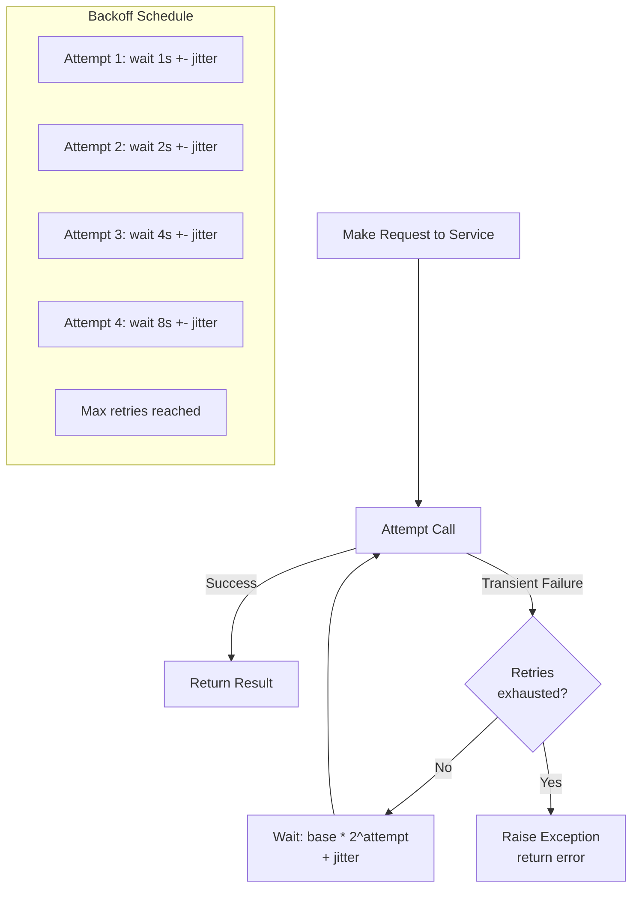
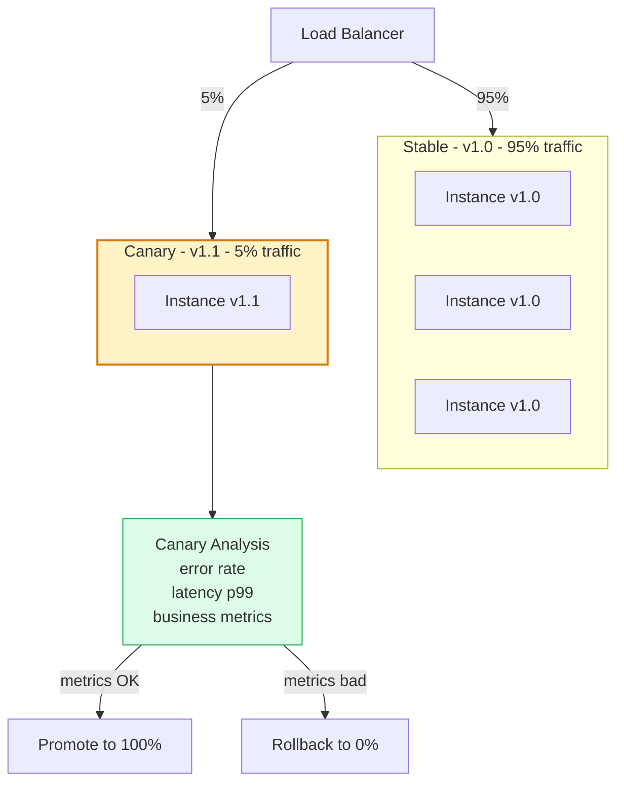
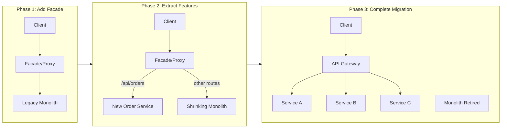

# Cloud Infrastructure Patterns

Cloud infrastructure patterns are architectural patterns specifically designed for cloud-native systems, addressing elasticity, resilience, observability, and cost efficiency at scale. They represent proven solutions for operating stateless and stateful workloads in cloud environments.

## Retry with Exponential Backoff



## Health Endpoint Pattern

```mermaid
graph TD
    LB[Load Balancer] -->|GET /health/live| Pod[Service Instance]
    K8s[Kubernetes Kubelet] -->|GET /health/ready| Pod
    Monitor[Monitoring System] -->|GET /health/details| Pod

    subgraph HealthEndpoints[Health Check Endpoints]
        Liveness[/health/live\nIs process alive?\nRestarts if unhealthy]
        Readiness[/health/ready\nCan serve traffic?\nRemoved from LB if unhealthy]
        Startup[/health/startup\nInitialization complete?\nDelays liveness checks]
        Deep[/health/details\nDependency status\nDB, cache, queue connectivity]
    end

    Pod --> Liveness & Readiness & Startup & Deep

    style Liveness fill:#dcfce7,stroke:#16a34a
    style Readiness fill:#dbeafe,stroke:#2563eb
    style Deep fill:#fef3c7,stroke:#d97706
```

## Blue-Green Deployment

```mermaid
graph TD
    LB[Load Balancer / DNS]

    subgraph Blue[Blue - Current Production v1.0]
        B1[Instance 1 v1.0]
        B2[Instance 2 v1.0]
        B3[Instance 3 v1.0]
    end

    subgraph Green[Green - New Version v1.1]
        G1[Instance 1 v1.1]
        G2[Instance 2 v1.1]
        G3[Instance 3 v1.1]
    end

    LB -->|100% traffic| Blue
    LB -. ->|0% - switch here| Green

    DB[(Shared Database\nSchema compatible)]
    Blue --> DB
    Green --> DB

    Rollback[Instant Rollback:\nSwitch LB back to Blue]

    style Blue fill:#dbeafe,stroke:#2563eb
    style Green fill:#dcfce7,stroke:#16a34a
```

## Canary Deployment



## Strangler Fig Pattern



## Key Concepts

- **Retry with Exponential Backoff and Jitter**: Automatically retry failed transient operations, increasing the wait time between retries exponentially to avoid thundering herd. Jitter (random variation) prevents synchronized retry storms when many clients retry simultaneously. Crucial for resilience against temporary service unavailability.

- **Health Endpoint Monitoring**: Services expose standardized health check endpoints that load balancers and orchestrators use to determine service health. Liveness probes determine if a process should be restarted; readiness probes determine if it should receive traffic. Deep health checks expose dependency status.

- **Blue-Green Deployment**: Maintains two identical production environments (blue = current, green = new). Traffic is switched from blue to green atomically, enabling instant rollback by switching back. Requires double the infrastructure during the switch window but eliminates deployment downtime.

- **Canary Deployment**: Gradually rolls out a new version to a small percentage of traffic while monitoring metrics. If metrics are acceptable, traffic percentage increases incrementally until the canary receives 100%. If metrics degrade, traffic is rolled back. Reduces blast radius of bad deployments.

- **Throttling Pattern**: Controls the rate of resource consumption to protect services from overload. Unlike rate limiting (which protects the service from abuse), throttling gracefully degrades under load by queuing excess requests or returning HTTP 429.

- **Valet Key Pattern**: Issues a temporary, scoped credential (token, SAS URL) to allow clients to access a specific resource directly without routing through the application server. Common for large file uploads to object storage — the application grants a signed S3/GCS URL, and the client uploads directly.

- **Strangler Fig Pattern**: Gradually replaces a legacy system by routing new functionality to new services while keeping old functionality in the legacy system. The legacy system is "strangled" over time as more functionality moves out. Named after the strangler fig vine that grows around a host tree.

## Trade-offs

| Pattern | Benefit | Cost |
|---------|---------|------|
| Retry + Backoff | Resilience to transient failures | Increased tail latency for failed operations |
| Health Endpoints | Automatic unhealthy instance removal | Must implement and maintain health checks |
| Blue-Green | Zero-downtime deployment | Double infrastructure cost during switch |
| Canary | Low blast radius for bad deploys | Slow rollout, complex traffic management |
| Strangler Fig | Safe incremental migration | Long-running partial migration state |

## When to Use

- **Retry + Backoff**: All external service calls and database operations — make it the default
- **Health Endpoints**: All containerized services deployed in Kubernetes or behind load balancers
- **Blue-Green**: When zero-downtime deployment and instant rollback are requirements
- **Canary**: When deploying high-risk changes to large user bases where gradual exposure reduces risk
- **Strangler Fig**: When migrating a monolith to microservices incrementally without a big-bang rewrite
