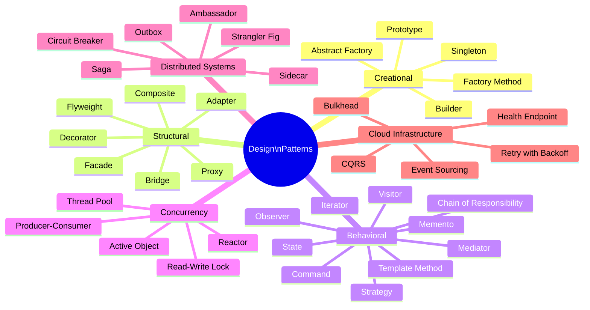
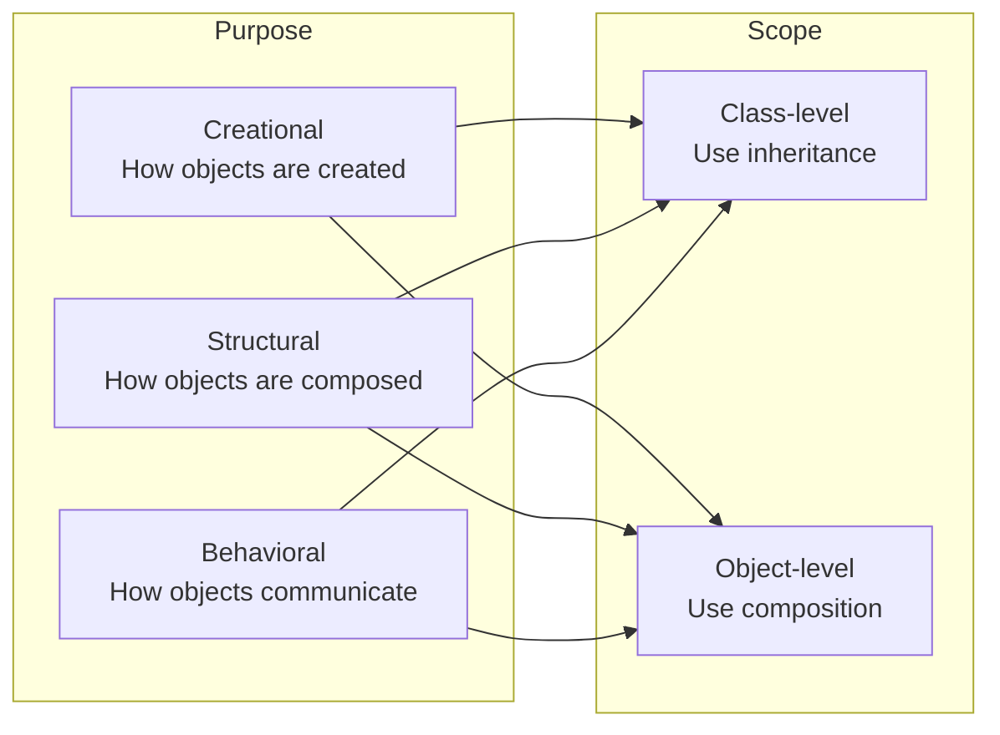

# Design Patterns

Design patterns are reusable solutions to commonly occurring problems in software design. They are not code templates but rather blueprints for how to structure code to solve a specific class of problem. Patterns exist at multiple levels: object-oriented (GoF), concurrency, distributed systems, and cloud infrastructure.

## Overview

## Pattern Classification

## Topics in This Section

| File | Topic | Key Patterns |
|------|-------|-------------|
| [01_creational_patterns.md](01_creational_patterns.md) | Creational | Singleton, Factory, Builder, Prototype |
| [02_structural_patterns.md](02_structural_patterns.md) | Structural | Adapter, Decorator, Facade, Proxy, Composite |
| [03_behavioral_patterns.md](03_behavioral_patterns.md) | Behavioral | Strategy, Observer, Command, State, Chain |
| [04_concurrency_patterns.md](04_concurrency_patterns.md) | Concurrency | Thread Pool, Producer-Consumer, Reactor |
| [05_distributed_systems_patterns.md](05_distributed_systems_patterns.md) | Distributed | Circuit Breaker, Saga, Outbox, Sidecar |
| [06_cloud_infrastructure_patterns.md](06_cloud_infrastructure_patterns.md) | Cloud | CQRS, Event Sourcing, Bulkhead, Retry |
