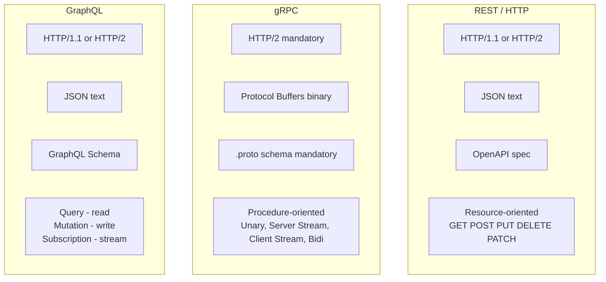
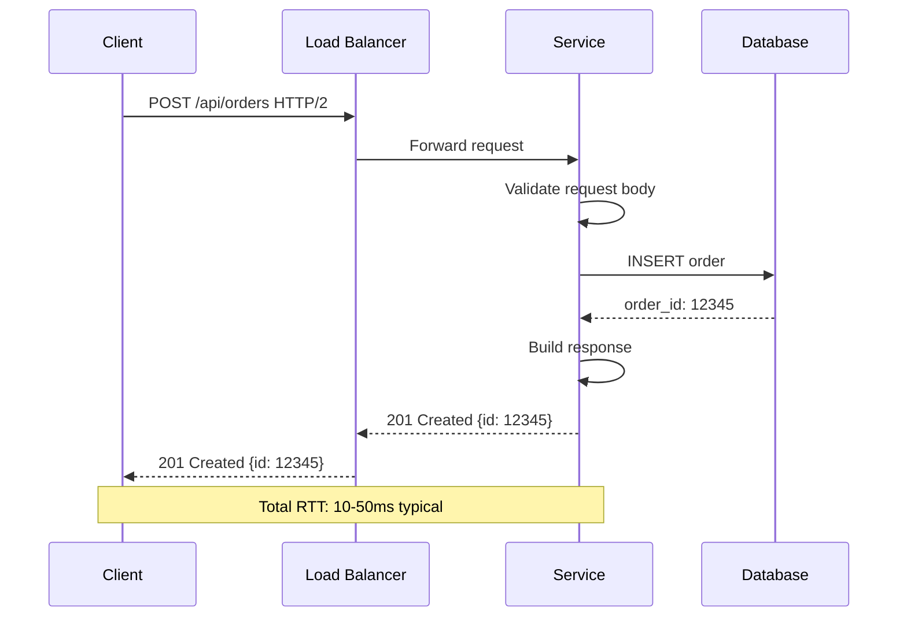
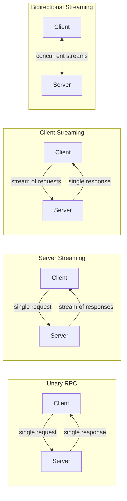
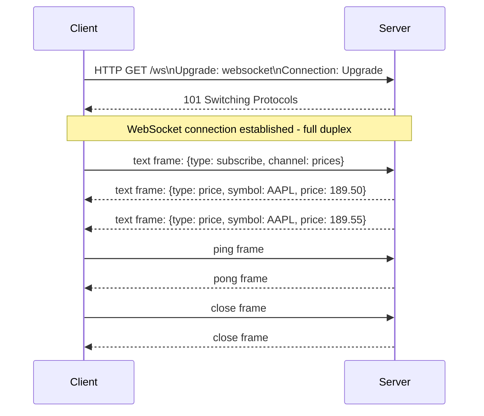

# Synchronous Communication Protocols

Synchronous protocols require the caller to wait for a response before proceeding. They provide immediate feedback, simplify error handling, and are easy to reason about — at the cost of temporal coupling between caller and callee.

## REST vs gRPC vs GraphQL Comparison

## HTTP Request-Response Flow

## gRPC Streaming Modes

## WebSocket Protocol

## Key Concepts

- **REST (Representational State Transfer)**: An architectural style for distributed hypermedia systems. Uses standard HTTP verbs (GET, POST, PUT, PATCH, DELETE) to operate on resources identified by URIs. Stateless — each request contains all information needed to process it. JSON is the de facto standard format. REST's simplicity and ubiquity make it the default choice for public APIs.

- **gRPC**: A high-performance, open-source RPC framework using HTTP/2 and Protocol Buffers. Provides strongly-typed contracts via `.proto` schema files, enabling code generation in multiple languages. Supports four communication modes: unary (request/response), server streaming, client streaming, and bidirectional streaming. ~5-10x more efficient than JSON REST for serialization.

- **GraphQL**: A query language and runtime for APIs. Clients specify exactly what data they need in a query, eliminating over-fetching (too much data) and under-fetching (too many round trips). The schema is the contract. Mutations modify data; subscriptions stream real-time updates. Requires schema design discipline to avoid N+1 query problems.

- **WebSocket**: Full-duplex communication channel over a single TCP connection, established via HTTP upgrade handshake. Enables server-to-client push without polling. Suitable for real-time features: live charts, collaborative editing, gaming, chat. Managing WebSocket connections at scale requires sticky sessions or a shared pub/sub layer.

- **Server-Sent Events (SSE)**: One-directional server-to-client streaming over plain HTTP. Simpler than WebSockets for use cases where only the server pushes data (activity feeds, live logs, progress notifications). SSE automatically reconnects on disconnection and handles event IDs for resumption.

- **HTTP/2**: Binary protocol with header compression (HPACK), multiplexing (multiple streams over one TCP connection), server push, and stream prioritization. Eliminates head-of-line blocking at the HTTP layer (but not at the TCP layer). Required by gRPC.

## Trade-offs

| Aspect | REST | gRPC | GraphQL | WebSocket |
|--------|------|------|---------|-----------|
| Performance | Moderate | High | Moderate | Low overhead after connect |
| Human readable | Yes | No (binary) | Yes | Yes/No |
| Streaming | Limited (SSE) | Native (4 modes) | Subscriptions | Native full-duplex |
| Browser support | Full | Limited | Full | Full |
| Code generation | Optional | Mandatory | Optional | Manual |
| Schema contract | Optional (OpenAPI) | Mandatory (.proto) | Mandatory (schema) | Manual |
| Caching | HTTP cache friendly | Not cache friendly | Complex | Not cacheable |

## When to Use

- **REST**: Public APIs, browser-facing services, when simplicity and HTTP caching are priorities
- **gRPC**: Internal service-to-service communication, polyglot environments, high-throughput data transfer
- **GraphQL**: Client-driven data fetching (mobile apps, SPAs with varying data needs per view)
- **WebSocket**: Real-time bidirectional communication (chat, gaming, collaborative tools)
- **SSE**: Server-to-client push where client never sends data after initial connection
