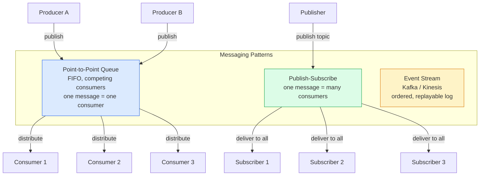
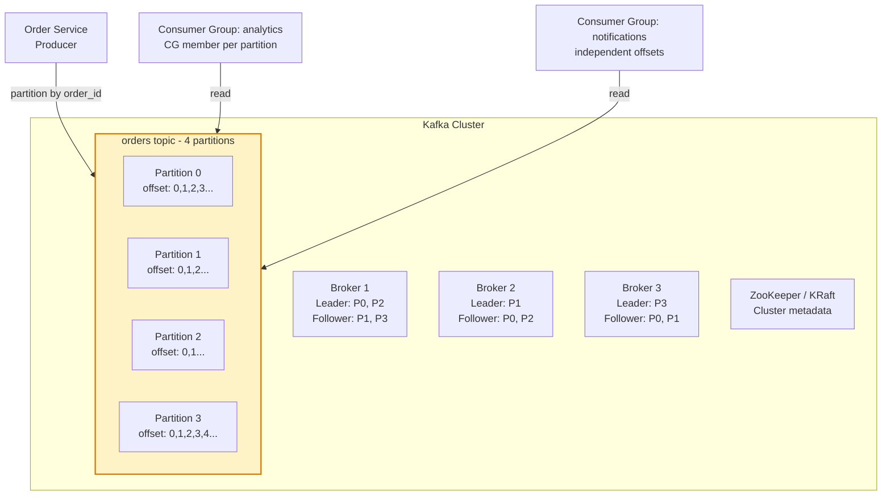
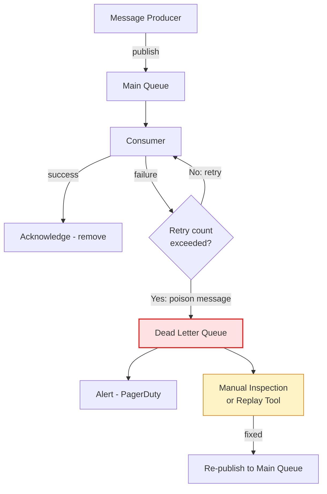
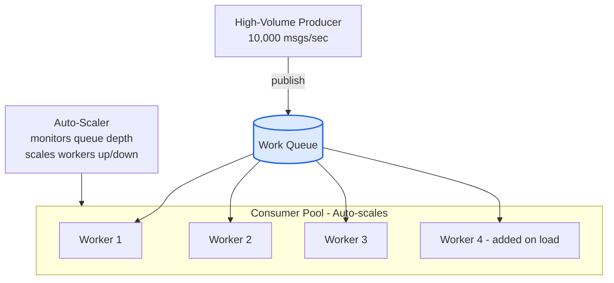

Asynchronous messaging decouples producers from consumers temporally — producers send messages to an intermediary (broker) without waiting for consumers to be available. This enables resilience, elastic load distribution, and loose coupling at the cost of eventual consistency and increased operational complexity.

## Messaging System Topology

## Kafka Architecture

## Dead Letter Queue Pattern

## Competing Consumers Pattern

## Key Concepts

- **Message Queue (Point-to-Point)**: A queue where each message is delivered to exactly one consumer. When multiple consumers (competing consumers) read from the same queue, messages are distributed across them for load balancing. The queue provides durability — messages persist until acknowledged. Examples: SQS, RabbitMQ queues.

- **Publish-Subscribe (Pub/Sub)**: One message is delivered to all active subscribers of a topic. Each subscriber receives its own copy. Unlike queues, there is no load balancing — every subscriber processes every message. Examples: SNS, Google Pub/Sub, Redis Pub/Sub.

- **Event Streaming (Kafka)**: An ordered, durable, append-only log partitioned across brokers. Consumers maintain their own offset — they can replay events from any point. Multiple consumer groups can independently consume the same partition at different offsets. Enables temporal decoupling, replay, and event sourcing.

- **Message Acknowledgment**: Consumers must explicitly acknowledge messages after processing. Un-acknowledged messages are re-delivered after a visibility timeout. This guarantees at-least-once delivery but requires idempotent consumers (processing the same message twice produces the same result).

- **Dead Letter Queue (DLQ)**: A separate queue where messages that fail processing after all retries are moved. Prevents poison messages from blocking the main queue forever. DLQ messages require manual inspection to understand and fix the root cause, then replay or discard.

- **Competing Consumers**: Multiple consumer instances read from the same queue, enabling horizontal scaling of message processing. Works best when message processing is stateless and independent. Ordering is not preserved across competing consumers.

- **Message Ordering**: Point-to-point queues within a single partition/shard preserve FIFO ordering. Kafka preserves order within a partition. If global ordering is required, use a single partition — this limits throughput. If partial ordering is acceptable, partition by key (e.g., user_id) to ensure per-key ordering.

## Trade-offs

| Aspect | Sync (HTTP) | Message Queue | Kafka Streams |
|--------|-------------|---------------|---------------|
| Coupling | Tight (caller waits) | Loose (fire and forget) | Very loose (replay) |
| Ordering | Inherent | Per-partition | Per-partition |
| Throughput | Limited by slowest service | High (decoupled) | Very high |
| Latency | Low (direct) | Higher (broker hop) | Higher |
| Replay | Not possible | Not possible | Native support |
| At-least-once delivery | No (at-most-once by default) | Yes | Yes |
| Consumer scaling | Must scale sender too | Independent scaling | Consumer group scaling |

## When to Use

- **Message Queue**: Background job processing, task offloading, work distribution across competing consumers
- **Pub/Sub**: Notification fan-out, event broadcasting to multiple independent consumers
- **Kafka**: Event sourcing, audit logs, data pipeline fan-out, cross-service event streams requiring replay
- **DLQ**: Any async processing system — always pair queues with DLQs for operational visibility