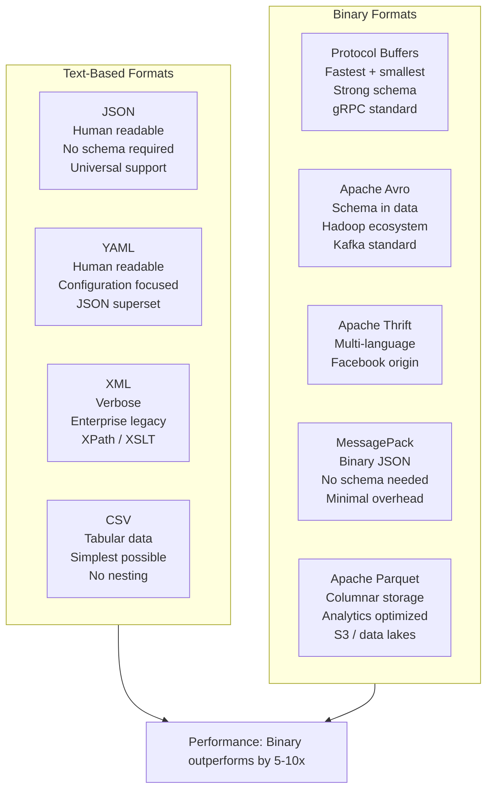
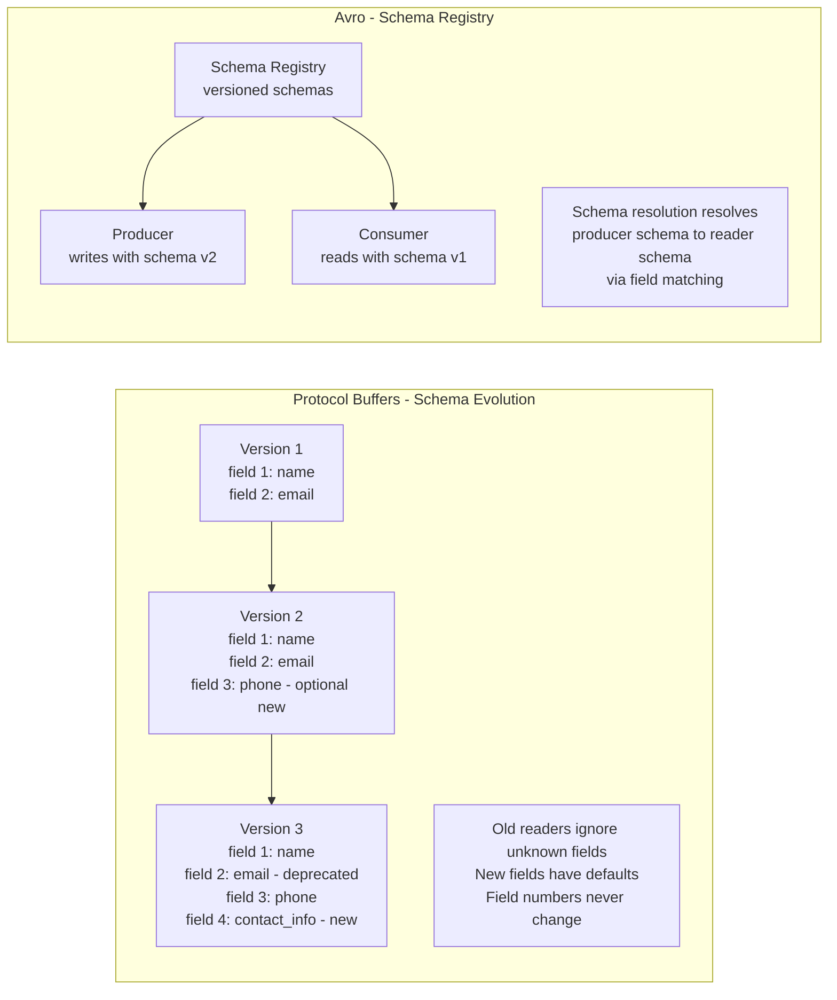
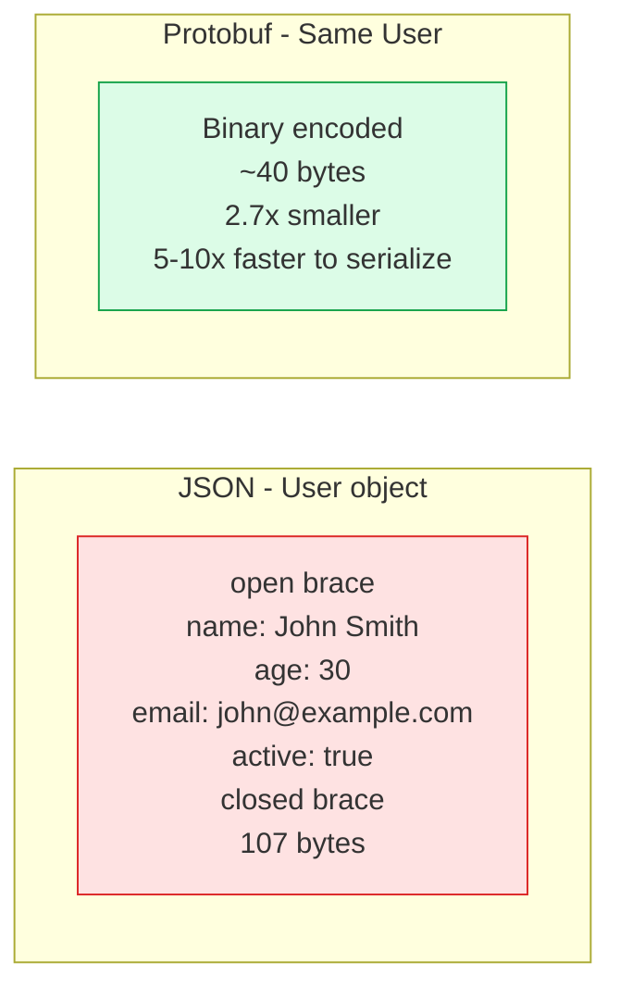
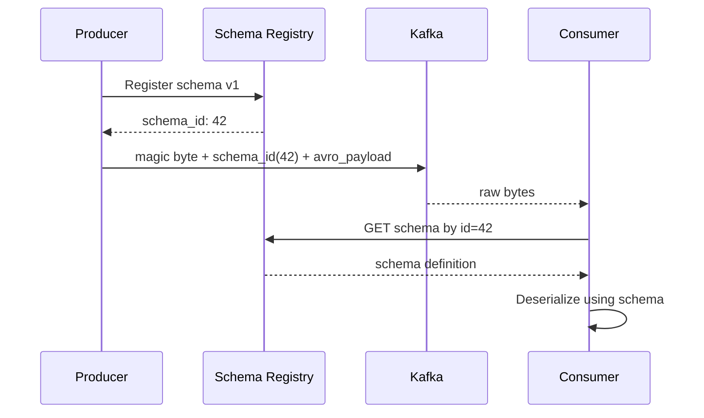

# Serialization Formats

Serialization converts in-memory data structures into a format suitable for storage or transmission. The choice of format affects payload size, serialization speed, schema evolution safety, human readability, and cross-language compatibility.

## Format Comparison Overview

## Schema Evolution

## Protobuf vs JSON Performance

## Avro with Schema Registry

## Key Concepts

- **JSON (JavaScript Object Notation)**: Human-readable, schema-optional, universally supported. Self-describing — field names are part of every message. This verbosity is its primary cost: name repetition across millions of messages wastes bandwidth and storage. No native binary type (base64 required). No schema enforcement by default (though JSON Schema provides optional validation).

- **Protocol Buffers (Protobuf)**: Google's binary serialization format used in gRPC. Fields are identified by integer field numbers (not names), making encoded messages extremely compact. Strongly typed with a mandatory `.proto` schema. Excellent forward/backward compatibility: unknown fields are preserved, new optional fields default gracefully.

- **Apache Avro**: Binary format used heavily in the Hadoop/Kafka ecosystem. The schema is included with the data or stored in a schema registry. Writer and reader schemas can differ — Avro resolves them using field names. Natural fit for event-driven systems with Confluent Schema Registry.

- **MessagePack**: Binary equivalent of JSON — uses the same data model (strings, numbers, arrays, maps) but encodes to binary. Significantly smaller and faster than JSON with no schema required. Good drop-in replacement for JSON in performance-sensitive contexts.

- **Apache Parquet**: Columnar binary format optimised for analytics workloads. Stores each column's data contiguously, enabling efficient columnar compression and predicate pushdown. Not suitable for row-by-row operations. Standard format for data lakes on S3.

- **Schema Registry**: A service (e.g., Confluent Schema Registry) that stores, versions, and enforces compatibility of schemas. Producers register schemas before publishing; consumers fetch schemas by ID. Enables schema evolution without breaking existing consumers.

- **Schema Evolution Rules**: For safe evolution: add new fields as optional (with defaults), never remove or rename fields (deprecate instead), never change a field's type, never reuse field numbers (Protobuf). Avro rules differ — use field names for resolution, so renaming requires aliases.

## Trade-offs

| Format | Size | Speed | Human Readable | Schema Required | Evolution Safety |
|--------|------|-------|---------------|-----------------|-----------------|
| JSON | Large | Slow | Yes | No | Low |
| XML | Very Large | Very Slow | Yes | Optional (XSD) | Low |
| Protobuf | Small | Very Fast | No | Yes (.proto) | High |
| Avro | Small | Fast | No | Yes (JSON schema) | High |
| MessagePack | Medium | Fast | No | No | Low |
| Parquet | Small (columnar) | Very Fast (analytics) | No | Yes | Moderate |

## When to Use

- **JSON**: Public APIs, configuration files, debugging contexts where human readability matters
- **Protobuf**: gRPC services, internal high-throughput APIs, mobile data transfer where bandwidth matters
- **Avro**: Kafka event streaming with Confluent Schema Registry, Hadoop/Spark data pipelines
- **Parquet**: Data lake storage, analytics queries on S3/GCS, Spark/Athena workloads
- **MessagePack**: Drop-in replacement for JSON when binary efficiency is needed without schema overhead
