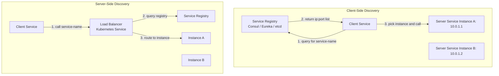
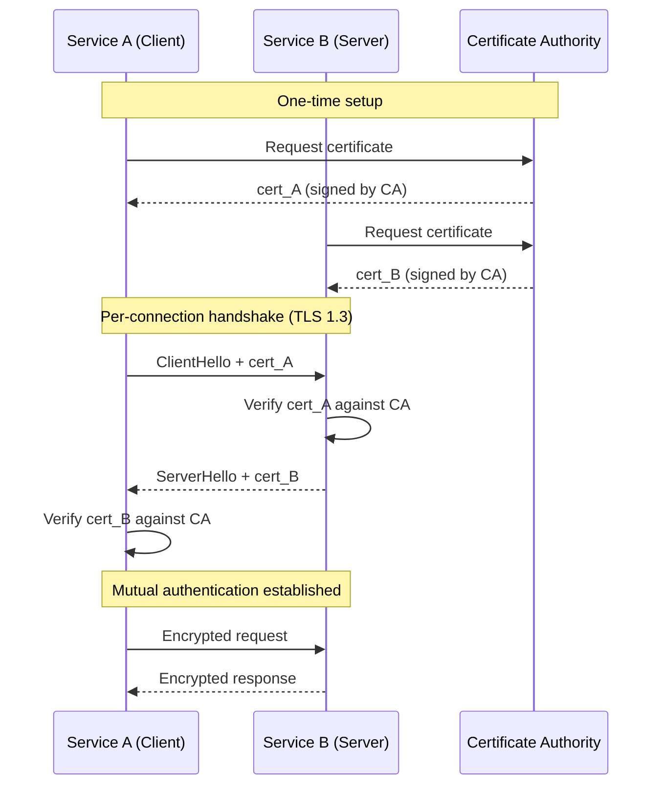
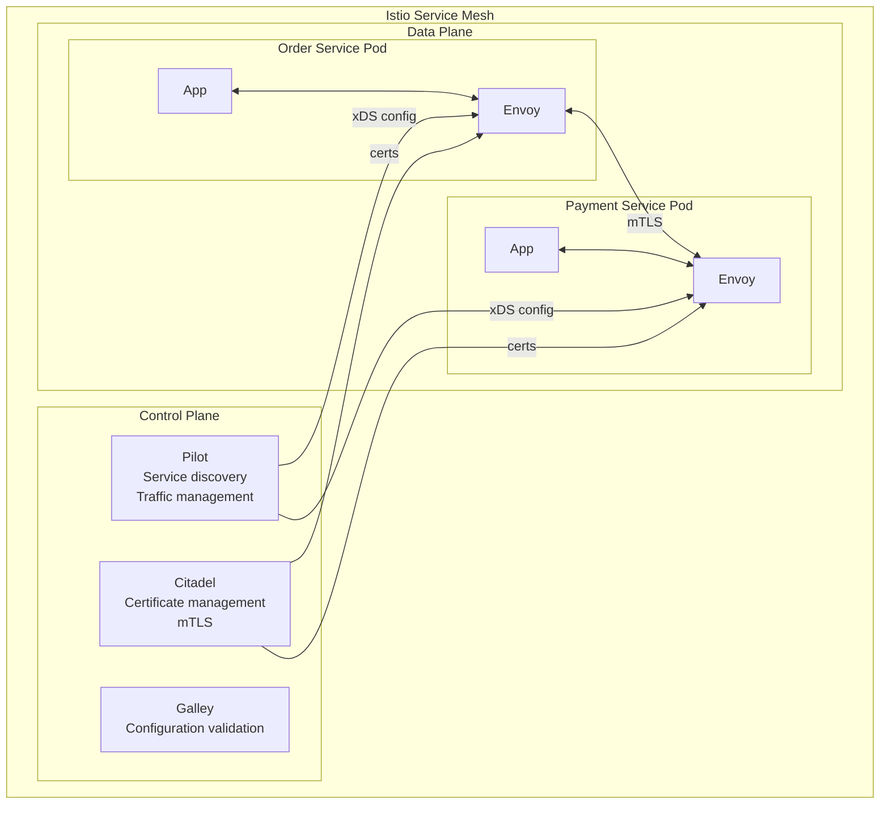

# Service-to-Service Communication Patterns

Service-to-service communication patterns address how microservices discover each other, authenticate to each other, and communicate reliably. These patterns form the operational foundation of distributed service architectures.

## Service Discovery



## mTLS Authentication



## Service Mesh Traffic Management



## Load Balancing Strategies

```mermaid
graph TD
    subgraph Algorithms[Load Balancing Algorithms]
        RR[Round Robin\nSequential rotation\nSimple, equal distribution]
        LConn[Least Connections\nRoute to least busy\nBetter for variable task lengths]
        IPHash[IP Hash\nClient IP → same server\nSession affinity]
        WRR[Weighted Round Robin\nProportional by server capacity]
        Random[Random\nStateless, uniform distribution\nLow overhead]
        P2C[Power of Two Choices\nRandom sample 2, pick least loaded\nO(1) approximates optimal]
    end

    Client[Client Requests] --> LB[Load Balancer]
    LB --> Algo{Algorithm}
    Algo --> RR & LConn & IPHash & WRR & Random & P2C
```

## Key Concepts

- **Service Discovery**: The mechanism by which services locate each other dynamically, without hard-coded IP addresses. Client-side discovery (the caller queries the registry and selects an instance) gives clients more control. Server-side discovery (the load balancer queries the registry) is simpler for clients.

- **DNS-Based Discovery**: The simplest form — services use a DNS name (e.g., `payment-service.internal`) that resolves to one or more IP addresses. Kubernetes Services use this model. DNS TTL controls how quickly changes propagate.

- **mTLS (Mutual TLS)**: Both the client and server present and verify X.509 certificates, establishing mutual authentication. In a service mesh, mTLS is automatically managed — certificates are issued by the mesh's CA, rotated automatically, and verified without application code changes. Provides both encryption and identity verification.

- **Service Mesh**: An infrastructure layer that handles service-to-service communication uniformly across a fleet of services. The data plane (sidecar proxies) handles traffic; the control plane configures the proxies. Provides: mTLS, retries, circuit breaking, traffic splitting, distributed tracing, and metrics.

- **Load Balancing at Layer 4 vs Layer 7**: Layer 4 (transport) load balancers route TCP/UDP packets without inspecting content — fast but cannot make routing decisions based on HTTP headers or paths. Layer 7 (application) load balancers inspect HTTP headers, cookies, and paths — slower but capable of content-based routing, SSL termination, and health checking.

- **Consistent Hashing**: A load balancing strategy where each server is mapped to a point on a hash ring. Requests are routed to the nearest server clockwise on the ring. When servers are added or removed, only 1/N of requests are remapped (vs. all requests with modulo hashing). Used in distributed caches and stateful services.

- **Service-to-Service Authentication**: In addition to network-level mTLS, services should authenticate at the application level. JWT tokens in HTTP headers are common — a service presents a service account JWT signed by the identity provider, which the receiving service validates.

## Trade-offs

| Pattern | Benefit | Cost |
|---------|---------|------|
| Client-side discovery | Client controls selection strategy | Client complexity, registry dependency |
| Server-side discovery | Simpler clients | Load balancer is a bottleneck |
| mTLS | Strong mutual authentication | Certificate management overhead |
| Service mesh | Zero-code observability and security | Significant operational complexity |
| Consistent hashing | Minimal remapping on topology change | Less uniform distribution |

## When to Use

- **mTLS**: All production internal service communication — default to mTLS in microservices environments
- **Service mesh**: When managing cross-cutting concerns (security, observability) for 10+ services
- **Client-side discovery**: When clients need custom selection logic (language affinity, geographic proximity)
- **Server-side discovery**: When client simplicity is a priority and load balancer is already in the critical path
