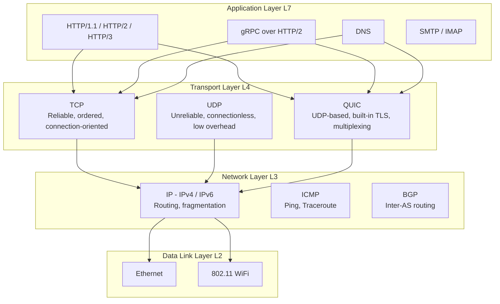
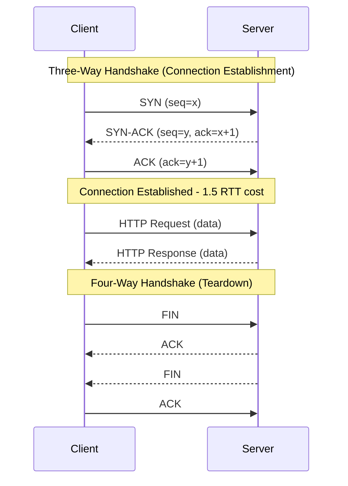
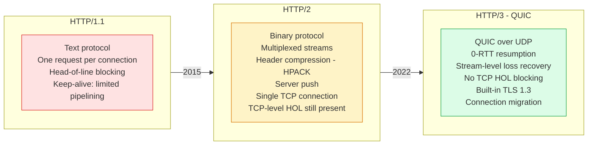
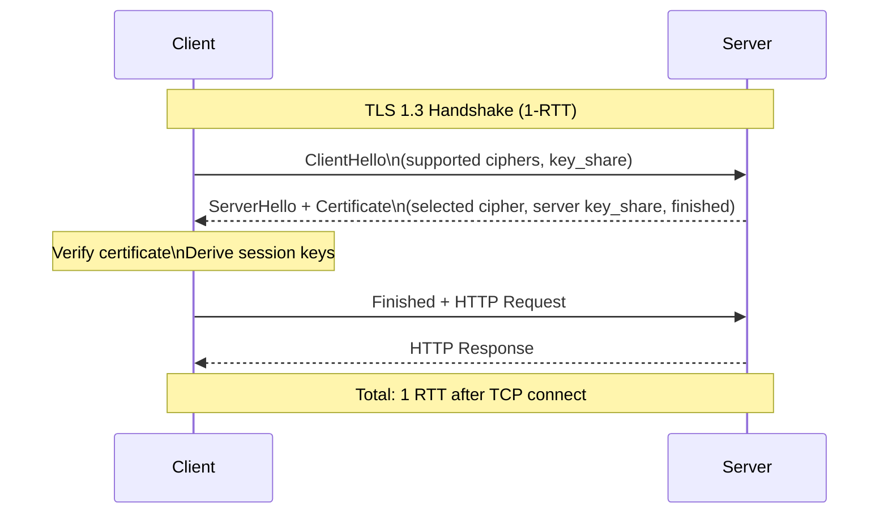
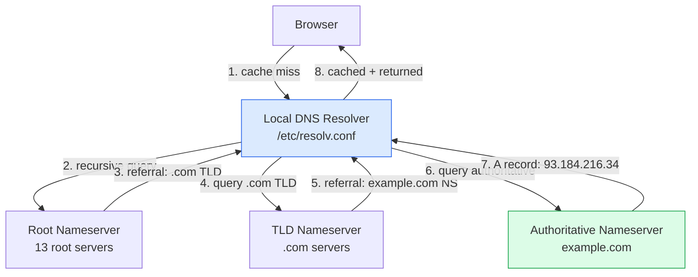

# Network Protocols

Network protocols are the foundational rules governing how data is transmitted across networks. Understanding protocol behaviour — connection establishment, flow control, encryption negotiation, and congestion management — enables engineers to diagnose performance problems and make informed infrastructure decisions.

## Protocol Stack

## TCP Connection Lifecycle

## HTTP Version Evolution

## TLS Handshake

## DNS Resolution Flow

## Key Concepts

- **TCP (Transmission Control Protocol)**: Provides reliable, ordered, error-checked delivery of bytes over a network. Uses a three-way handshake for connection establishment (1.5 RTT overhead), sliding window flow control, and congestion control algorithms (CUBIC, BBR). TCP guarantees ordering within a connection but causes head-of-line blocking — a lost packet stalls all subsequent data.

- **UDP (User Datagram Protocol)**: Connectionless, unreliable protocol with minimal overhead. No handshake, no ordering guarantees, no flow control. Suitable for latency-sensitive applications (gaming, VoIP, DNS queries) where an occasional lost packet is preferable to the latency of retransmission.

- **QUIC**: A transport protocol built over UDP, developed by Google and standardized by IETF as the foundation for HTTP/3. Provides: 0-RTT connection resumption, stream-level multiplexing (no TCP head-of-line blocking), built-in TLS 1.3, and connection migration (changing IP without reconnecting). Solves the fundamental limitations of HTTP/2 over TCP.

- **TLS (Transport Layer Security)**: Cryptographic protocol providing encryption, authentication, and integrity for network communications. TLS 1.3 (current standard) simplified the handshake to 1-RTT, removed weak cipher suites, and made forward secrecy mandatory. TLS 1.2 is still widely deployed but deprecated.

- **HTTP/2 Multiplexing**: Multiple HTTP streams share a single TCP connection, eliminating the HTTP/1.1 requirement to open 6+ parallel connections per domain. Each stream is independent — a request for `/api/users` and `/api/orders` can be in-flight simultaneously. However, a lost TCP packet blocks all HTTP/2 streams (TCP head-of-line blocking).

- **DNS (Domain Name System)**: The hierarchical, distributed naming system that maps domain names to IP addresses. Resolution traverses root nameservers, TLD nameservers, and authoritative nameservers. DNS caching (controlled by TTL) is critical for performance — a TTL of 60s means every hostname lookup may add 60s to propagation time for changes.

- **BGP (Border Gateway Protocol)**: The routing protocol that exchanges reachability information between autonomous systems (ISPs, cloud providers). BGP route advertisements determine how traffic flows across the internet. BGP misconfigurations (route leaks, hijacks) can cause large-scale internet outages.

## Trade-offs

| Protocol | Reliability | Latency | Throughput | Use Case |
|---------|------------|---------|-----------|---------|
| TCP | Guaranteed | Higher (handshake) | Limited by window | Web, databases, file transfer |
| UDP | None | Lowest | Unlimited | Gaming, VoIP, DNS, streaming |
| QUIC/HTTP3 | Guaranteed | Low (0-RTT) | High (no HOL) | Modern web, mobile |
| TLS 1.3 | Encrypted | 1-RTT overhead | Minimal impact | All secure communications |

## When to Use

- **TCP**: All reliable data transfer where ordering and delivery guarantees are required
- **UDP**: Latency-critical applications where some loss is tolerable and retransmission adds more cost than benefit
- **QUIC/HTTP3**: New client-server applications targeting modern browsers and mobile clients
- **TLS 1.3**: All production communication — there is no valid reason to use older TLS versions in new systems
