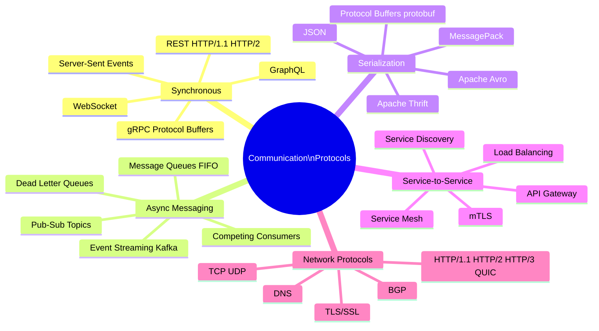

Communication protocols define how services exchange data — the encoding, transport, sequencing, and error-handling rules that govern inter-service interactions. Choosing the right protocol involves trade-offs between latency, reliability, coupling, and operational complexity.

## Overview

## Topics in This Section

| File | Topic | Key Concepts |
|------|-------|--------------|
| [01_synchronous_protocols.md](01_synchronous_protocols.md) | Synchronous | REST, gRPC, WebSocket, SSE |
| [02_async_messaging_patterns.md](02_async_messaging_patterns.md) | Async Messaging | Queues, pub/sub, streaming, DLQ |
| [03_serialization_formats.md](03_serialization_formats.md) | Serialization | JSON, Protobuf, Avro, schema evolution |
| [04_service_to_service_patterns.md](04_service_to_service_patterns.md) | Service-to-Service | Discovery, mTLS, service mesh, gateways |
| [05_network_protocols.md](05_network_protocols.md) | Network | TCP, HTTP versions, TLS, DNS, QUIC |