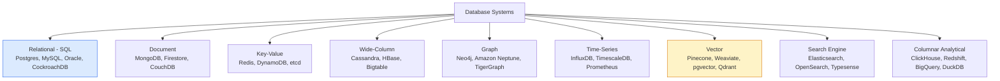
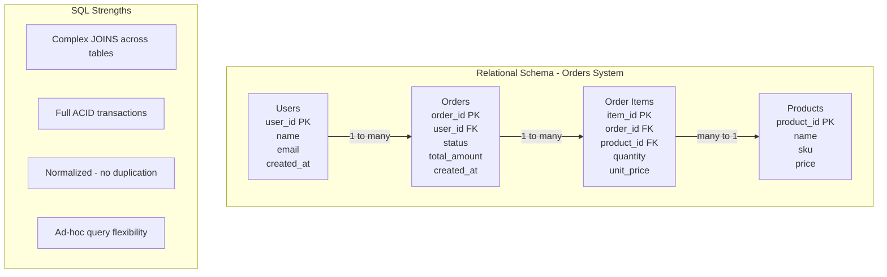
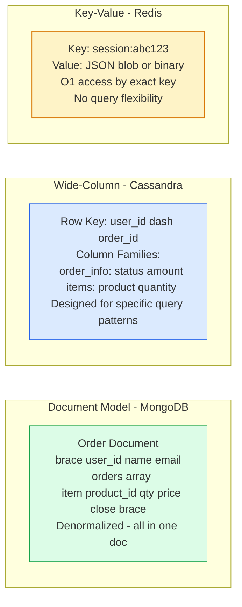

# Database Paradigms

The database landscape has fragmented dramatically — no single paradigm fits all workloads. Understanding the data model, query capabilities, and operational characteristics of each paradigm is essential for matching storage technology to access patterns.

## Database Taxonomy



## Relational Model



## NoSQL Data Models



## Vector Database Architecture

```mermaid
graph TD
    subgraph Ingestion[Data Ingestion]
        Docs[Raw Documents\nImages, Text, Code]
        Embedder[Embedding Model\nOpenAI, Sentence-BERT, CLIP]
        Docs --> Embedder
        Embedder -->|dense vectors| VectorStore[Vector Index\nHNSW - ANN index]
    end

    subgraph Query[Similarity Search]
        Query[Query: user text]
        QEmbed[Embed query] --> SimilaritySearch[ANN Search\nTop-K nearest vectors]
        VectorStore --> SimilaritySearch
        SimilaritySearch --> Results[Top-K similar documents]
    end

    Query --> QEmbed

    style VectorStore fill:#fef3c7,stroke:#d97706,stroke-width:2px
    style SimilaritySearch fill:#dcfce7,stroke:#16a34a
```

## Key Concepts

- **Relational (SQL)**: Organizes data into tables with predefined schemas, enforcing referential integrity via foreign keys. ACID transactions span multiple tables via JOINs. SQL is the most powerful query language — ad-hoc queries, aggregations, and complex joins are native. Vertical scaling bottleneck for write-heavy workloads beyond what a single node can handle.

- **Document Database**: Stores data as semi-structured documents (JSON/BSON). Documents can contain nested objects and arrays, enabling denormalized data models where related data lives together. Excellent for read-heavy workloads where a single document satisfies a query. Poor for operations that span multiple documents (no joins).

- **Key-Value Store**: The simplest model — a dictionary with O(1) point lookups by key. No schema, no query language beyond get/set/delete. Redis adds data structures (sorted sets, lists, hashes) and expiration. Used for caching, session storage, feature flags, and rate limiting.

- **Wide-Column (Column-Family)**: Stores data in rows with dynamic column families. Rows are partitioned and sorted by a composite key. Optimized for high-write throughput and queries on time-series or event data where the query pattern is known upfront. Cassandra's data model forces schema design around queries, not around domain entities.

- **Graph Database**: Stores entities (nodes) and relationships (edges) as first-class citizens with properties. Graph traversal (finding paths, neighbors, subgraphs) is native and performant. Relational databases can model graph data but become expensive as traversal depth increases. Used for social networks, fraud detection, recommendation engines.

- **Time-Series Database**: Optimized for append-only writes of timestamped data points. Uses specialized compression (delta encoding, gorilla compression) and retention policies. Supports time-range aggregations efficiently. Used for metrics, IoT, financial tick data, application telemetry.

- **Vector Database**: Stores high-dimensional dense vectors (embeddings) and supports approximate nearest neighbor (ANN) search. Used for semantic similarity search, recommendation systems, and RAG (Retrieval-Augmented Generation) architectures. HNSW (Hierarchical Navigable Small World) is the dominant index algorithm.

## Trade-offs

| Paradigm | Query Flexibility | Write Throughput | Schema | Consistency | Best For |
|----------|-----------------|-----------------|--------|-------------|---------|
| Relational | Highest | Moderate | Strict | ACID | Complex queries, transactions |
| Document | Moderate | High | Flexible | Varies | Hierarchical data, APIs |
| Key-Value | Point lookup only | Very high | None | Varies | Caching, sessions |
| Wide-Column | Limited (query design) | Very high | Semi-structured | Tunable | Time-series, write-heavy |
| Graph | Graph traversal | Moderate | Flexible | ACID | Relationships, networks |
| Time-Series | Time-range queries | Very high | Structured | Varies | Metrics, telemetry |
| Vector | Similarity search | Moderate | Fixed-dimension | Eventual | AI search, recommendations |

## When to Use

- **Relational**: Default for most application data with complex relationships and transaction requirements
- **Document**: Content management, product catalogs, user profiles, API backends with hierarchical data
- **Key-Value**: Caching, session management, rate limiting counters, feature flags
- **Wide-Column**: IoT telemetry, analytics event tables, write-heavy time-series at massive scale
- **Graph**: Social networks, fraud detection, recommendation engines, knowledge graphs
- **Time-Series**: Infrastructure metrics, application monitoring, financial tick data
- **Vector**: Semantic search, RAG, image similarity, recommendation systems using embeddings
