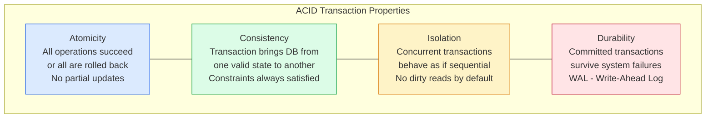
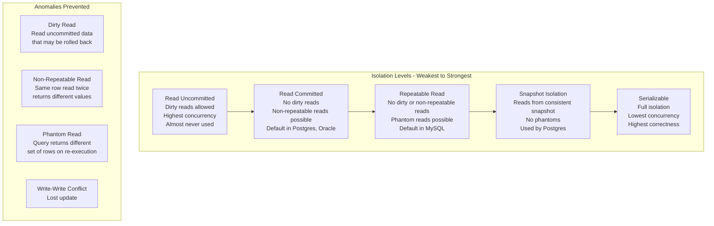
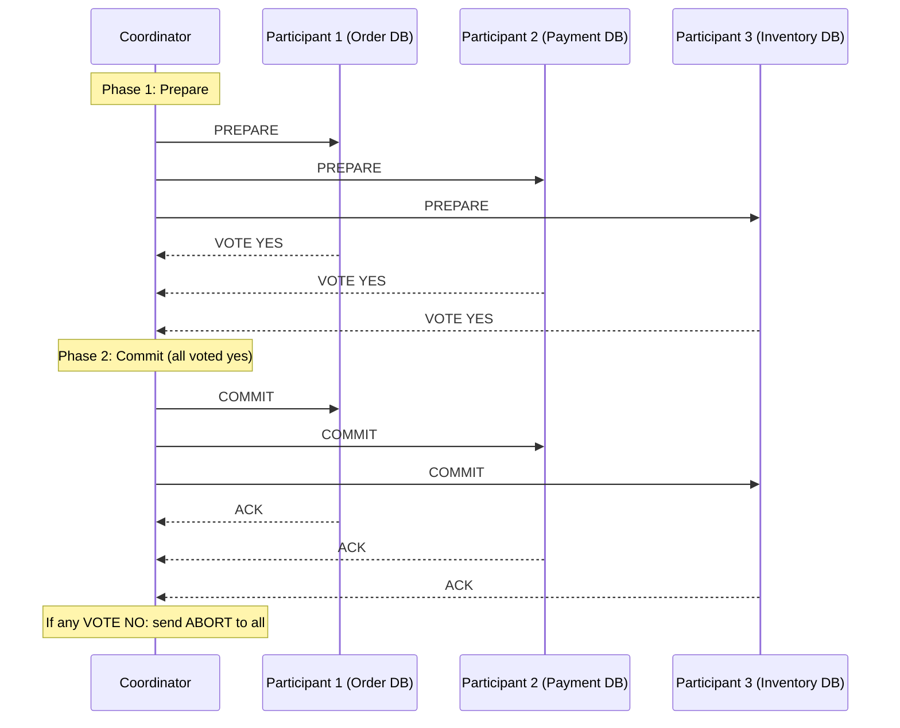
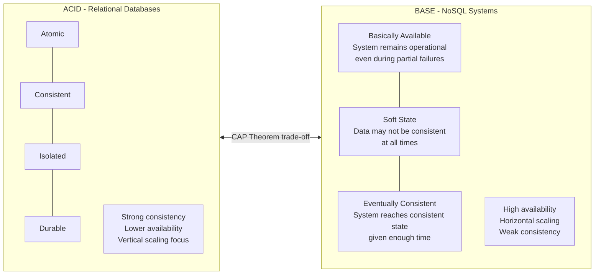

# Consistency and Transactions

Consistency and transactions are the mechanisms that ensure data remains correct and coherent in the face of concurrent access and partial failures. Understanding ACID vs. BASE, isolation levels, and distributed transaction patterns is fundamental to building correct data-driven systems.

## ACID Properties

## Transaction Isolation Levels

## Distributed Transactions: 2PC

## ACID vs BASE

## Key Concepts

- **Atomicity**: A transaction is an indivisible unit — either all its operations complete successfully, or none of them do. Implemented via undo logs (rollback) and write-ahead logs (WAL). If a crash occurs mid-transaction, the database uses the WAL to redo completed transactions and undo incomplete ones on recovery.

- **Consistency**: Transactions move the database from one valid state to another. All integrity constraints (foreign keys, check constraints, unique constraints) must be satisfied after every committed transaction. This is the application's responsibility as much as the database's.

- **Isolation**: Concurrent transactions must not interfere with each other. The degree of isolation is configurable via isolation levels — stronger isolation prevents more anomalies but reduces concurrency (higher locking overhead).

- **Durability**: Once a transaction is committed, its changes persist even if the system crashes immediately after. Achieved via write-ahead logging: changes are written to a durable log before being applied to data files. On recovery, the WAL is replayed to restore committed state.

- **Read Committed**: The most common default isolation level. A transaction can only read data that has been committed. Prevents dirty reads. Still allows non-repeatable reads (a row read twice within the same transaction can return different values if another transaction commits between the two reads).

- **Snapshot Isolation (SI)**: Each transaction sees a consistent snapshot of the database as it existed at transaction start. Reads are non-blocking (no read locks). Does not prevent write skew — two transactions can read the same data and make conflicting writes without seeing each other's changes.

- **Serializable**: The strongest isolation level. Concurrent transactions produce results identical to some serial execution order. Implemented via two-phase locking (2PL) or serializable snapshot isolation (SSI). Highest correctness guarantee at the cost of reduced concurrency.

- **Two-Phase Commit (2PC)**: A distributed transaction protocol where a coordinator orchestrates PREPARE (phase 1) and COMMIT/ABORT (phase 2) across multiple participants. Guarantees atomicity across distributed nodes but introduces blocking (if the coordinator fails between phases, participants are blocked until recovery) and latency.

- **SAGA (vs 2PC)**: An alternative to 2PC for distributed transactions. Instead of a distributed lock, sagas use compensating transactions to undo completed steps if a later step fails. Provides eventual consistency without the blocking and coordinator failure problems of 2PC.

## Trade-offs

| Level | Dirty Read | Non-Repeatable Read | Phantom Read | Performance |
|-------|-----------|--------------------|--------------|----|
| Read Uncommitted | Possible | Possible | Possible | Highest |
| Read Committed | No | Possible | Possible | High |
| Repeatable Read | No | No | Possible | Medium |
| Snapshot Isolation | No | No | No | High (MVCC) |
| Serializable | No | No | No | Lowest |

## When to Use

- **Read Committed**: Default for most OLTP applications — good balance of correctness and performance
- **Serializable**: Financial transactions, inventory updates, anywhere correctness outweighs throughput
- **Snapshot Isolation**: Read-heavy workloads needing consistent reads without blocking writers
- **SAGA over 2PC**: Microservices with cross-service consistency needs — 2PC in microservices is an anti-pattern
- **BASE**: Analytics, social media feeds, recommendation systems where eventual consistency is acceptable
