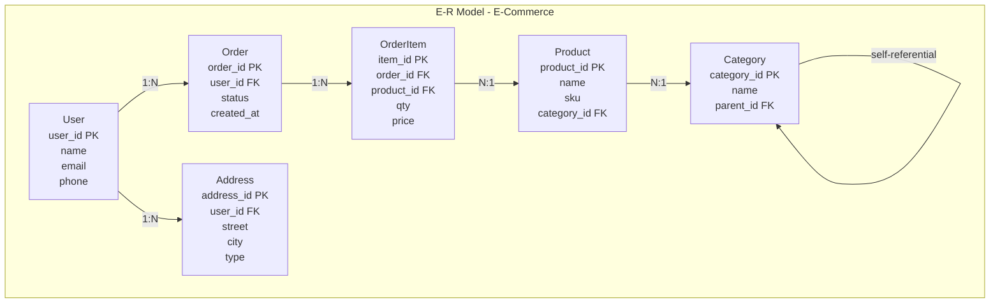
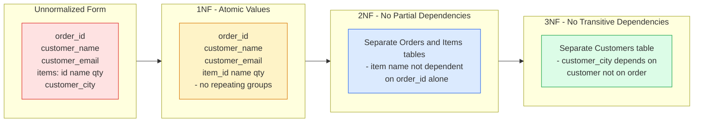
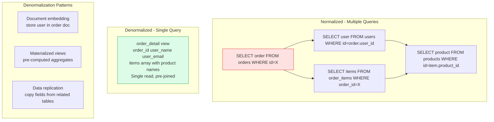
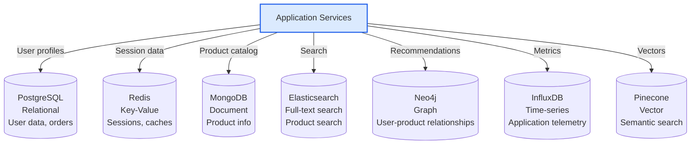

# Data Modeling

Data modeling is the process of designing the structure and relationships of data for storage and retrieval. Good data models balance normalization (preventing redundancy) with denormalization (optimizing for access patterns), and evolve with the system without costly migrations.

## Entity-Relationship Modeling

## Normalization Progression

## Denormalization Patterns

## Polyglot Persistence

## Key Concepts

- **Entity-Relationship (ER) Modeling**: A conceptual modeling technique that identifies entities (objects), their attributes, and the relationships between them. ER models are implementation-independent — they describe the domain, not the storage. Used as the basis for relational schema design.

- **First Normal Form (1NF)**: All attributes are atomic (no arrays, no multi-valued attributes), and every row is uniquely identifiable by a primary key. A table with an "items" text column containing comma-separated values is not in 1NF.

- **Second Normal Form (2NF)**: Must be in 1NF, and every non-key attribute must be fully dependent on the entire primary key (no partial dependencies). Relevant only for composite primary keys. Example: if an OrderItem table has key (order_id, product_id), the product name must not live there — it depends only on product_id.

- **Third Normal Form (3NF)**: Must be in 2NF, and no non-key attribute should depend on another non-key attribute (no transitive dependencies). If the orders table has customer_city, and customer_city depends on customer_id (which is not the PK), that's a transitive dependency — customer_city belongs in a customers table.

- **Denormalization**: Intentionally introducing redundancy to optimize read performance. Trade storage space and write complexity for faster reads. Common strategies: document embedding (store related data in one document), materialized views (pre-computed query results), and summary tables (pre-aggregated analytics).

- **Polyglot Persistence**: Using multiple different database technologies in the same application, each chosen for its strengths relative to a specific use case. An e-commerce system might use Postgres for orders, Redis for sessions, Elasticsearch for search, and a graph database for recommendations.

- **Schema Versioning**: Managing evolution of data schemas over time without breaking running applications. Strategies include: expand/contract migrations (add new columns before removing old ones), backward-compatible changes, and blue-green schema migrations.

## Trade-offs

| Approach | Benefit | Cost |
|----------|---------|------|
| High normalization | No redundancy, easy writes | Many JOINs for reads |
| Denormalization | Fast reads, fewer queries | Write complexity, consistency risk |
| Polyglot persistence | Best tool per use case | Operational complexity, data sync |
| Single model | Operational simplicity | Performance compromises |

## When to Use

- **High normalization**: OLTP systems with frequent updates and complex queries — normalize first, denormalize selectively based on measured query costs
- **Denormalization**: Read-heavy APIs, analytics, when the same data is read from many places in the same form
- **Polyglot persistence**: Large systems where different data types have genuinely different access patterns — justify each additional database with a clear need
