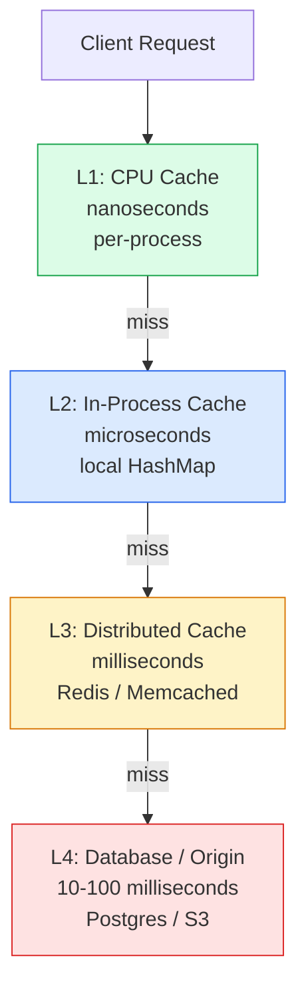
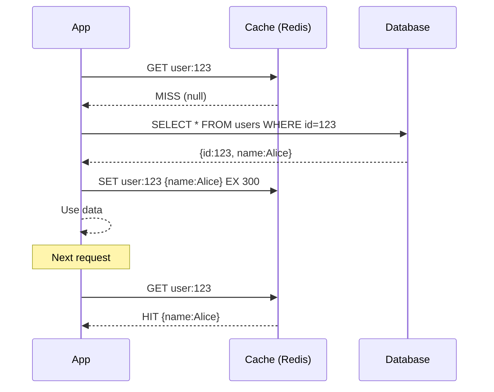
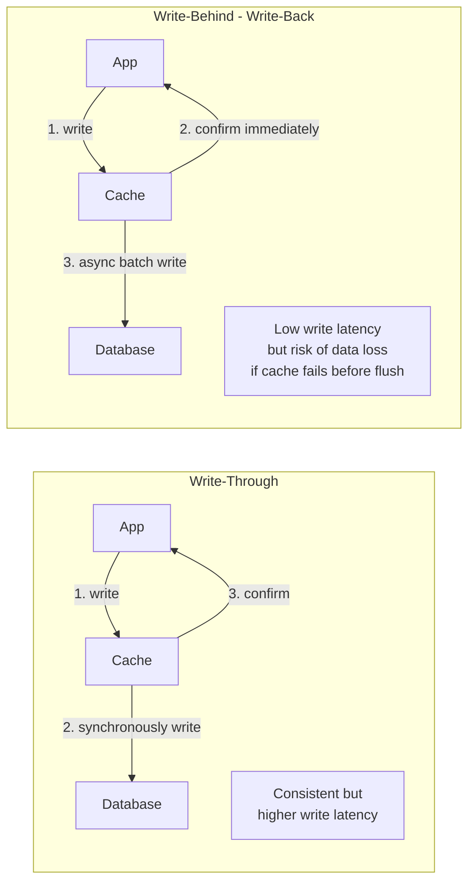
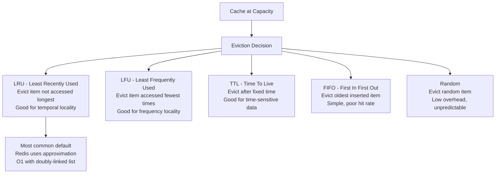
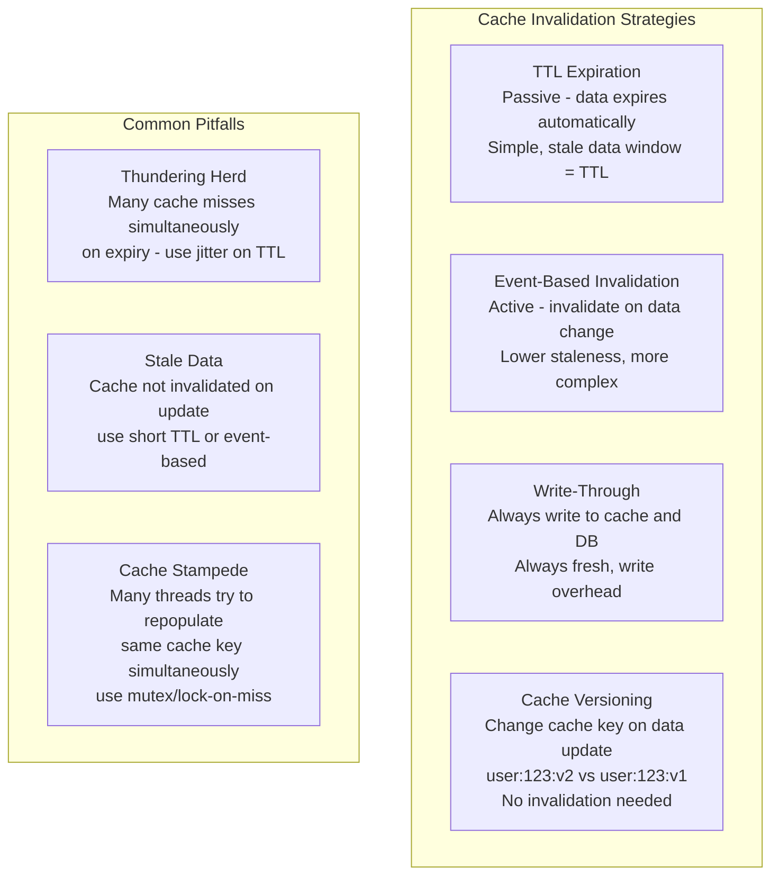

Caching stores copies of frequently accessed data in a faster storage layer (memory) to reduce latency and database load. The fundamental trade-off is between data freshness (how up-to-date cached data is) and performance (how much work is saved by serving from cache).

## Cache Architecture Layers

## Cache-Aside (Lazy Loading)

## Write-Through vs Write-Behind

## Cache Eviction Policies

## Cache Invalidation Patterns

## Key Concepts

- **Cache Hit and Miss**: A cache hit occurs when the requested data is found in the cache. A cache miss requires fetching from the slower origin (database). Cache hit rate is the primary metric — most applications target 90%+ for hot data.

- **Cache-Aside (Lazy Loading)**: The application is responsible for reading from and writing to the cache. On a miss, the application reads from the database and populates the cache. Simple to implement, but the first request after expiry always goes to the database (cold start). Most common pattern.

- **Read-Through**: The cache sits in front of the database. On a miss, the cache itself fetches from the database and stores the result. The application always talks to the cache. Simplifies application code but requires cache support for this pattern.

- **Write-Through**: Every write goes to the cache first, then synchronously to the database. Keeps cache and database always in sync. Write latency is the sum of both writes. Eliminates stale data at the cost of write performance.

- **Write-Behind (Write-Back)**: Writes go to the cache immediately (fast), and the cache asynchronously flushes to the database in batches. Excellent write throughput but risks data loss if the cache fails before flushing. Good for high-write workloads where durability is less critical.

- **Cache Eviction**: When the cache is full, the eviction policy determines what to remove. LRU (Least Recently Used) is the most common — it evicts the item that hasn't been accessed for the longest time. LFU evicts the least frequently accessed. TTL is time-based expiry.

- **Thundering Herd**: When a popular cache entry expires, many concurrent requests hit the database simultaneously to repopulate it, causing a spike. Mitigation: add random jitter to TTL, use probabilistic early expiration, or use a mutex to allow only one thread to repopulate while others wait.

- **Cache Warming**: Pre-populating the cache before a service launch or after a cache flush, to avoid a cold-start thundering herd.

## Trade-offs

| Strategy | Consistency | Write Performance | Read Performance | Complexity |
|----------|------------|-------------------|-----------------|------------|
| Cache-Aside | Stale for TTL period | Normal (DB write) | High (after warm) | Low |
| Read-Through | Stale for TTL period | Normal | High | Low |
| Write-Through | Always fresh | Lower (double write) | High | Medium |
| Write-Behind | Risk of loss on failure | Highest | High | High |

## When to Use

- **Cache-Aside**: Most common choice — use for any read-heavy workload with tolerable staleness
- **Write-Through**: When read performance AND freshness are both required
- **Write-Behind**: Write-heavy workloads (counters, analytics) where some data loss is acceptable
- **Short TTL**: When data changes frequently and staleness matters (prices, inventory levels)
- **Long TTL + Event Invalidation**: When data rarely changes but must be fresh when it does (user profiles)