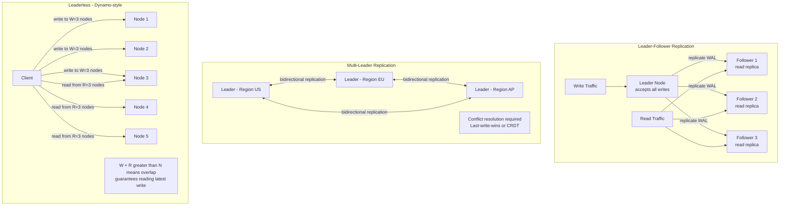
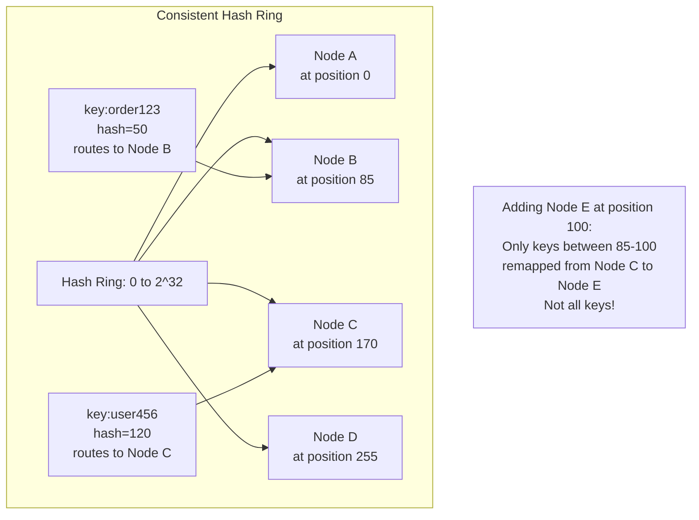
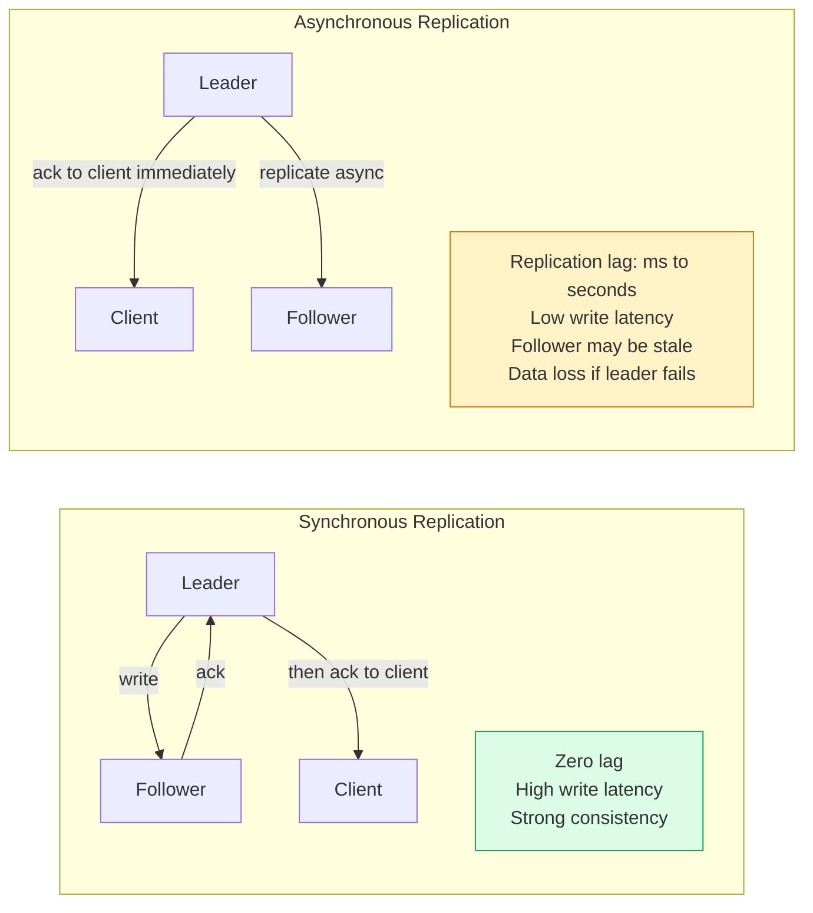

# Replication and Partitioning

Replication copies data across multiple nodes for fault tolerance and read scaling. Partitioning (sharding) distributes data across nodes to scale writes and storage beyond a single machine. These two techniques are often combined and are the foundation of all distributed database systems.

## Replication Topologies



## Partitioning Strategies

```mermaid
graph TD
    subgraph RangePartition[Range Partitioning]
        Data[All Records]
        P1[Partition 1\nA-F]
        P2[Partition 2\nG-M]
        P3[Partition 3\nN-S]
        P4[Partition 4\nT-Z]
        Data --> P1 & P2 & P3 & P4

        Note[Range scans efficient\nHot spots possible\ne.g. all orders starting with A]
    end

    subgraph HashPartition[Hash Partitioning]
        HData[Record: order_id=12345]
        Hash[hash(order_id) mod N]
        HP1[Partition 0]
        HP2[Partition 1]
        HP3[Partition 2]
        HP4[Partition 3]
        HData --> Hash --> HP1 & HP2 & HP3 & HP4

        Note2[Uniform distribution\nNo hot spots\nRange scans impossible]
    end
```

## Consistent Hashing



## Replication Lag and Consistency



## Key Concepts

- **Leader-Follower Replication**: All writes go to the leader; the leader replicates changes to followers. Reads can be served by any follower (though followers may be slightly stale). Automatic failover promotes a follower to leader when the leader fails. Used by Postgres, MySQL, MongoDB. Simple to reason about but single-node write throughput limitation.

- **Multi-Leader Replication**: Multiple nodes accept writes independently and replicate to each other. Enables writes in multiple geographic regions simultaneously (lower latency for geographically distributed users). Requires conflict resolution when the same record is concurrently updated in different regions. Techniques: last-write-wins (LWW), CRDT, application-level merge.

- **Leaderless Replication**: Any node can accept writes. Consistency is achieved via quorum: if there are N replicas and a write must succeed on W nodes and a read must query R nodes, then W + R > N guarantees reading the latest write. Used by Cassandra, DynamoDB. No single point of failure but requires anti-entropy (repair) processes to fix divergence.

- **Range Partitioning**: Data is split into ranges based on a key (e.g., alphabetically, by timestamp). Range scans are efficient. Hot spots occur when access patterns are skewed — all recent orders have the current date as the timestamp, routing all writes to the same partition.

- **Hash Partitioning**: The partition is determined by hashing the partition key. Produces uniform distribution, eliminating hot spots. Range queries require scanning all partitions. Consistent hashing minimises data movement when the number of partitions changes.

- **Consistent Hashing**: Nodes and data keys are mapped to positions on a ring. Data is routed to the next clockwise node. Adding or removing a node only affects the adjacent keys — approximately 1/N of keys are remapped, not all keys.

- **Replication Lag**: The delay between a write being applied to the leader and being visible on followers. Async replication has non-zero lag. This causes read-your-writes inconsistency — a user may not see their own recently submitted changes if their read hits a stale replica.

## Trade-offs

| Approach | Write Scale | Read Scale | Fault Tolerance | Consistency |
|----------|------------|-----------|----------------|-------------|
| Single node | Limited | Limited | Low | Strong |
| Leader-follower | Limited | High | Medium | Stale reads |
| Multi-leader | High | High | High | Conflict complexity |
| Leaderless | High | High | High | Tunable quorum |
| Range partitioning | High | Efficient ranges | Medium | Depends on replication |
| Hash partitioning | High | No range scans | Medium | Depends on replication |

## When to Use

- **Leader-Follower**: Most relational databases — Postgres, MySQL — simple and well-understood
- **Multi-Leader**: Geographically distributed systems where write latency to a single leader is unacceptable
- **Leaderless (Cassandra)**: Very high write throughput, no single point of failure, eventually consistent OK
- **Hash Partitioning**: Even load distribution across partitions, random access patterns dominate
- **Range Partitioning**: Ordered access patterns (time-series, alphabetical range scans)
