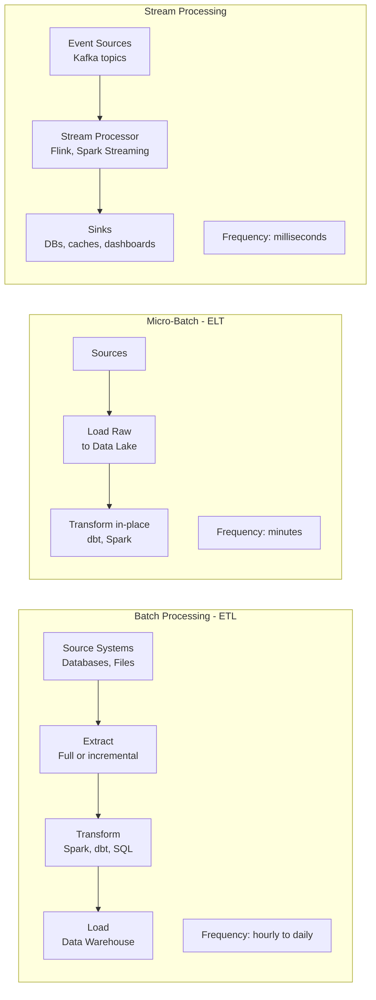
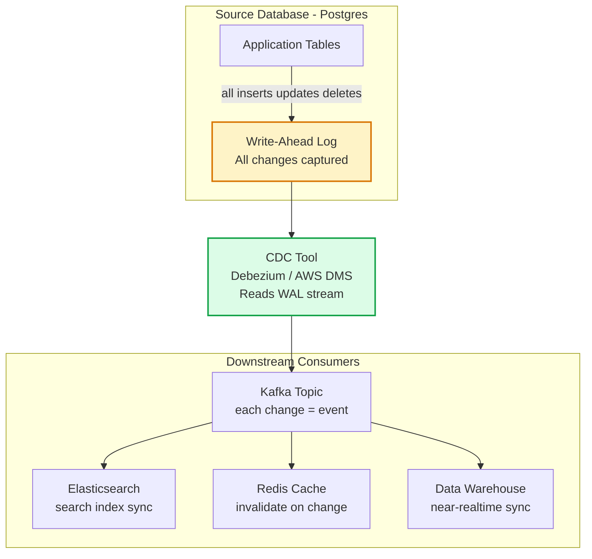
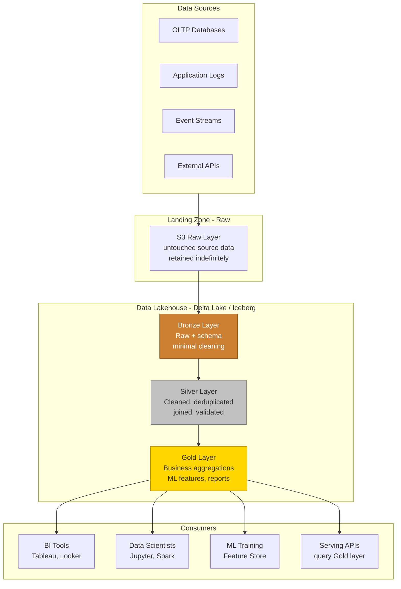
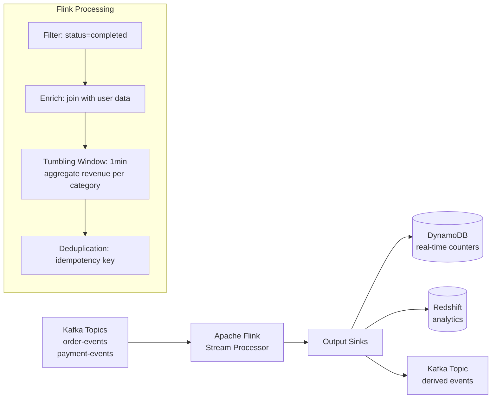

# Data Pipelines

Data pipelines move data from source systems to destinations — transforming, enriching, and validating it along the way. Pipelines range from nightly batch ETL jobs to real-time streaming architectures processing millions of events per second.

## Pipeline Architecture Spectrum

## Change Data Capture (CDC)

## Data Lakehouse Architecture

## Stream Processing Architecture

## Key Concepts

- **ETL (Extract, Transform, Load)**: Traditional batch pipeline — data is extracted from sources, transformed in a processing engine, and loaded into the target. The transformation is done before loading, meaning the data in the warehouse is always clean. Tight coupling between source and destination schemas.

- **ELT (Extract, Load, Transform)**: Data is loaded raw into the data lake/warehouse first, then transformed in-place using SQL or Spark. Enables iterative refinement of transformations without re-extracting. The modern approach with data lakehouses (dbt + BigQuery, dbt + Snowflake).

- **Change Data Capture (CDC)**: Captures row-level changes (inserts, updates, deletes) from a database's transaction log (WAL in Postgres, binlog in MySQL) as a stream of events. Enables real-time data synchronisation between systems without polling. Debezium is the leading open-source CDC tool.

- **Data Lakehouse**: Combines the low-cost storage of data lakes (S3/GCS) with the transactional features of data warehouses (ACID, schema enforcement, time travel) using open table formats (Delta Lake, Apache Iceberg, Apache Hudi). Eliminates the traditional lake/warehouse separation.

- **Bronze/Silver/Gold Layers (Medallion Architecture)**: A data organisation pattern where Bronze = raw data as-landed, Silver = cleaned and enriched, Gold = business-level aggregations ready for reporting. Each layer builds on the previous, with increasing data quality and specificity.

- **Stream Processing**: Continuous processing of unbounded data streams, typically with millisecond latency. Apache Flink provides stateful stream processing with exactly-once semantics, windowing (tumbling, sliding, session windows), and event-time processing with watermarks.

- **Watermarks**: In stream processing, a watermark is a signal to the processor indicating that all events with a timestamp up to a certain point have been observed. Watermarks allow the processor to correctly handle out-of-order events while limiting how long it waits for late data.

- **Idempotency in Pipelines**: Processing the same event multiple times produces the same result. Essential because at-least-once delivery (Kafka, SQS) can deliver duplicates. Achieved via idempotency keys, upsert operations, or exactly-once processing semantics.

## Trade-offs

| Approach | Latency | Complexity | Cost | Best For |
|---------|---------|-----------|------|---------|
| Batch ETL | Hours | Low | Low | Reporting, nightly refresh |
| Micro-batch | Minutes | Medium | Medium | Near-real-time dashboards |
| CDC | Seconds | Medium | Medium | Database sync, cache invalidation |
| Stream (Flink) | Milliseconds | High | Higher | Real-time features, fraud detection |

## When to Use

- **Batch ETL**: Historical reporting, compliance exports, when data freshness of hours is acceptable
- **ELT with dbt**: Modern analytics warehouse workloads with SQL-native transformations
- **CDC**: Whenever you need to keep downstream systems in sync with database changes without polling
- **Stream Processing**: Real-time fraud detection, live dashboards, real-time personalization, event-driven ML scoring
