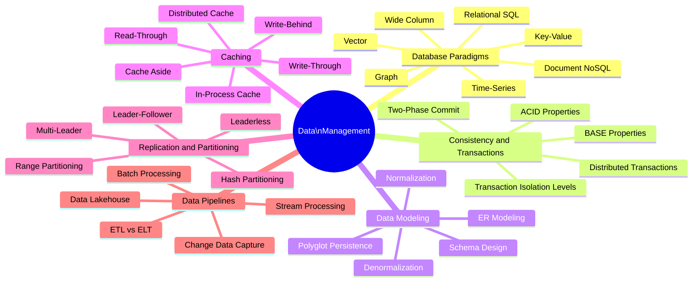

Data management covers the storage, retrieval, transformation, and movement of data at scale. The explosion of database paradigms, caching systems, and streaming platforms over the past decade means engineers must understand a broad landscape to make effective choices for their workloads.

## Overview

## Topics in This Section

| File | Topic | Key Concepts |
|------|-------|--------------|
| [01_database_paradigms.md](01_database_paradigms.md) | Database Paradigms | SQL, NoSQL types, vector DBs |
| [02_consistency_transactions.md](02_consistency_transactions.md) | Consistency & Transactions | ACID, BASE, isolation levels |
| [03_data_modeling.md](03_data_modeling.md) | Data Modeling | ER, normalization, schema design |
| [04_caching_strategies.md](04_caching_strategies.md) | Caching | Cache patterns, eviction, invalidation |
| [05_replication_partitioning.md](05_replication_partitioning.md) | Replication & Partitioning | Replication modes, sharding strategies |
| [06_data_pipelines.md](06_data_pipelines.md) | Data Pipelines | ETL/ELT, CDC, streaming, lakehouse |