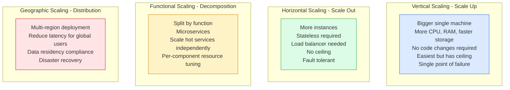
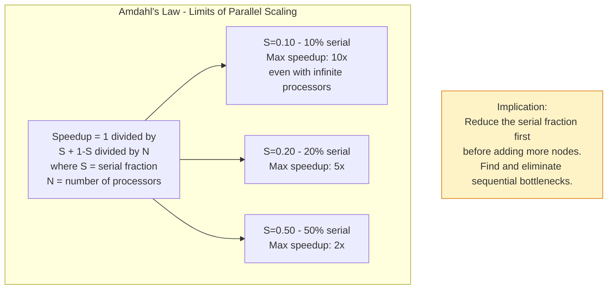
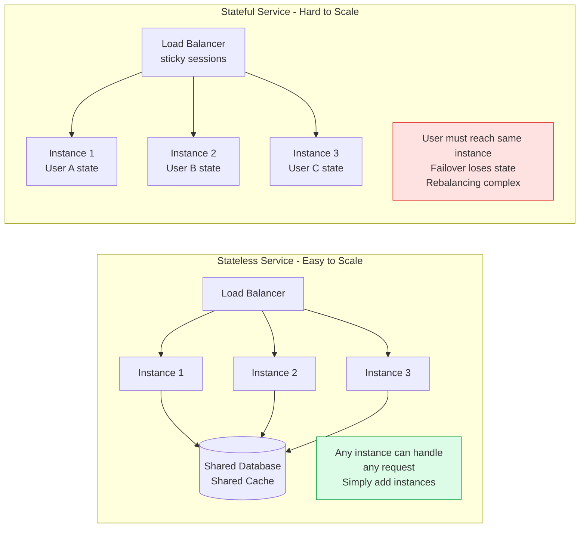
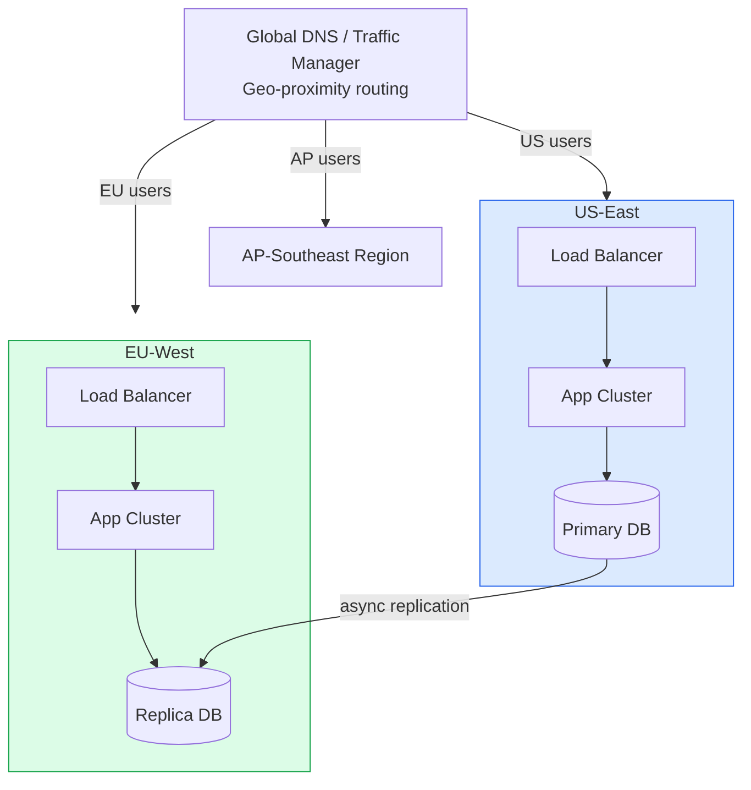

Scalability has multiple dimensions — systems can scale along compute, storage, network, and geographic axes. Understanding which dimension is the bottleneck determines the appropriate scaling strategy. Premature scaling optimizations are expensive; late scaling decisions cause outages.

## Scaling Dimensions

## Amdahl's Law

## Stateless vs Stateful Scaling

## Multi-Region Architecture

## Key Concepts

- **Vertical Scaling**: Adding more resources (CPU, RAM, disk, network bandwidth) to an existing machine. The path of least resistance — no application changes required. Hardware limits eventually cap vertical scaling. Modern cloud instances (AWS x1e.32xlarge: 3.9TB RAM, 128 vCPUs) push the ceiling very high before horizontal scaling is forced.

- **Horizontal Scaling**: Adding more instances of a service, distributing load via a load balancer. Requires stateless service design — each instance must be able to handle any request independently. Theoretically unlimited but introduces distributed systems complexity.

- **Functional Decomposition**: Splitting a monolith into services that can be scaled independently based on their specific resource needs. A payment service (CPU-bound, low volume) and a search service (IO-bound, high volume) have different optimal instance types.

- **Amdahl's Law**: The theoretical maximum speedup from parallelization is bounded by the sequential fraction of the program. If 20% of execution is sequential, the maximum possible speedup is 5x regardless of how many parallel processors are added. The takeaway: identify and eliminate sequential bottlenecks before scaling horizontally.

- **Gustafson's Law**: Counter to Amdahl's Law — as the problem size grows, the serial fraction typically stays constant while the parallel portion grows. Adding more processors allows solving larger problems in the same time, even if per-problem speedup is bounded.

- **Stateless Design**: Services that store no session state locally can be horizontally scaled trivially — any instance can serve any request. State must be externalised to databases, caches, or object storage. The twelve-factor app principle: store state in backing services, not in process memory.

- **Database Bottleneck**: The database is typically the first horizontal scaling bottleneck in web applications. Mitigation strategies: read replicas (scale reads), caching (reduce load), connection pooling (reduce connection overhead), partitioning/sharding (scale writes and storage).

## Trade-offs

| Approach | Benefit | Cost |
|----------|---------|------|
| Vertical | Simple, no code changes | Ceiling, expensive at top end, SPOF |
| Horizontal | Theoretically unlimited, fault tolerant | Statelessness required, LB needed |
| Functional decomposition | Right-sized resources per service | Microservices complexity |
| Multi-region | Global performance, DR | Data consistency, cost |
| Read replicas | Scale reads cheaply | Stale reads, replication lag |

## When to Use

- **Vertical first**: For most systems, vertical scaling buys time cheaply — scale vertically until the cost or ceiling forces horizontal
- **Horizontal**: When vertical ceiling is reached or when fault tolerance requires multiple instances
- **Functional decomposition**: When clear bottlenecks exist in specific capabilities that need independent scaling
- **Multi-region**: When user latency to a single region is unacceptable, or when disaster recovery and data residency requirements mandate it