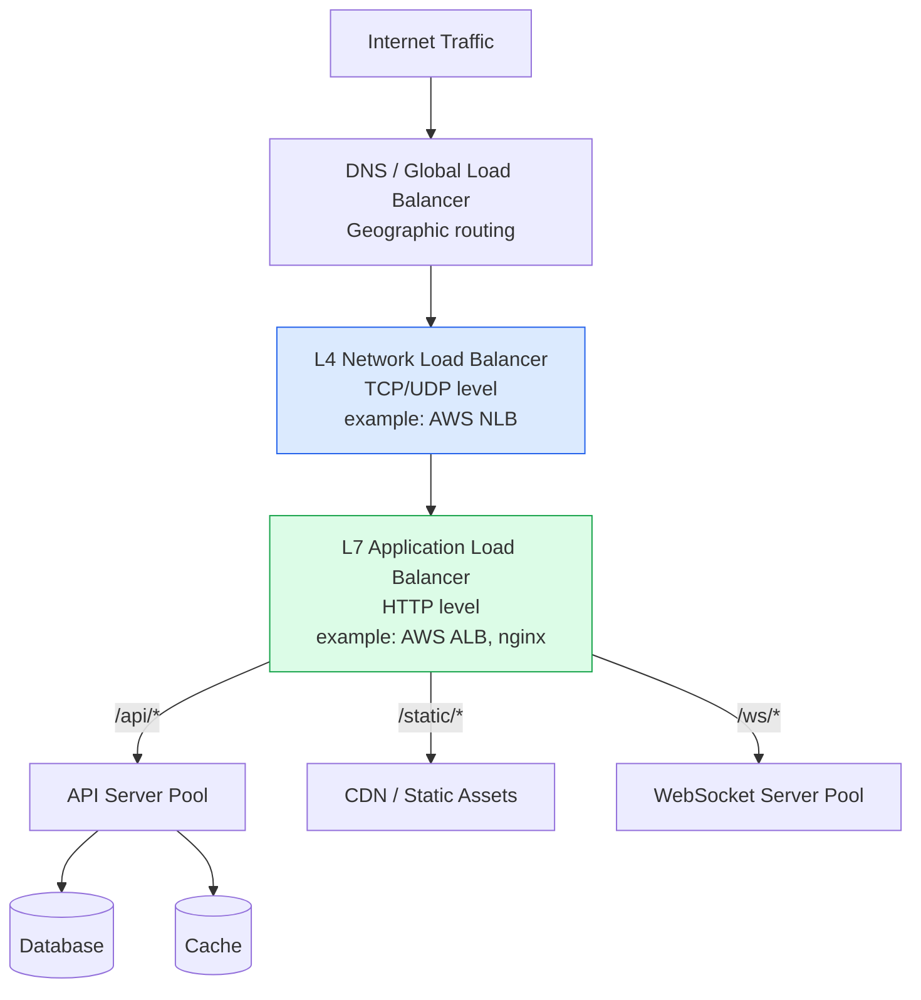
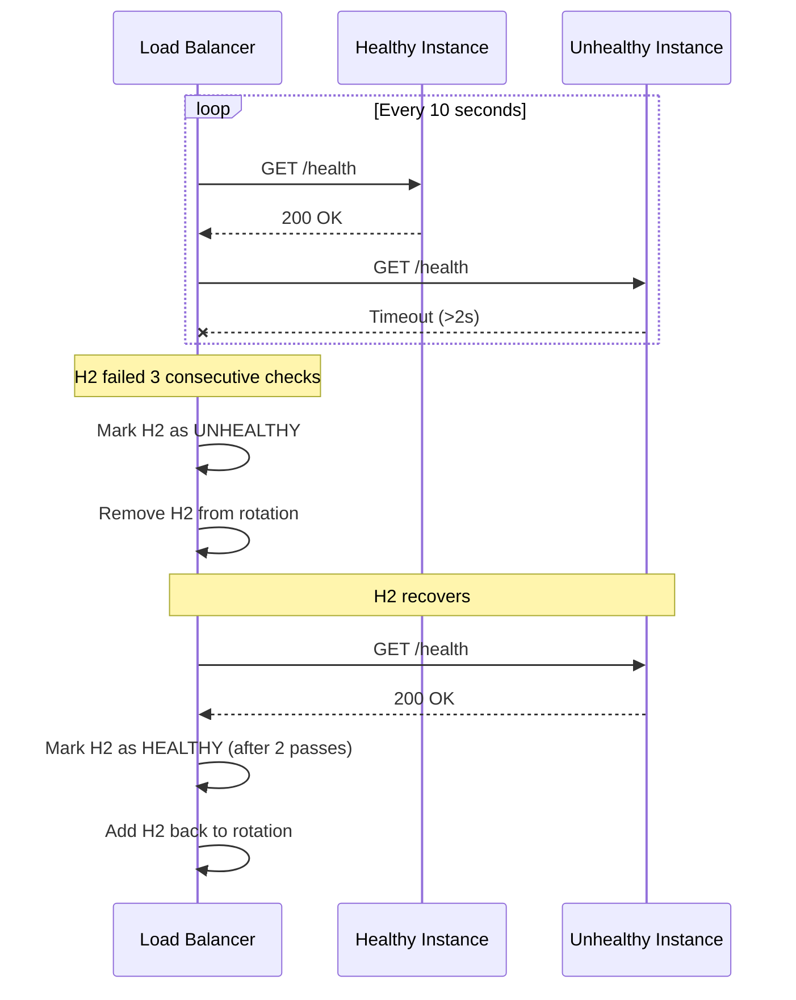
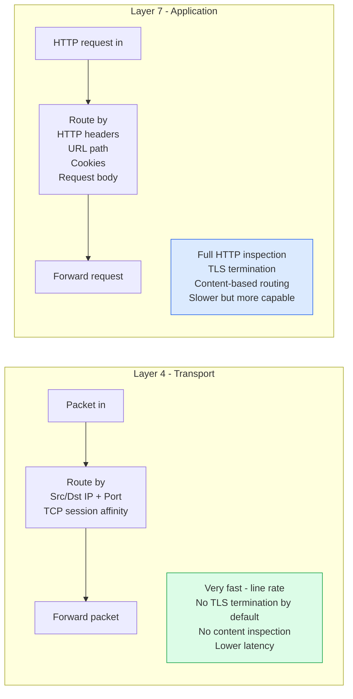

# Load Balancing

Load balancing distributes incoming network traffic across multiple backend instances to maximize throughput, minimize latency, and ensure no single server becomes a bottleneck. Load balancers also provide health checking and automatic failover.

## Load Balancer Architecture



## Load Balancing Algorithms

```mermaid
graph TD
    subgraph Algorithms[Load Balancing Algorithms]
        RR[Round Robin\nA B C A B C\nEqual weight rotation\nSimplest, uniform load assumption]

        WRR[Weighted Round Robin\nA A A B B C\nWeight by server capacity\nGood for heterogeneous servers]

        LC[Least Connections\nRoute to server with\nfewest active connections\nGood for variable request duration]

        WLC[Weighted Least Connections\nLeast connections divided by weight\nBest for heterogeneous servers\nwith variable workload]

        IPH[IP Hash\nhash(client_ip) mod N\nSame client = same server\nSession affinity without cookies]

        RandP2[Random Pick of 2\nSample 2 random servers\nPick least loaded of the 2\nO1 approximates optimal]
    end
```

## Health Checking



## Layer 4 vs Layer 7



## Key Concepts

- **L4 Load Balancer**: Operates at the transport layer, routing TCP/UDP connections based on IP addresses and ports. Does not inspect packet contents. Extremely fast (often hardware-accelerated). Cannot route based on HTTP paths, headers, or cookies. Used for very high-throughput TCP traffic. Examples: AWS Network Load Balancer, HAProxy in TCP mode.

- **L7 Load Balancer**: Operates at the application layer, inspecting HTTP requests. Can route based on URL path (`/api/` vs `/static/`), headers, cookies, query parameters, or request body. Enables advanced features: SSL termination, request transformation, rate limiting, WAF, canary deployments. Examples: NGINX, AWS ALB, Envoy.

- **Round Robin**: Distributes requests in rotation. Assumes equal server capacity and equal request cost. Simplest algorithm. Works well when requests have similar resource consumption and servers are homogeneous.

- **Least Connections**: Routes each new request to the server with the fewest active connections. Better than round robin for long-lived connections (WebSockets, file uploads) where connection count correlates with load. Requires centralized state tracking.

- **Weighted Round Robin**: Assigns a weight to each server proportional to its capacity. A 4-core server gets 4x the requests of a 1-core server. Useful when backend instances have different hardware specifications.

- **Power of Two Choices (P2C)**: Pick two servers at random, send to the one with fewer active connections. Provides near-optimal load distribution in O(1) without centralized coordination. Used in Envoy and modern service meshes.

- **Session Affinity (Sticky Sessions)**: Routes a client's requests to the same backend instance. Necessary for stateful sessions but undermines horizontal scaling. Prefer externalising session state to eliminate stickiness requirements.

- **Health Checking**: Load balancers continuously probe backends with health checks. Failing backends are removed from rotation. Passive health checking (detecting errors on real traffic) is faster but harsher; active health checking (synthetic probes) is more conservative but catches failures before users are impacted.

## Trade-offs

| Algorithm | Use Case | Limitation |
|-----------|----------|-----------|
| Round Robin | Homogeneous servers, uniform requests | Poor for variable request cost |
| Least Connections | Variable request duration | State tracking overhead |
| IP Hash | Session affinity | Uneven distribution if few clients |
| Weighted Round Robin | Heterogeneous servers | Requires manual weight configuration |
| Power of Two Choices | Best general-purpose | Requires connection count from instances |

## When to Use

- **L4 LB**: When raw throughput and minimal latency overhead are the primary requirements (high-volume TCP services, UDP-based protocols)
- **L7 LB**: Default for HTTP services — enables content-based routing, SSL termination, health checking at the application level
- **Least Connections**: Long-lived connections, WebSockets, streaming services
- **Round Robin**: Stateless HTTP services with uniform request profiles
- **No sticky sessions**: Design stateless services to eliminate the stickiness requirement entirely
