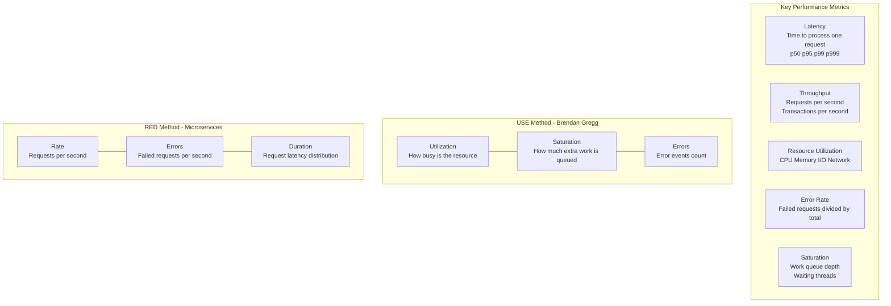
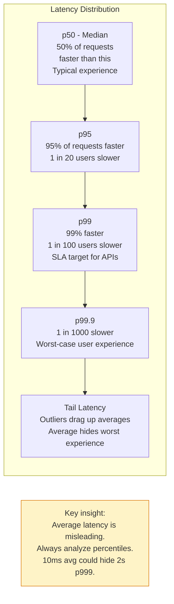
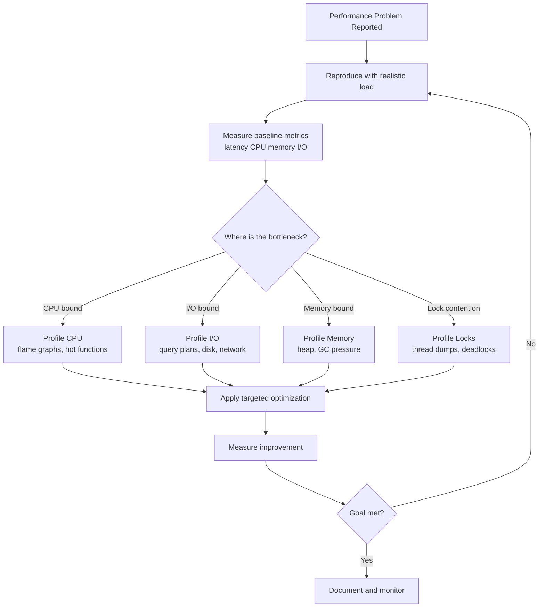
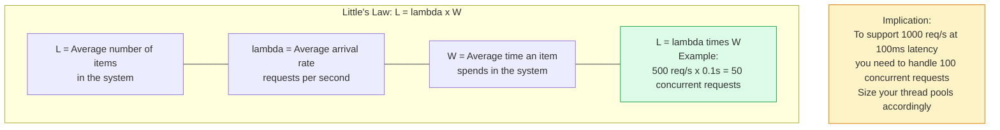

Performance engineering is the systematic process of measuring, analyzing, and improving system performance. It involves understanding latency distributions, identifying bottlenecks through profiling, applying optimizations, and validating improvements under realistic load.

## Performance Measurement Framework

## Latency Percentiles

## Profiling and Bottleneck Identification

## Little's Law

## Key Concepts

- **Latency vs Throughput Trade-off**: Optimizing for throughput (batching, larger requests) often increases per-request latency. Optimizing for latency (avoid batching, eager processing) reduces throughput. Most systems need to balance both — the operating point depends on workload characteristics.

- **Percentile Metrics (p50, p95, p99)**: Average latency hides the worst-case user experience. The p99 latency is the 99th percentile — 1 in 100 requests takes longer than this. SLAs are typically expressed as p95 or p99 guarantees. High tail latency often indicates resource contention, GC pauses, or queue build-up.

- **Flame Graphs**: A visualization of profiling data where each stack frame is a horizontal bar, width proportional to CPU time. Allows quick identification of hot code paths without reading raw profiling output. Created by Brendan Gregg; available for CPU, memory, and off-CPU profiling.

- **USE Method (Utilization, Saturation, Errors)**: A methodology for checking every resource (CPU, memory, disk, network) for: how busy it is (utilization), how much work is queued (saturation), and how often it fails (errors). Start with the resource showing the highest utilization or saturation.

- **Red Method (Rate, Errors, Duration)**: Three signals to monitor for every microservice — the rate of requests, the rate of errors, and the distribution of request durations. Sufficient for diagnosing most service-level performance problems.

- **Little's Law**: L = λW. The average number of items in a system (L) equals the arrival rate (λ) multiplied by the average time in the system (W). Fundamental for capacity planning — knowing expected RPS and target latency gives you the required concurrency.

- **Connection Pooling**: Creating and destroying database connections on each request is expensive (hundreds of milliseconds for TCP + TLS + auth). Connection pools maintain a set of pre-established connections and reuse them. Pool size tuning: too small causes waiting; too large exhausts DB connection limits.

- **N+1 Query Problem**: A common ORM anti-pattern where a query to fetch N objects is followed by N additional queries to fetch each object's relations. For 100 orders, 101 SQL queries are issued. Fix: use JOIN or eager loading (SELECT IN with batch).

## Trade-offs

| Optimization | Benefit | Risk |
|---|---|---|
| Caching | Reduced DB load, lower latency | Stale data |
| Connection pooling | Reduced connection overhead | Pool exhaustion |
| Batching | Higher throughput | Higher latency |
| Async processing | Non-blocking | Complex error handling |
| Index tuning | Faster queries | Write overhead, disk space |
| Denormalization | Fewer JOINs | Data consistency risk |

## When to Apply

- Profile before optimizing — never guess at bottlenecks; always measure
- Fix the highest-impact bottleneck first (Amdahl's Law — the serial bottleneck limits total speedup)
- Set performance budgets: define p99 and p999 latency targets and alert when they are exceeded
- Use load testing (k6, Gatling, Locust) to validate performance under realistic traffic patterns before production