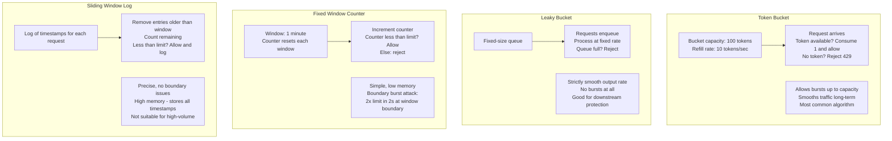
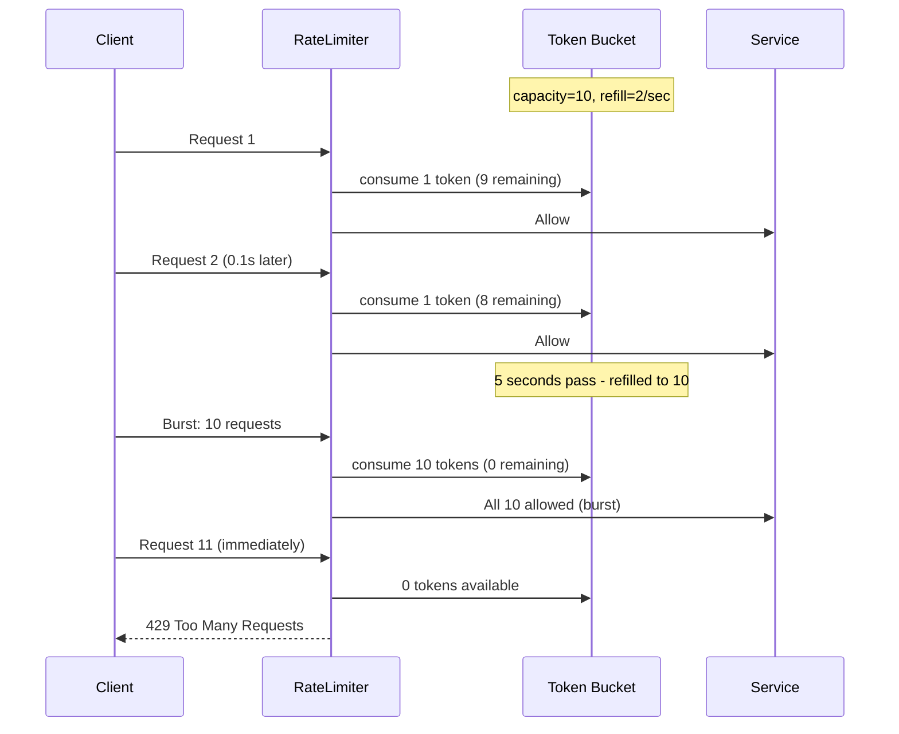
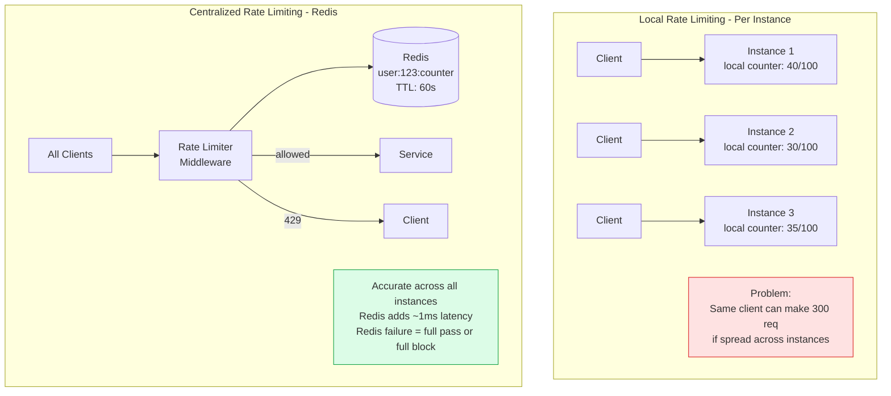
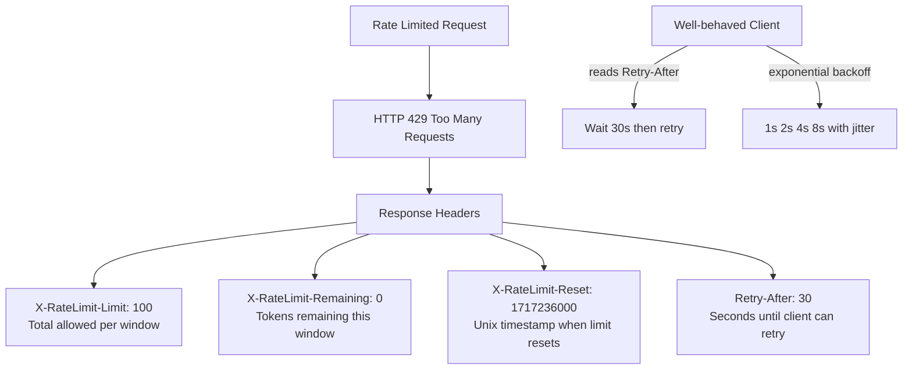

Rate limiting controls the rate at which clients can make requests to a service, protecting it from abuse, overload, and denial-of-service attacks. A well-designed rate limiter is fair, accurate at scale, and adds minimal latency to the request path.

## Rate Limiting Algorithms

## Token Bucket Algorithm

## Distributed Rate Limiting

## Rate Limit Response Design

## Key Concepts

- **Token Bucket**: Tokens are added to a bucket at a constant rate (refill rate). Each request consumes one token. If the bucket is empty, the request is rejected. The bucket capacity defines the burst allowance. Most popular algorithm — it allows short bursts while controlling average rate.

- **Leaky Bucket**: Requests are added to a queue (the "bucket"). Requests are processed from the queue at a constant rate (the "leak rate"). If the queue is full, new requests are rejected. Unlike token bucket, this strictly limits the output rate — no bursts. Used when downstream services must receive a smooth request rate.

- **Fixed Window Counter**: Divide time into fixed windows (e.g., 1 minute). Maintain a counter per client per window. Reset the counter at the window boundary. Simple to implement (Redis INCR with EXPIRE), but vulnerable to boundary bursts: a client can make 2x the limit by making requests at the end of one window and the start of the next.

- **Sliding Window Log**: Maintain a log of request timestamps for each client. On each request, remove timestamps older than the window, count remaining, and allow if count < limit. Precise but memory-intensive — not suitable for millions of clients.

- **Sliding Window Counter**: A hybrid — track the current window counter and the previous window counter. Estimate the count in the sliding window as: prev_count * ((window_length - time_in_current_window) / window_length) + current_count. Low memory, accurate approximation, widely used.

- **Rate Limit Keys**: The entity being rate limited can be: IP address (simple, easily spoofed), API key/client ID (per application), user ID (per user), or endpoint (per route). A layered approach combines multiple keys.

- **Distributed Rate Limiting**: In a multi-instance deployment, local counters are inaccurate because requests are spread across instances. Centralized rate limiting uses Redis with atomic operations (INCR + EXPIRE, or Lua scripts for token bucket) to maintain accurate counts. Redis Cluster provides high availability.

## Trade-offs

| Algorithm | Accuracy | Memory | Burst Handling | Complexity |
|-----------|---------|--------|--------------|------------|
| Fixed Window | Low (boundary attack) | Very Low | Allows 2x limit at boundary | Low |
| Sliding Window Log | Exact | High | Exact | Medium |
| Sliding Window Counter | ~99% accurate | Low | Smooth | Medium |
| Token Bucket | High | Low | Explicit burst capacity | Medium |
| Leaky Bucket | High | Low | No bursts | Low |

## When to Use

- **Token Bucket**: Default for API rate limiting — allows natural bursts while controlling average rate
- **Leaky Bucket**: When downstream services need a strictly metered input rate
- **Sliding Window Counter**: When accuracy and memory efficiency are both required at high scale
- **Fixed Window**: Acceptable only for low-value rate limits where boundary attacks don't matter
- **Centralized (Redis-based)**: All production rate limiters with more than one instance