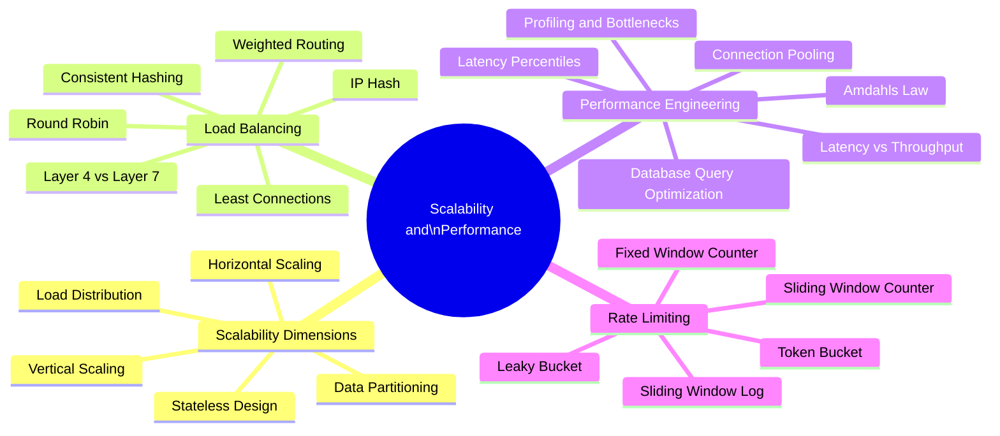

# Scalability and Performance

Scalability is the ability of a system to handle growing amounts of work by adding resources. Performance is the efficiency with which a system uses those resources. At scale, these two properties must be co-designed — a system can be scalable but slow, or fast but brittle under load.

## Overview

## Topics in This Section

| File | Topic | Key Concepts |
|------|-------|--------------|
| [01_scalability_dimensions.md](01_scalability_dimensions.md) | Scalability Dimensions | Vertical, horizontal, functional, geographic |
| [02_load_balancing.md](02_load_balancing.md) | Load Balancing | Algorithms, L4 vs L7, health checks |
| [03_performance_engineering.md](03_performance_engineering.md) | Performance Engineering | Profiling, latency, Amdahl's law |
| [04_rate_limiting.md](04_rate_limiting.md) | Rate Limiting | Algorithms, distributed rate limiting |
