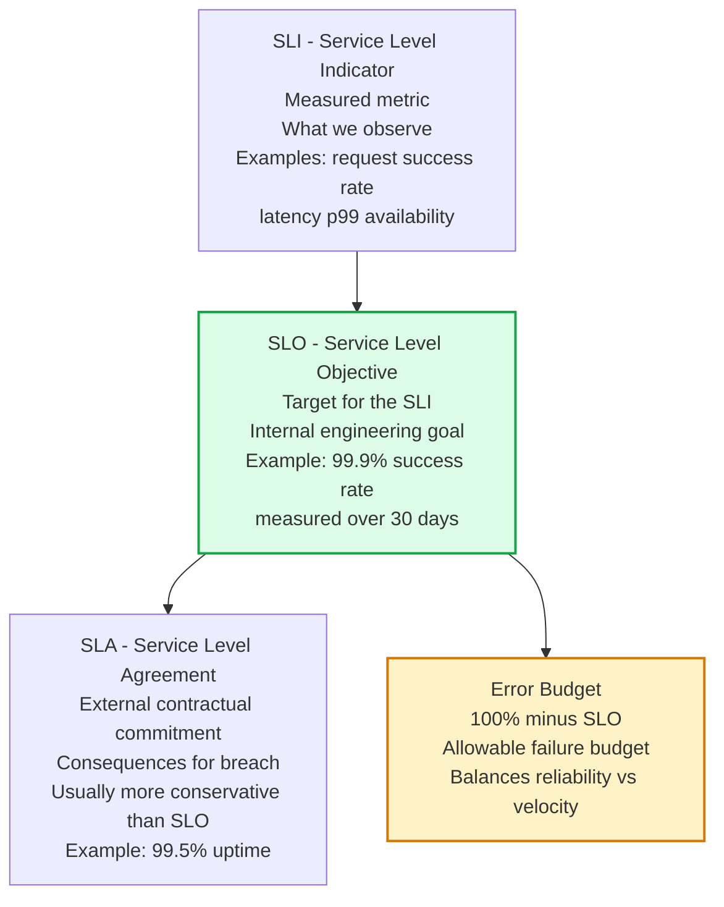
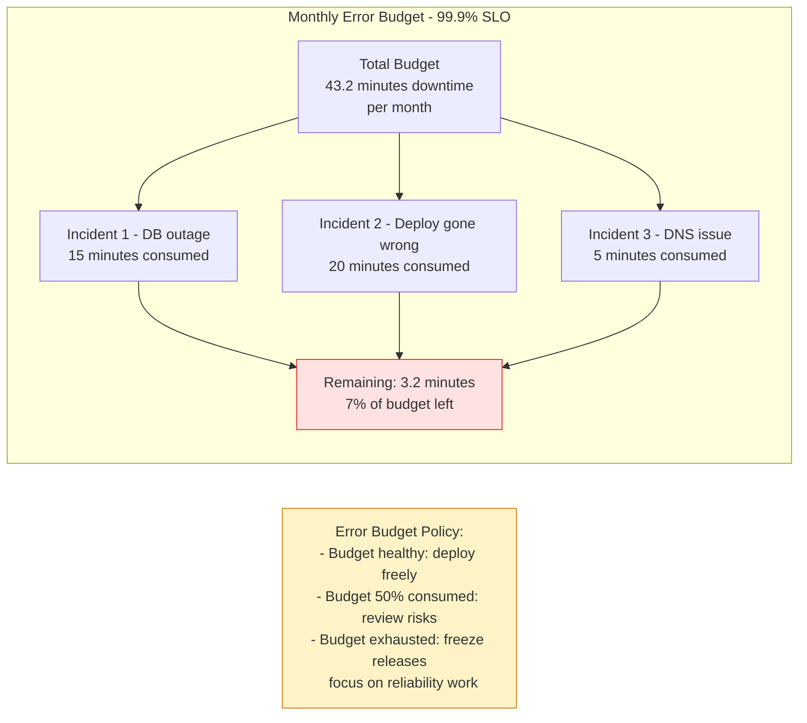
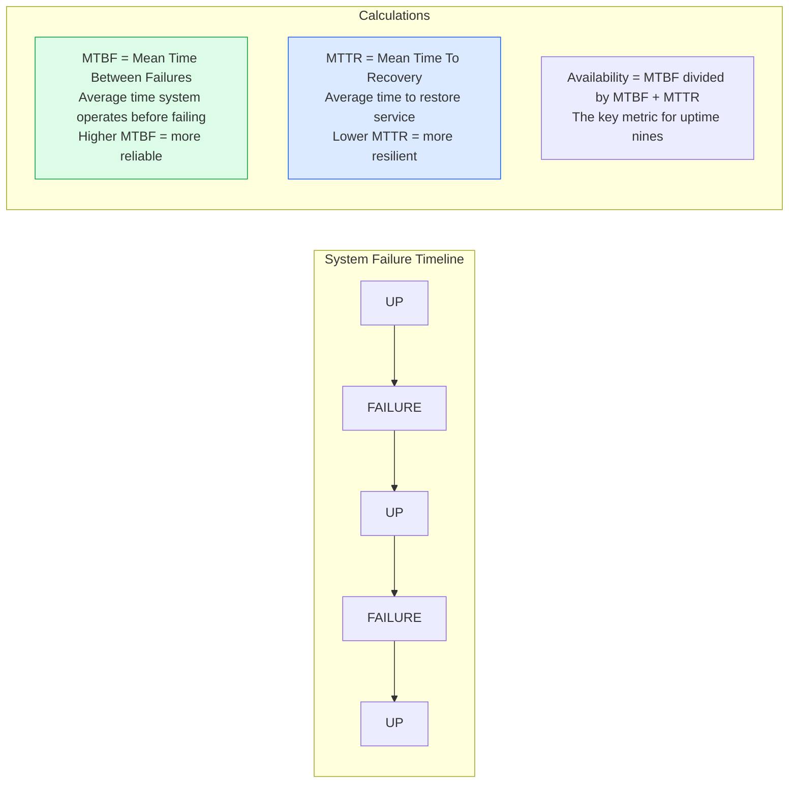
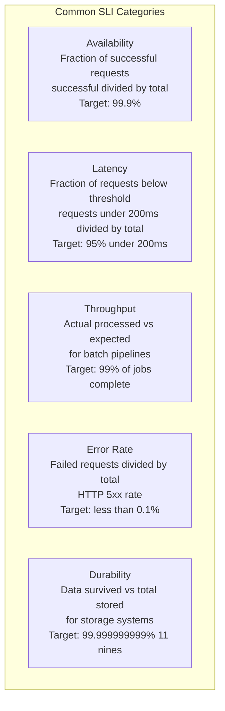

Reliability engineering provides a structured vocabulary and measurement framework for reasoning about system dependability. SLIs, SLOs, and error budgets transform vague reliability aspirations into measurable, actionable engineering targets.

## SLI, SLO, SLA Hierarchy

## Error Budget Consumption

## MTBF, MTTR, and Availability

## Common SLIs

## Key Concepts

- **SLI (Service Level Indicator)**: A measurable property of a service used to assess its reliability. Must be: quantifiable (a number), representative of user experience, and meaningful to the business. Good SLIs: request success rate (not "is the server up" but "are users getting successful responses"), p99 latency.

- **SLO (Service Level Objective)**: A target value or range for an SLI, measured over a specific time window. Internal — not a customer commitment. The SLO defines the engineering quality goal. Example: "99.9% of API requests return 2xx over a rolling 30-day window."

- **SLA (Service Level Agreement)**: A contractual commitment to customers with financial or legal consequences for breach. SLAs are typically more conservative than SLOs (e.g., SLO is 99.9%, SLA is 99.5%) — the gap provides a buffer.

- **Error Budget**: (100% - SLO%) × time. The amount of reliability the service is allowed to "spend" on failures, deployments, and experiments. If the SLO is 99.9%, the error budget is 0.1% = 43.2 minutes per month. Error budgets align engineering effort — when budget is abundant, teams can ship faster; when exhausted, reliability work takes priority over features.

- **MTBF (Mean Time Between Failures)**: Average time the system operates between failures. A higher MTBF means fewer failures. Improving MTBF requires better hardware, better code quality, and better testing.

- **MTTR (Mean Time To Recovery)**: Average time from failure detection to full service restoration. Improving MTTR requires better alerting (detect faster), runbooks, on-call training, and automation. MTTR improvement often has more ROI than MTBF improvement.

- **Availability = MTBF / (MTBF + MTTR)**: Even with frequent failures (low MTBF), high availability is achievable with very fast recovery (low MTTR). For critical services, invest in MTTR reduction first.

## Trade-offs

| Target | Benefit | Cost |
|--------|---------|------|
| Higher SLO (99.99%) | Better user experience | 10x engineering effort per nine |
| Lower SLO (99%) | Development velocity | Users experience more downtime |
| Tight error budget | Forces reliability investment | Can block feature deployments |
| Loose error budget | More deployment freedom | Reliability debt accumulates |

## When to Apply

- Define SLOs before incidents, not during — reactive reliability targets are set under pressure
- Set SLOs slightly above what you can currently achieve — aspirational but reachable
- Review SLOs quarterly as the system and user expectations evolve
- Always set an SLO for your most critical user journeys first