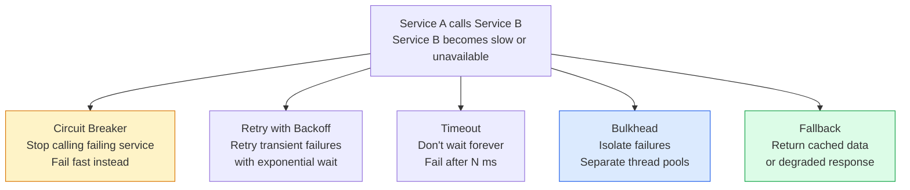
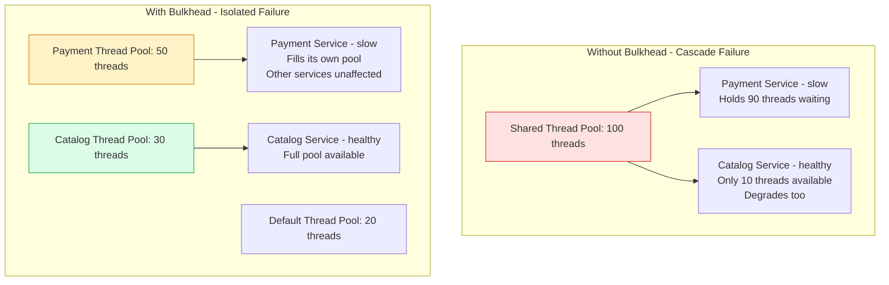
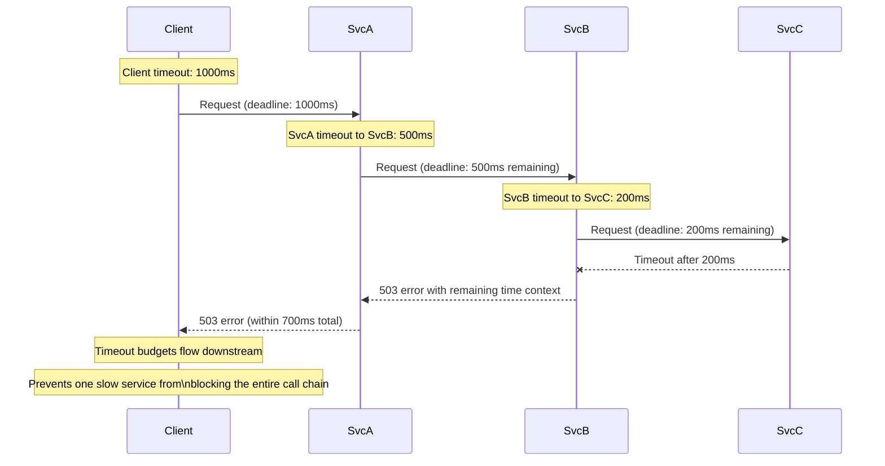
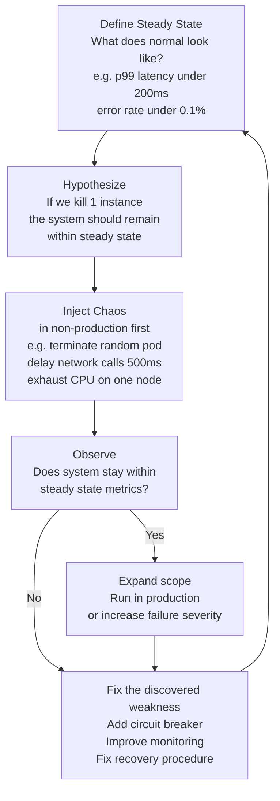

# Resilience Patterns

Resilience patterns make systems robust against partial failures, resource exhaustion, and cascade effects. A resilient system degrades gracefully under load and recovers automatically — without requiring human intervention for every failure mode.

## Resilience Pattern Overview

## Bulkhead Pattern

## Timeout Cascade Prevention

## Chaos Engineering

## Key Concepts

- **Timeout**: Every outbound call must have an explicit timeout. Without timeouts, a hanging downstream service causes threads to wait indefinitely, eventually exhausting the thread pool. Timeouts should be cascaded: the outermost timeout must be shorter than the sum of all downstream timeouts to prevent the caller from timing out before getting a response.

- **Retry with Exponential Backoff**: Automatically retry failed operations with increasing wait times. Only appropriate for idempotent operations and transient errors (network blip, temporary overload). Always add jitter to prevent synchronized retry storms. Set a maximum retry count to avoid infinite retries.

- **Circuit Breaker**: Monitors failure rates for a service dependency. When failures exceed a threshold, the circuit "opens" — subsequent calls fail immediately without attempting the downstream call. After a cooldown, the circuit "half-opens" to probe recovery. Prevents cascading failures and allows failing services to recover without being overwhelmed.

- **Bulkhead**: Allocates separate resource pools for different dependencies. If one dependency becomes slow or unresponsive, only its bulkhead fills — other dependencies retain their own pools. Named after ship compartments that prevent sinking by containing flooding to a section.

- **Fallback**: When a dependency fails, return a degraded but acceptable response. Examples: return cached data, return an empty list, return a default recommendation, or return a user-facing message explaining partial functionality. Fallbacks must be designed at the feature level — what is "good enough" when the real answer is unavailable?

- **Chaos Engineering**: The discipline of intentionally injecting failures into a system to find weaknesses before they manifest as incidents. Based on the scientific method: define steady state, hypothesize, experiment, observe, improve. Netflix Chaos Monkey is the original implementation.

- **Graceful Degradation**: A system under partial failure continues to serve core functionality while degrading non-critical features. Example: a product page still shows the product without reviews if the review service is down.

- **Hedging (Speculative Retry)**: Send the same request to multiple backends simultaneously and use the first response. Reduces tail latency at the cost of increased resource utilisation. Used when p99 latency is critical and extra load on backends is acceptable.

## Trade-offs

| Pattern | Benefit | Cost |
|---------|---------|------|
| Timeout | Prevents indefinite blocking | May fail valid slow operations |
| Retry | Hides transient failures | Can amplify load on struggling service |
| Circuit Breaker | Prevents cascade failures | Delayed recovery detection |
| Bulkhead | Failure isolation | Resource underutilisation |
| Fallback | User experience preserved | May serve stale data |
| Chaos Engineering | Finds weaknesses before incidents | Risk (even in controlled environments) |

## When to Use

- **Timeout**: Always — on every outbound call without exception
- **Retry**: Idempotent operations with transient failure patterns (network blips, rate limits)
- **Circuit Breaker**: All synchronous calls to external services
- **Bulkhead**: When multiple downstream dependencies have different reliability characteristics
- **Fallback**: For non-critical features where a degraded response is better than an error
- **Chaos Engineering**: After basic observability and on-call processes are mature
