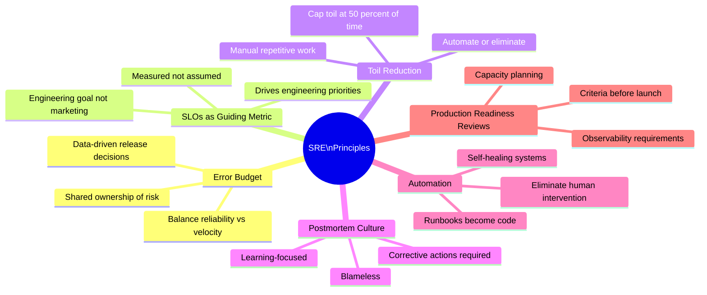
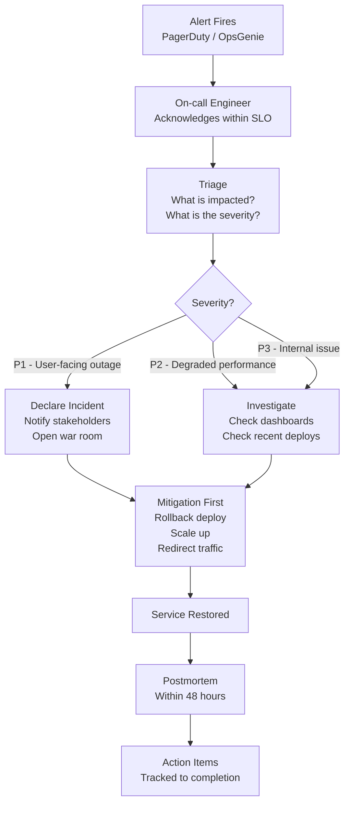
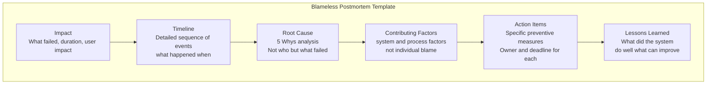
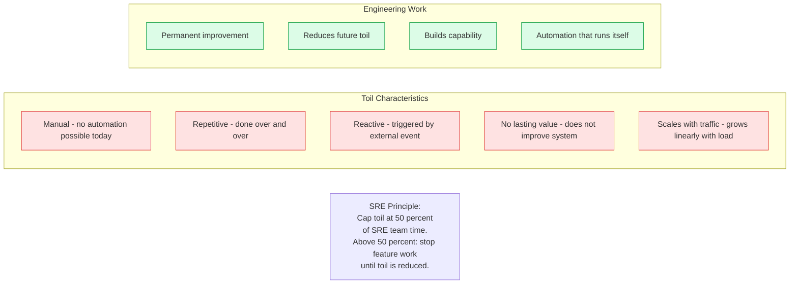
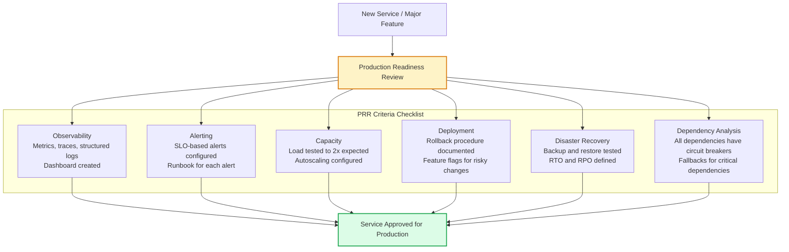

# Site Reliability Engineering (SRE)

Site Reliability Engineering is the discipline of applying software engineering to operations problems — automating toil, defining reliability standards through SLOs, and building systems that are easy to operate. SRE was formalized at Google and has since been adopted broadly as the operational counterpart to DevOps.

## SRE Principles

## On-Call Process

## Blameless Postmortem Structure

## Toil vs Engineering Work

## Production Readiness Review (PRR)

## Key Concepts

- **Error Budget**: The 1 - SLO reliability budget that the service is allowed to "spend" on failures, experiments, and deployments. The error budget creates a shared incentive between SRE and product teams — when budget is plentiful, both teams want to ship features; when exhausted, reliability investment takes priority.

- **Toil**: Manual, repetitive, reactive operational work that scales linearly with service growth and provides no lasting value. Examples: manually restarting crashed pods, manually clearing a queue, manually running a database cleanup script. SRE teams should cap toil at 50% of their time; excess toil triggers automation investment.

- **Blameless Postmortem**: A structured retrospective after an incident focused on understanding what failed in the system (not who was at fault) and creating action items to prevent recurrence. Blamelessness is essential — blame-focused postmortems cause engineers to hide problems and discourage honest reporting.

- **Toil Automation**: Every piece of toil should be a candidate for automation. The process: document the runbook for the manual process, then convert the runbook into code. Self-healing systems (automated remediation) are the goal — the system detects and fixes its own problems without human intervention.

- **Production Readiness Review (PRR)**: A structured checklist-based review that a service must pass before being allowed to serve production traffic. Ensures observability, alerting, capacity, deployment safety, and disaster recovery are all addressed before launch.

- **Error Budget Policy**: The documented policy for what happens when the error budget is exhausted. Typically: freeze non-emergency deployments, redirect engineering capacity to reliability improvements, require higher testing standards for next releases.

- **Capacity Planning**: Forecasting resource requirements based on growth projections and traffic patterns. Load tests verify that the service can handle 2-5x current peak traffic before a deployment that might drive increased load.

## Trade-offs

| SRE Practice | Benefit | Cost |
|---|---|---|
| Error budget policy | Aligns reliability/velocity incentives | Can block feature development |
| Blameless postmortems | Learning culture, honest reporting | Requires leadership buy-in |
| Toil automation | Reduces operational burden | Upfront engineering time |
| PRR | Prevents production fires | Slows initial deployment |
| Chaos engineering | Finds weaknesses early | Operational risk |

## When to Apply

- Start with SLOs and basic observability before anything else — you cannot improve what you cannot measure
- Introduce PRRs when the service is nearing production — too early wastes effort on changing systems
- Error budget policy requires organizational maturity — start with lighter-weight versions (SLO dashboards, weekly reviews)
- SRE practices scale: small teams should apply the principles without the full ceremony
