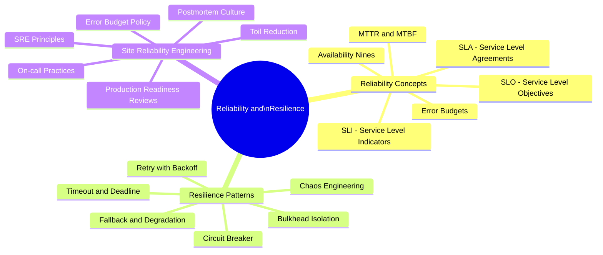
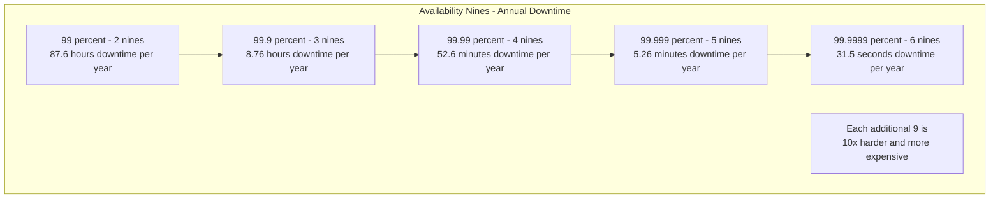

# Reliability and Resilience

Reliability is a system's ability to function correctly over time. Resilience is its ability to maintain acceptable behaviour in the face of failures. In distributed systems, failures are not exceptional events — they are the norm. The question is not whether components will fail, but how gracefully the system handles those failures.

## Overview

## Availability Calculation

## Topics in This Section

| File | Topic | Key Concepts |
|------|-------|--------------|
| [01_reliability_concepts.md](01_reliability_concepts.md) | Reliability Concepts | SLI/SLO/SLA, error budgets, MTTR |
| [02_resilience_patterns.md](02_resilience_patterns.md) | Resilience Patterns | Circuit breaker, bulkhead, chaos |
| [03_sre.md](03_sre.md) | SRE | Error budget policy, toil, postmortems |
