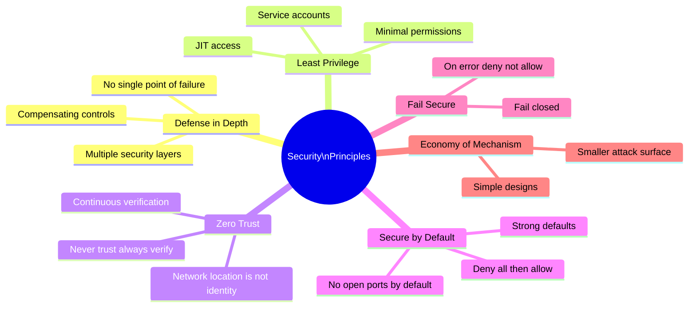
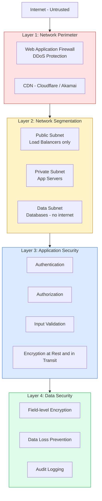
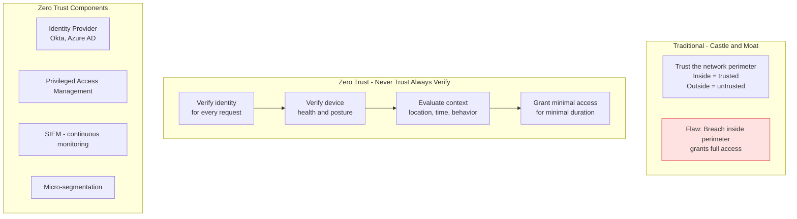

Security principles are foundational guidelines that shape the design of secure systems. Applying these principles during design is orders of magnitude cheaper than remediating vulnerabilities after deployment. Security is not a feature — it is a property of the system.

## Core Security Principles

## Defense in Depth

## Zero Trust Architecture

## Key Concepts

- **Defense in Depth**: Layer multiple independent security controls so that if one layer is bypassed, others still protect the asset. No single security control should be the only barrier between an attacker and sensitive data. Layers include: network perimeter, network segmentation, host security, application security, data encryption, audit logging.

- **Least Privilege**: Every process, user, and service should have the minimum permissions necessary to perform its function. A read-only service should have read-only database credentials. An application should not run as root. Just-In-Time (JIT) access grants elevated permissions only for the duration needed.

- **Zero Trust**: Security model that assumes no implicit trust based on network location. Every request must be authenticated and authorized, regardless of whether it originates from inside or outside the corporate network. "Never trust, always verify" — the replacement for castle-and-moat perimeter security.

- **Secure by Default**: Systems should be configured securely out of the box. Default configurations should deny all, require authentication, use strong encryption, and expose minimal functionality. Users who need more permissive configurations should explicitly enable it.

- **Fail Secure**: When a security check fails (error, timeout, unavailable), the system should deny access rather than allow it. An authentication service that crashes should prevent access, not grant it. Fail-open is a common and dangerous anti-pattern.

- **Economy of Mechanism**: Keep security mechanisms as simple as possible. Complex security systems are harder to reason about, more likely to have subtle bugs, and more expensive to audit. Simplicity reduces attack surface.

- **Complete Mediation**: Every access to every object must be checked for authorization, every time. Caching authorization decisions must account for permission changes between cache population and access.

## Trade-offs

| Principle | Security Benefit | Operational Cost |
|-----------|----------------|-----------------|
| Least privilege | Limits breach scope | Access management overhead |
| Zero trust | Eliminates lateral movement | Higher authentication overhead |
| Defense in depth | No single failure is fatal | More infrastructure to maintain |
| Secure by default | Reduces accidental exposure | May block legitimate use |
| Fail secure | Prevents access on error | May cause availability impact |

## When to Apply

- Apply least privilege to all service accounts, IAM roles, and database users from day one
- Adopt zero trust when moving workloads to cloud or when remote work eliminates network perimeter as a security boundary
- Defense in depth should guide all architecture reviews — ask "what happens if this control fails?"