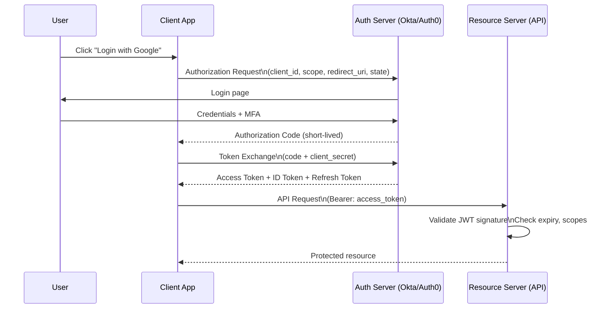
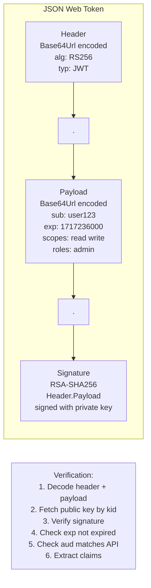
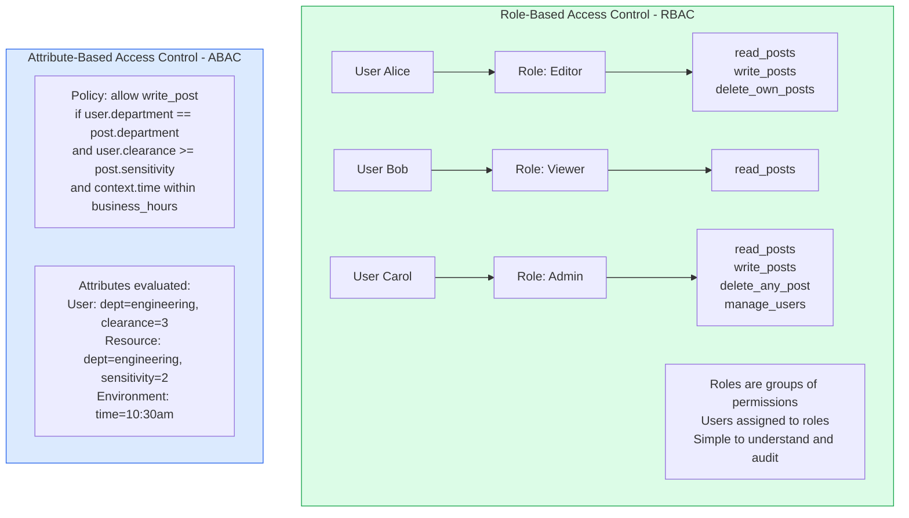

Authentication (AuthN) verifies identity — who are you? Authorization (AuthZ) verifies permission — what are you allowed to do? These are distinct concerns that must be carefully designed for security, usability, and maintainability.

## OAuth 2.0 and OIDC Flow



## JWT Structure



## RBAC vs ABAC



## Multi-Factor Authentication

```mermaid
graph TD
    subgraph Factors[MFA Factor Categories]
        Know[Something You Know\nPassword, PIN, Security questions]
        Have[Something You Have\nTOTP app, Hardware key FIDO2\nSMS OTP, Email OTP]
        Are[Something You Are\nBiometrics: fingerprint\nface, voice]
    end

    subgraph Strength[MFA Strength]
        Weak[SMS OTP - weak\nSIM swapping attacks]
        Medium[TOTP app - medium\nPhishing resistant if used with bound certs]
        Strong[FIDO2 / WebAuthn - strong\nPhishing resistant by design\nCryptographic binding to origin]
    end

    Know + Have --> MFA[Multi-Factor Authentication]
    Know + Are --> MFA
    Have + Are --> MFA

    style Strong fill:#dcfce7,stroke:#16a34a
    style Weak fill:#fee2e2,stroke:#dc2626
```

## Key Concepts

- **OAuth 2.0**: An authorization framework, not an authentication protocol. Enables a client application to obtain delegated access to resources on behalf of a resource owner (user). Tokens (access tokens) grant scoped permissions without sharing credentials. The four grant types: Authorization Code (web apps), PKCE (SPAs/mobile), Client Credentials (service-to-service), Device Code (TVs/CLI).

- **OpenID Connect (OIDC)**: An authentication layer on top of OAuth 2.0 that adds the ID token (a JWT containing user identity claims). OIDC enables SSO — once authenticated with the identity provider, users are authenticated across all relying party applications.

- **JWT (JSON Web Token)**: A self-contained token format with three Base64URL-encoded parts: header (algorithm), payload (claims), and signature. The signature allows the recipient to verify authenticity without querying the issuer. JWTs should be short-lived (15-60 minutes) to limit exposure if stolen. Never store sensitive data in JWT payload (it's encoded, not encrypted).

- **RBAC (Role-Based Access Control)**: Users are assigned to roles; roles are assigned permissions. Simpler to understand and audit than ABAC. Best for systems with a small number of distinct roles and clear permission boundaries. Limitation: cannot express context-dependent or attribute-dependent access rules.

- **ABAC (Attribute-Based Access Control)**: Access decisions are based on attributes of the subject (user), resource, and environment, evaluated against policies. Highly flexible — can express "users can access their own data" or "access is allowed only from corporate network during business hours." More complex to implement and audit.

- **API Keys**: Long-lived opaque credentials for service-to-service or developer API access. Unlike JWTs, API keys are not self-describing — the server must look them up in a database to determine permissions. Must be hashed before storage (treat like passwords). Rotate regularly.

- **Password Hashing**: Passwords must be hashed with a slow, salted hashing algorithm designed for passwords: bcrypt, Argon2id, or scrypt. SHA-256/MD5 are NOT acceptable for password storage — they are too fast and allow brute-force attacks.

## Trade-offs

| Approach | Security | Flexibility | Complexity |
|----------|----------|-------------|-----------|
| Session cookies | Good | Low | Low |
| JWT (stateless) | Good | Medium | Medium |
| OAuth 2.0 + OIDC | Excellent | High | High |
| RBAC | Good | Low (rigid roles) | Low |
| ABAC | Excellent | Very high | High |
| SMS MFA | Weak (SIM swap) | High (universal) | Low |
| FIDO2/WebAuthn | Excellent (phishing-resistant) | Medium | Medium |

## When to Use

- **OAuth 2.0 + OIDC**: Any application with user login — do not implement custom authentication
- **Client Credentials**: Service-to-service authentication (service account tokens)
- **RBAC**: Most applications — start with RBAC and add ABAC only when role explosion occurs
- **FIDO2**: High-security applications — require hardware keys for privileged users and admins
- **Short-lived JWTs**: All token-based authentication — combine with refresh tokens for session persistence