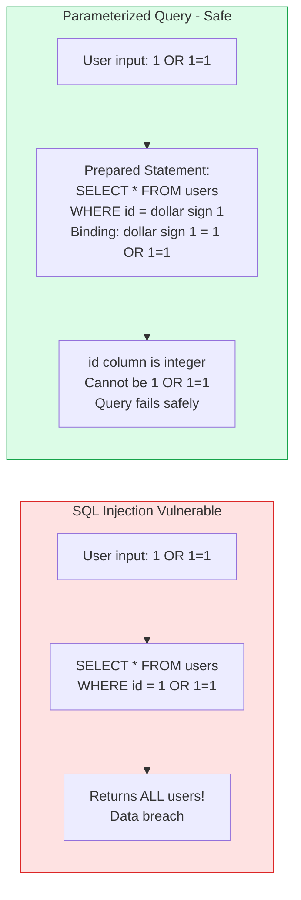
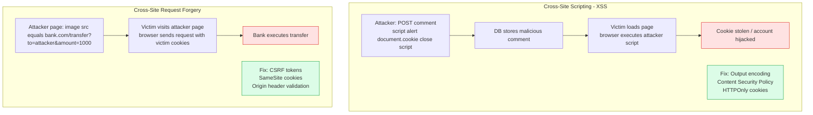
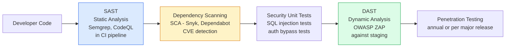

Application security addresses vulnerabilities in software code and design. The OWASP Top 10 provides the canonical list of critical web application security risks. Addressing these during development is far cheaper than remediating them after deployment.

## OWASP Top 10 Overview

```mermaid
graph TD
    OWASP[OWASP Top 10 - 2021]

    OWASP --> A1[A01 - Broken Access Control\nMost critical\nUnauthorized data access]
    OWASP --> A2[A02 - Cryptographic Failures\nWeak encryption\nData exposed in transit or at rest]
    OWASP --> A3[A03 - Injection\nSQL NoSQL Command LDAP\nUntrusted data sent to interpreter]
    OWASP --> A4[A04 - Insecure Design\nMissing security controls\nThreat modeling not done]
    OWASP --> A5[A05 - Security Misconfiguration\nDefault credentials\nOpen S3 buckets\nVerbose error messages]
    OWASP --> A6[A06 - Vulnerable Components\nOutdated dependencies\nKnown CVEs]
    OWASP --> A7[A07 - Authn and Authn Failures\nWeak passwords\nNo MFA\nExposed session tokens]
    OWASP --> A8[A08 - Software and Data Integrity\nInsecure CI/CD\nNo signature verification]
    OWASP --> A9[A09 - Security Logging Failures\nNo audit logs\nSecurity events not alerted]
    OWASP --> A10[A10 - SSRF\nServer-Side Request Forgery\nFetch arbitrary URLs]

    style A1 fill:#fee2e2,stroke:#dc2626
    style A3 fill:#fee2e2,stroke:#dc2626
```

## SQL Injection Prevention

## XSS and CSRF

## Security Testing Pipeline

## Key Concepts

- **SQL Injection**: Untrusted data is inserted into SQL queries as code, allowing attackers to manipulate queries. Prevention: always use parameterized queries (prepared statements) or an ORM that uses them internally. Never concatenate user input into SQL strings. ORMs are not inherently safe if raw query methods are used with string concatenation.

- **Cross-Site Scripting (XSS)**: Attacker injects malicious scripts into content served to other users' browsers. Stored XSS: malicious script is persisted in the database. Reflected XSS: malicious script is reflected in the response immediately. DOM XSS: client-side JavaScript manipulates the DOM insecurely. Prevention: output encoding, Content Security Policy (CSP), HttpOnly cookies.

- **CSRF (Cross-Site Request Forgery)**: A malicious site tricks a user's browser into making an authenticated request to another site using the user's credentials. Prevention: CSRF tokens (unique per session, verified server-side), SameSite cookie attribute (Strict or Lax), checking the Origin/Referer header.

- **SSRF (Server-Side Request Forgery)**: A vulnerability where the server can be induced to make HTTP requests to arbitrary URLs, including internal services. An attacker can use this to reach cloud metadata endpoints (AWS IMDSv1 at 169.254.169.254) and steal IAM credentials. Prevention: validate and allowlist URLs the server can fetch, block metadata IPs, use IMDSv2.

- **SAST (Static Application Security Testing)**: Analyzes source code for security vulnerabilities without executing it. Fast, integrated into CI pipelines. Produces false positives — requires tuning. Examples: Semgrep, CodeQL, SonarQube, Checkmarx.

- **DAST (Dynamic Application Security Testing)**: Tests a running application by sending malicious inputs and observing responses. Finds vulnerabilities that SAST misses (runtime configuration, business logic flaws). Examples: OWASP ZAP, Burp Suite. Slower than SAST — typically run against staging environments.

- **SCA (Software Composition Analysis)**: Inventories third-party dependencies and checks them against CVE databases. Snyk, Dependabot, OWASP Dependency-Check. Critical — the log4shell vulnerability (Log4j2, CVE-2021-44228) affected millions of applications through a transitive dependency.

## Trade-offs

| Control | Effectiveness | Developer Friction |
|---------|-------------|-------------------|
| Parameterized queries | High | Low (ORM handles it) |
| Output encoding | High | Low (templating engines) |
| CSP headers | High | Medium (policy tuning) |
| SAST in CI | Medium | Low |
| DAST | High | Medium (staging required) |
| Penetration testing | Very high | Low (external team) |

## When to Apply

- Parameterized queries: always — no exceptions
- Output encoding: whenever rendering user-controlled data in HTML
- CSRF tokens: all state-changing requests from browser clients
- Dependency scanning: run in every CI pipeline, block on high/critical CVEs
- SAST: integrate into CI pipelines as a non-blocking informational check initially, harden over time