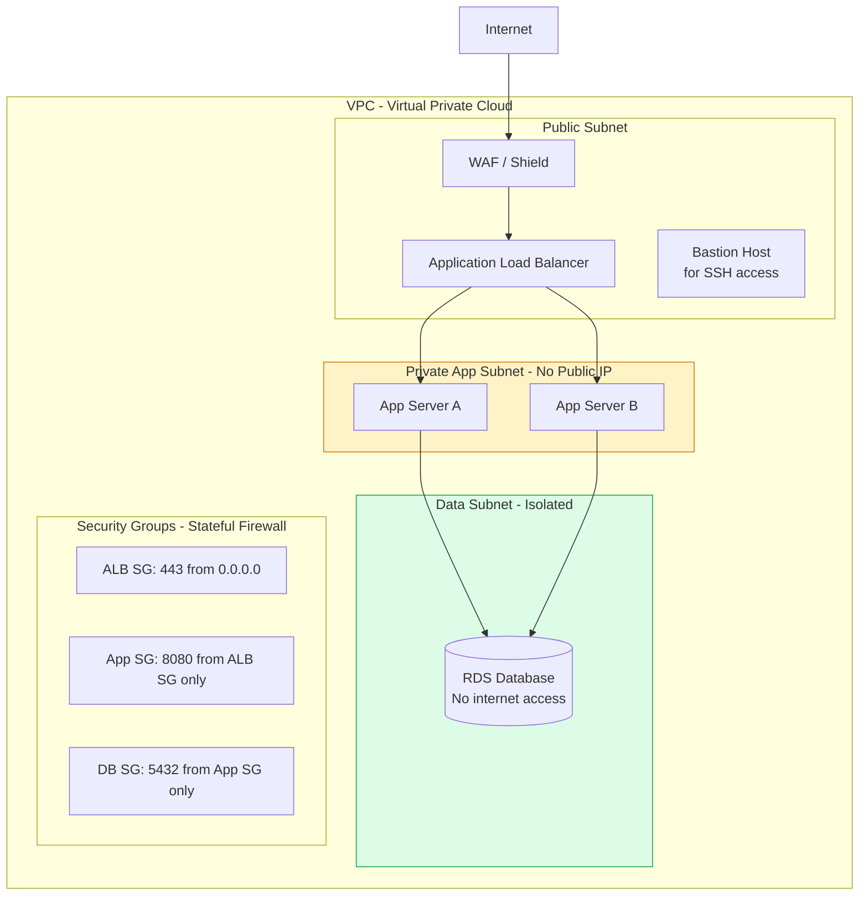
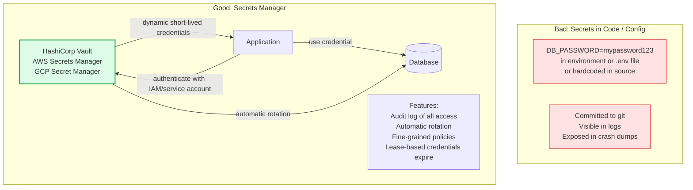
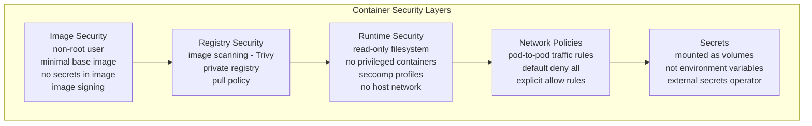

Infrastructure security protects the compute, network, and storage layers that run applications. Cloud environments require explicit security configuration — the shared responsibility model means the cloud provider secures the infrastructure, but tenants must secure everything they deploy on it.

## Network Security Architecture

## Secrets Management

## Container Security

## Key Concepts

- **VPC and Network Segmentation**: Isolate resources into subnets by trust level. Public subnets contain internet-facing resources (load balancers). Private subnets contain application servers with no public IPs. Data subnets contain databases with no internet access. Security groups (stateful firewalls) enforce which subnets can communicate with which.

- **Security Groups**: Virtual firewalls that control inbound and outbound traffic for resources. Rules reference other security groups rather than IP ranges — application servers allow traffic from the load balancer's security group, databases allow traffic from the application server's security group. This ensures only expected traffic flows regardless of IP changes.

- **Secrets Management**: Never store secrets (database passwords, API keys, TLS certificates) in environment variables, configuration files, or source code. Use a secrets manager that: encrypts secrets at rest and in transit, provides fine-grained access control per service, maintains an audit log of all secret accesses, and supports automatic rotation.

- **Dynamic Secrets (Vault)**: HashiCorp Vault can generate short-lived database credentials on demand (dynamic secrets). Applications request credentials from Vault, receive credentials valid for 1 hour, use them, then discard them. A breach of those credentials is limited to the lease duration.

- **WAF (Web Application Firewall)**: Inspects HTTP traffic and blocks malicious requests based on rules. Provides protection against OWASP Top 10 attacks, bot traffic, and DDoS at the application layer. AWS WAF, Cloudflare WAF, and ModSecurity are common implementations.

- **Container Security**: Run containers with non-root users, read-only root filesystems, and minimal capabilities (seccomp profiles drop Linux capabilities not needed). Never run privileged containers. Scan images for CVEs before deployment. Sign images with Cosign/Notary for supply chain integrity.

- **IAM Least Privilege**: Cloud IAM roles should be scoped to the minimum actions on the minimum resources. Prefer IAM roles over access keys. Rotate access keys regularly. Use IAM conditions to restrict access to specific resource tags, regions, or time windows.

- **mTLS Between Services**: All internal service-to-service communication should use mTLS to authenticate service identities and encrypt traffic. In a service mesh (Istio, Linkerd), this is automated — certificates are issued by the mesh CA and rotated automatically.

## Trade-offs

| Control | Security Benefit | Operational Cost |
|---------|----------------|-----------------|
| Network segmentation | Limits lateral movement | VPC design complexity |
| Secrets manager | No hardcoded secrets | App must authenticate to secrets manager |
| Dynamic secrets | Short credential lifetime | Vault operational complexity |
| WAF | Blocks known attacks | False positive management |
| Container security hardening | Reduces container escape risk | More restrictive runtime |

## When to Apply

- Network segmentation: from day one — retrofitting VPC structure is painful
- Secrets management: replace all environment-variable secrets before production launch
- WAF: all internet-facing services
- Container hardening: enabled by default in production; relaxed only with explicit justification
- mTLS: all production internal service traffic in microservices architectures