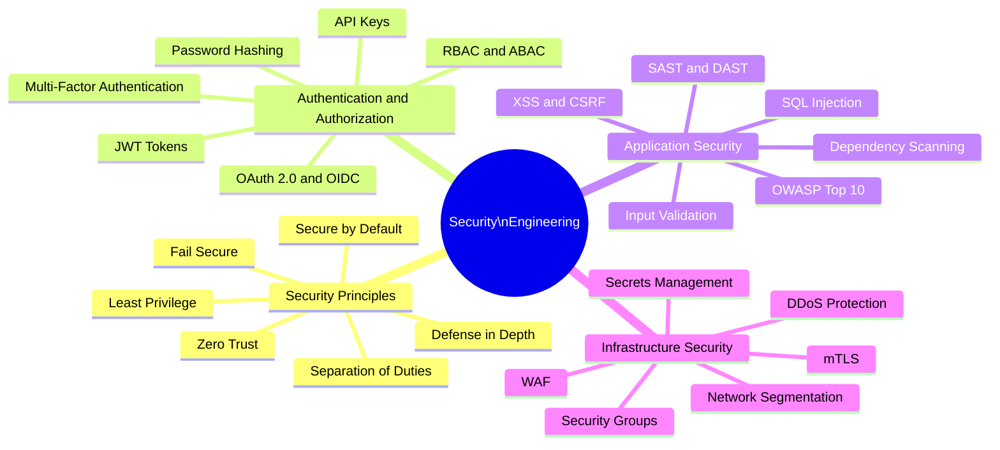

# Security Engineering

Security engineering applies engineering discipline to protecting systems from unauthorized access, data breaches, and service disruption. Security must be designed in from the start — retrofitting security is expensive and incomplete.

## Overview

## Topics in This Section

| File | Topic | Key Concepts |
|------|-------|--------------|
| [01_security_principles.md](01_security_principles.md) | Security Principles | Defense in depth, zero trust, least privilege |
| [02_authentication_authorization.md](02_authentication_authorization.md) | AuthN & AuthZ | OAuth 2.0, OIDC, JWT, RBAC, ABAC |
| [03_application_security.md](03_application_security.md) | Application Security | OWASP Top 10, injection, XSS |
| [04_infrastructure_security.md](04_infrastructure_security.md) | Infrastructure Security | Secrets management, WAF, network segmentation |
