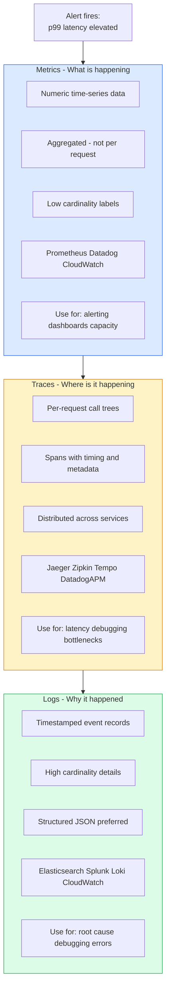
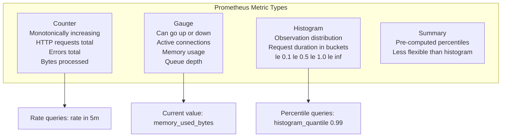
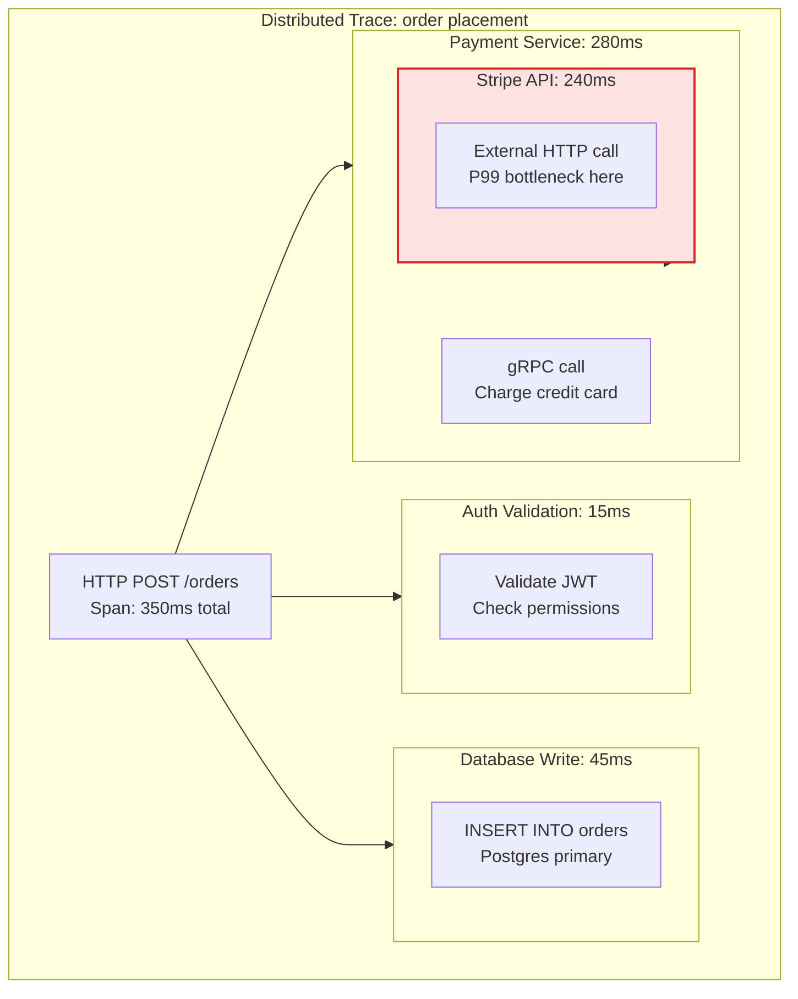
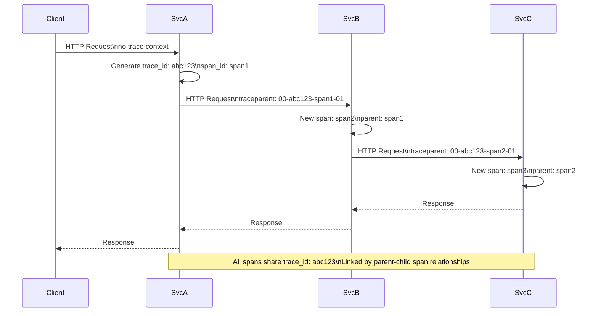

The three pillars of observability — metrics, traces, and logs — provide complementary views into system behaviour. Metrics answer "what is wrong"; traces answer "where is it wrong"; logs answer "why is it wrong". Together they enable effective production debugging and monitoring.

## Three Pillars Overview

## Metrics Types

## Distributed Tracing

## Context Propagation

## Key Concepts

- **Metrics**: Numeric measurements aggregated over time, stored as time-series. Low storage cost — aggregation discards individual request details. Excellent for alerting (threshold-based and SLO burn rate), capacity planning, and dashboard visualization. Prometheus is the standard open-source system; the OpenMetrics format enables interoperability.

- **Counter**: A metric that only increases. Represents cumulative totals (total requests, total errors, total bytes). To find the rate, use the rate() or irate() function. Counters reset to zero on service restart.

- **Gauge**: A metric that can increase or decrease. Represents current state (active connections, memory usage, queue depth, temperature). Use directly for current-value dashboards.

- **Histogram**: Records observations (request durations, response sizes) in configurable buckets. Enables server-side percentile calculation via histogram_quantile. More flexible than summaries for cross-dimensional aggregation. The recommended metric type for latency measurement.

- **Distributed Trace**: A collection of spans representing a single request's journey through a distributed system. Each span records an operation (HTTP call, DB query, cache lookup) with its start time, duration, and metadata. Spans are linked by parent-child relationships, forming a tree rooted at the entry point.

- **Trace Sampling**: Tracing every request at high throughput is expensive. Sampling strategies: head-based (decide to trace at entry point based on probability), tail-based (decide after the request completes, keeping traces that show errors or high latency). Tail-based sampling with OpenTelemetry Collector is the most powerful approach.

- **OpenTelemetry (OTel)**: A CNCF project providing vendor-neutral APIs, SDKs, and collector for metrics, traces, and logs. Instrument code once with OTel; route telemetry to any backend (Jaeger, Prometheus, Datadog, Honeycomb). The standard for modern observability instrumentation.

- **Correlation ID**: A unique identifier attached to every request at the entry point (API gateway or first service). Propagated in HTTP headers to all downstream services. Stored in every log line. Enables correlating logs across services for a single request.

## Trade-offs

| Pillar | Detail Level | Storage Cost | Query Speed | Best For |
|--------|------------|-------------|-------------|---------|
| Metrics | Low (aggregated) | Low | Fast | Alerting, dashboards |
| Traces | Medium (per request) | Medium | Medium | Latency debugging |
| Logs | High (per event) | High | Slow | Root cause analysis |

## When to Use

- **Start with metrics**: Set up Prometheus + Grafana for all services before anything else
- **Add traces**: When debugging "why is this endpoint slow" becomes frequent — traces show where time is spent
- **Improve logs**: Move from unstructured text to structured JSON with correlation IDs for searchable logs
- **Use all three**: Production incidents typically require all three: metrics detect the problem, traces localize it, logs explain it