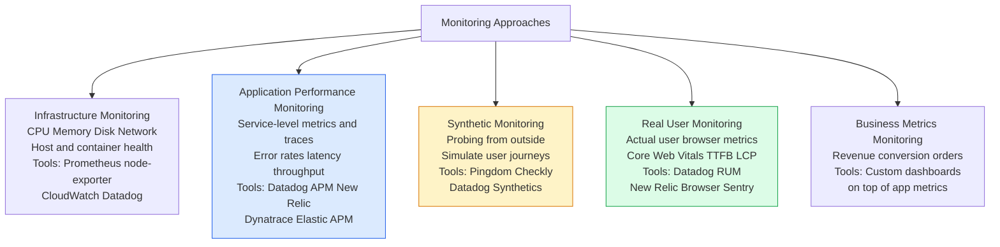
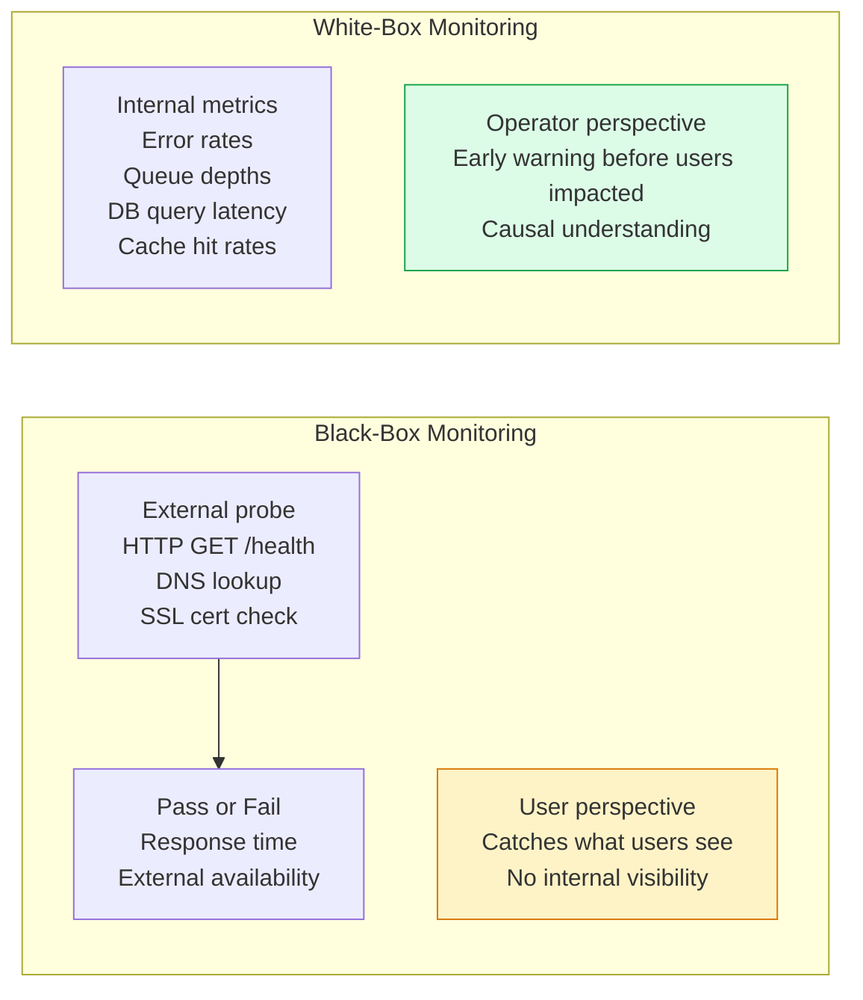
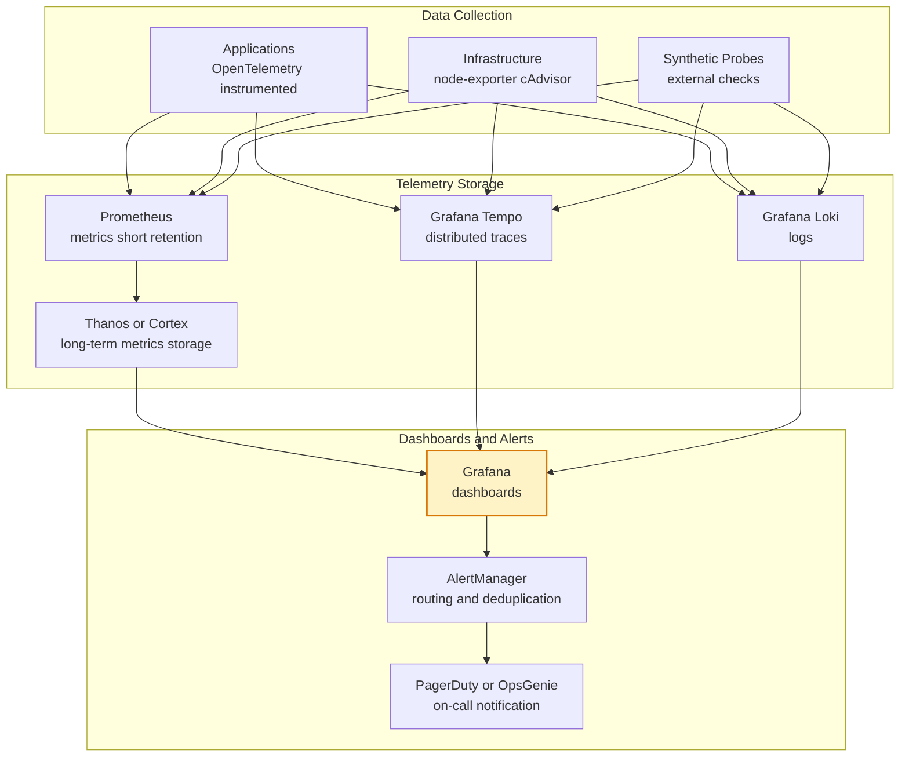

# Monitoring Approaches

Monitoring approaches vary by what is being observed and from whose perspective. Infrastructure monitoring tracks resource health; application monitoring tracks business-level performance; synthetic monitoring probes from the outside; real user monitoring captures actual user experience.

## Monitoring Taxonomy

## Black-Box vs White-Box Monitoring

## SLO-Based Monitoring Stack

## Key Concepts

- **Infrastructure Monitoring**: Tracks the health of compute, storage, and network resources — CPU utilization, memory pressure, disk I/O, network throughput, and host availability. Essential baseline for diagnosing resource-level bottlenecks. Does not capture application-level health.

- **APM (Application Performance Monitoring)**: Monitors application-level metrics and traces — request rates, error rates, latency distributions, and distributed traces. Bridges infrastructure metrics and user experience. Modern APM tools auto-instrument popular frameworks and libraries to capture traces without manual code changes.

- **Synthetic Monitoring**: Probes service endpoints from external locations on a schedule, simulating user actions (login flow, checkout flow). Detects availability and performance issues from the user's perspective, independent of internal infrastructure state. Catches CDN, DNS, and network-path issues that internal monitoring misses.

- **Real User Monitoring (RUM)**: Collects performance data from actual user browsers and mobile apps. Captures Core Web Vitals (LCP, FID, CLS, TTFB), JavaScript errors, and resource loading times. Segments by geography, device, browser, and network type. The ground truth for user experience.

- **Core Web Vitals**: Google's set of user experience metrics: LCP (Largest Contentful Paint — loading), INP (Interaction to Next Paint — interactivity), and CLS (Cumulative Layout Shift — visual stability). Used for SEO ranking and UX quality gates.

- **Black-Box Monitoring**: Monitors from the outside, without access to internal state. Simulates what a user or external system experiences. Synthetic monitoring is black-box. Catches external-facing failures but cannot explain root causes.

- **White-Box Monitoring**: Monitors internal system state through metrics, logs, and traces exposed by the application. Can detect problems before they affect users. Requires instrumentation of the application. Most production monitoring is white-box.

- **The USE Method**: For infrastructure resources: Utilization (how busy), Saturation (how much queuing), Errors (how many failures). Apply to every resource in the system to identify bottlenecks.

## Trade-offs

| Approach | Perspective | Complexity | Cost |
|---------|------------|-----------|------|
| Infrastructure | Resource health | Low | Low |
| APM | Service health | Medium | Medium |
| Synthetic | External availability | Low | Low |
| RUM | Actual user experience | Medium | Medium |
| Business metrics | Revenue impact | Low | Low |

## When to Use

- **Infrastructure monitoring**: Always — baseline for all other monitoring
- **APM**: Any production service — the ROI of finding and fixing performance issues quickly is very high
- **Synthetic**: Critical user journeys (login, checkout, core APIs) — run checks every minute from multiple geographic locations
- **RUM**: Consumer-facing web and mobile products where user experience directly drives business metrics
- **Business metrics**: Dashboard that correlates technical metrics (error rates, latency) with business outcomes (conversion, revenue)
