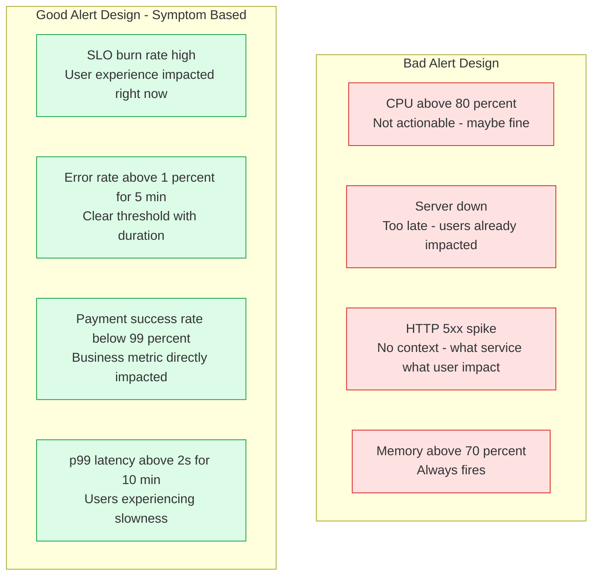
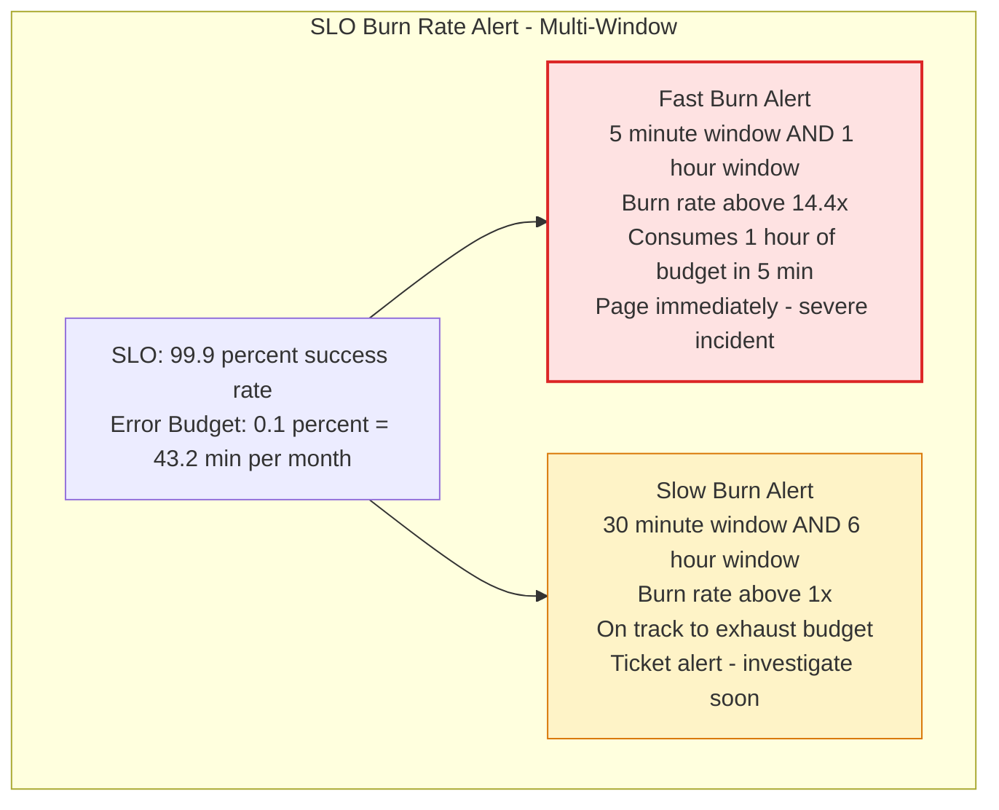
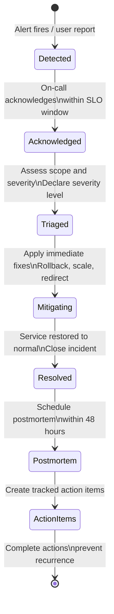
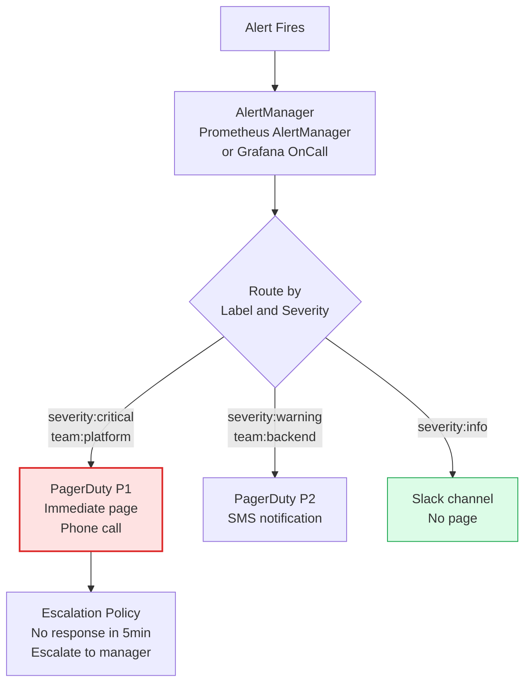

Effective alerting pages engineers only when human action is required, with enough context to act quickly. Poor alerting causes alert fatigue — too many false-positive pages result in engineers ignoring alerts, including real ones. Incident management provides a structured process for responding to and learning from production failures.

## Alert Design Principles

## SLO Burn Rate Alerting

## Incident Response Flow

## Alert Routing

## Key Concepts

- **Alert Fatigue**: The phenomenon where engineers stop responding carefully to alerts because there are too many false positives. Alert fatigue is one of the most dangerous operational conditions — it causes real incidents to be missed. Every alert must be: actionable (requires human intervention), urgent (cannot wait until morning), and accurate (fires only when the condition is truly present).

- **Symptom-Based Alerting**: Alert on what users experience (high error rate, slow responses, service unavailable) rather than what the system is doing internally (high CPU, high memory). Symptom-based alerts have fewer false positives and directly indicate user impact.

- **SLO Burn Rate Alerting**: Instead of alerting on raw error rates, alert on how fast the error budget is being consumed. Multi-window burn rate alerting (fast alert for severe incidents, slow alert for gradual degradation) provides early warning while minimizing false positives. The Google SRE workbook provides the specific burn rate thresholds.

- **Incident Severity Levels**: A common classification: P1 (complete service unavailability or data loss), P2 (major degradation affecting many users), P3 (minor degradation or internal-only issue). Severity drives response urgency, escalation paths, and stakeholder notification.

- **Incident Command Structure**: For P1 incidents, assign clear roles: Incident Commander (coordinates response, owns communication), Operations Lead (implements technical fixes), Communications Lead (updates stakeholders). Avoid everyone trying to fix the problem simultaneously without coordination.

- **MTTD and MTTR**: Mean Time To Detect and Mean Time To Recover. Better alerting reduces MTTD. Better runbooks, automation, and on-call training reduce MTTR. Both are key operational metrics.

- **Runbooks**: Documented procedures for responding to specific alerts. Should answer: what is this alert about, who is impacted, how to verify the issue, what immediate mitigation steps to take, who to escalate to. Runbooks linked directly from alert notifications reduce MTTR dramatically.

## Trade-offs

| Alert Type | False Positive Rate | MTTD | Actionability |
|-----------|-------------------|------|--------------|
| Threshold-based (CPU>80%) | High | Fast | Low |
| Symptom-based (error rate) | Medium | Medium | High |
| SLO burn rate | Low | Slightly slower | Highest |
| Anomaly detection | Variable | Fast | Medium |

## When to Apply

- **SLO burn rate alerts**: Primary alerting strategy for all user-facing services
- **Symptom-based alerts first**: Start with error rate and latency alerts; add cause-based alerts only after symptoms are covered
- **Review alert quality monthly**: Remove alerts that fire without requiring action; fix alerts that trigger false positives
- **Runbooks for every alert**: No alert should fire without a linked runbook explaining how to respond