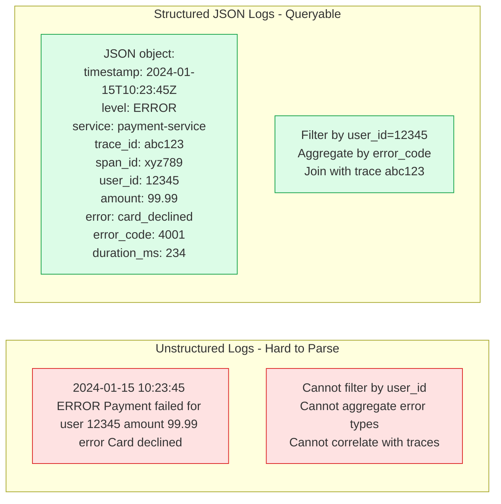
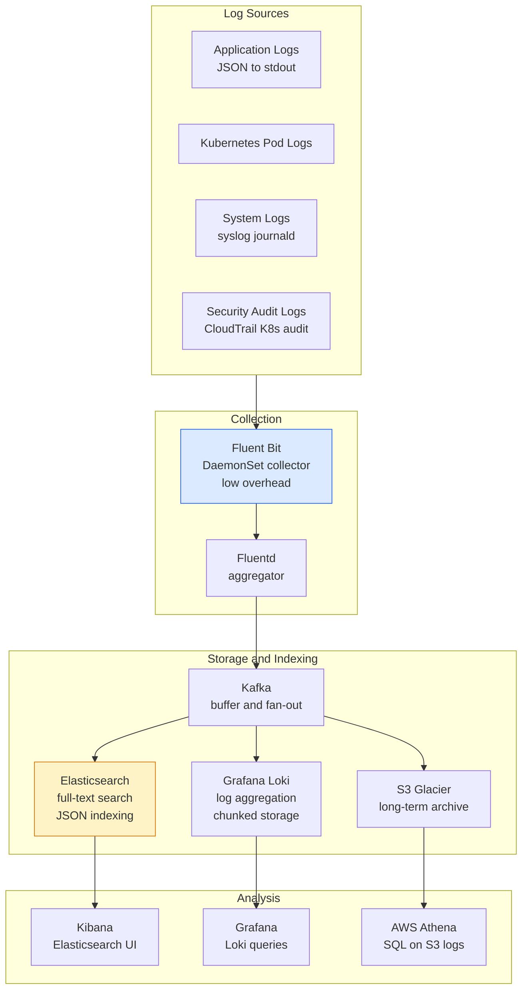
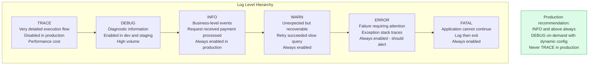

Log management covers the production, collection, aggregation, storage, and analysis of application and system logs. Effective logging provides the detailed narrative needed to diagnose production incidents and audit security events.

## Structured Logging

## Log Aggregation Pipeline

## Log Levels

## Key Concepts

- **Structured Logging**: Write logs as JSON (or another parseable format) instead of free-form strings. Every log event should include: timestamp (ISO 8601), level, service name, trace_id, span_id, user_id (if applicable), and relevant domain fields. Structured logs can be queried, aggregated, and correlated with traces.

- **Correlation IDs**: A unique ID generated at the request entry point and propagated through all downstream calls and stored in all log lines. Enables finding all logs related to a single request across multiple services. Typically the same as the OpenTelemetry trace ID.

- **Log Levels**: Use levels appropriately — INFO for business events (request processed, user logged in), WARN for unexpected but handled conditions (retry succeeded, fallback used), ERROR for failures requiring investigation (exception thrown, external call failed), DEBUG for developer information.

- **Log Aggregation**: Centralize logs from all instances and services into a single searchable system. Without aggregation, debugging requires SSH-ing into individual instances and grepping log files. Fluent Bit (lightweight) collects from each host; Fluentd or Kafka buffers and routes; Elasticsearch or Loki stores.

- **Retention Policy**: Different log types need different retention. Security audit logs: 12-24 months (compliance). Application error logs: 30-90 days (operational). Debug logs: 7 days maximum. Archive to cold storage (S3 Glacier) for compliance requirements beyond operational retention.

- **Log Sampling**: High-throughput services can generate terabytes of logs per day. For INFO-level request logs, sample at 1-10% in production. Always log ERROR and WARN at 100%. Use the trace sampling decision to ensure sampled traces have full logs.

- **Security Audit Logs**: A separate, tamper-evident log stream of security-relevant events: logins (successful and failed), privilege escalations, data access, configuration changes, and secrets access. These logs must be protected from tampering (append-only storage) and retained for compliance.

## Trade-offs

| Approach | Queryability | Storage Cost | Setup Complexity |
|---------|------------|-------------|-----------------|
| Unstructured logs | Low | Low | Low |
| Structured JSON logs | High | Medium | Low |
| Elasticsearch | Very high | High | Medium |
| Grafana Loki | Medium | Low | Medium |
| S3 + Athena | High (SQL) | Very low | Low |

## When to Apply

- **Structured logging**: Adopt in every new service; retrofit in existing services where log analysis is painful
- **Correlation IDs**: Add at the gateway/entry point; propagate via OpenTelemetry context to all downstream calls
- **Centralized aggregation**: Any system with more than one service instance — local log files do not scale
- **Log sampling**: Only for very high-volume INFO-level logs; never sample ERROR/WARN
- **Separate audit log stream**: Any service handling user data, financial transactions, or security decisions