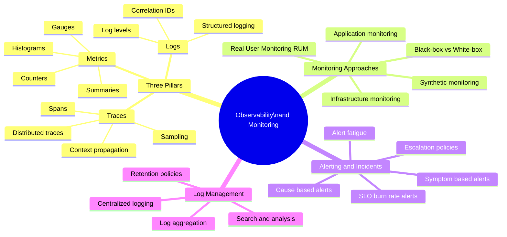

# Observability and Monitoring

Observability is the ability to understand a system's internal state from its external outputs. In distributed systems, where traditional debugging is impossible, observability is the primary tool for understanding production behaviour, diagnosing failures, and validating system health.

## Overview

## Topics in This Section

| File | Topic | Key Concepts |
|------|-------|--------------|
| [01_three_pillars.md](01_three_pillars.md) | Three Pillars | Metrics, traces, logs |
| [02_monitoring_approaches.md](02_monitoring_approaches.md) | Monitoring Approaches | Infrastructure, APM, synthetic, RUM |
| [03_alerting_incident_management.md](03_alerting_incident_management.md) | Alerting & Incidents | Alert design, burn rate, incident response |
| [04_log_management.md](04_log_management.md) | Log Management | Structured logging, aggregation, retention |
