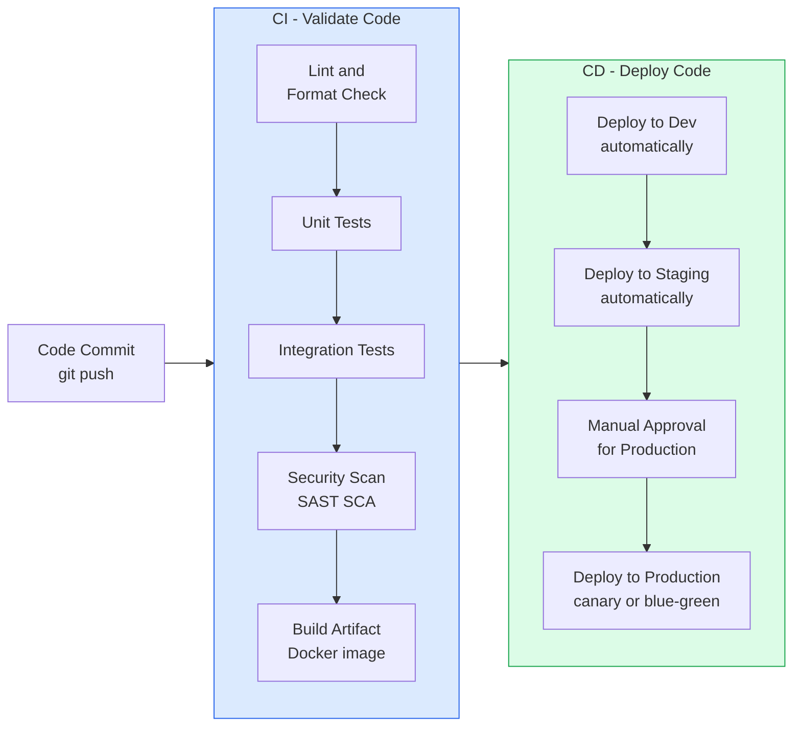
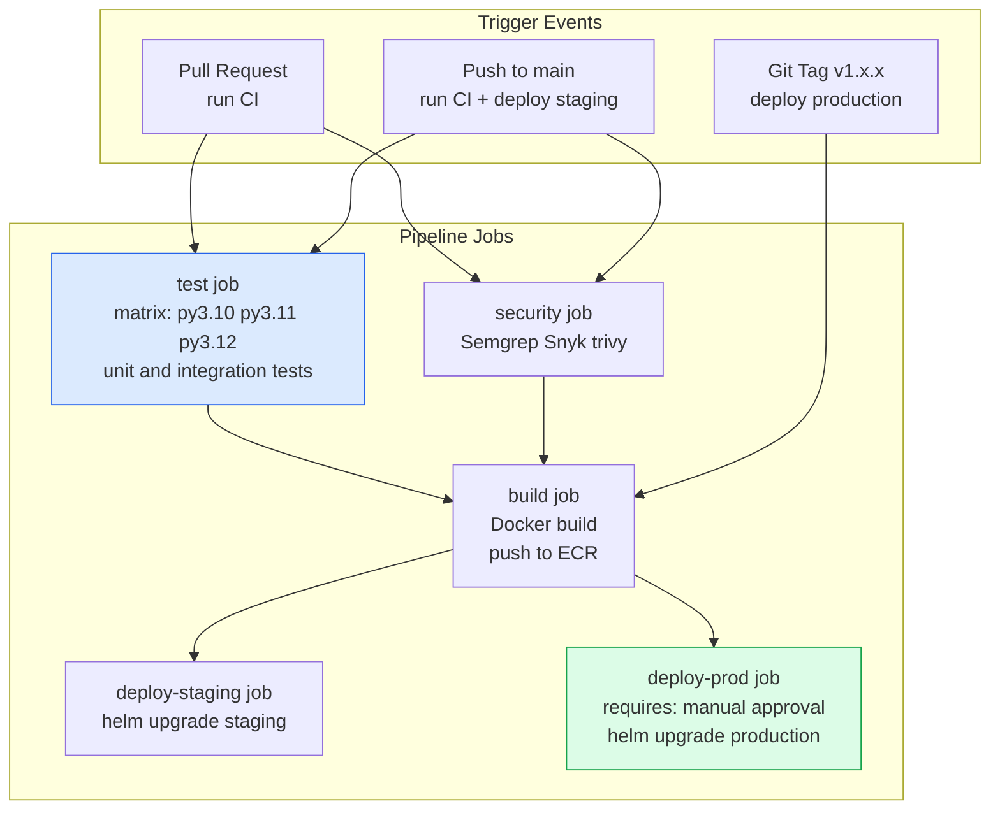
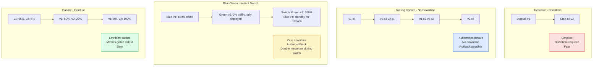
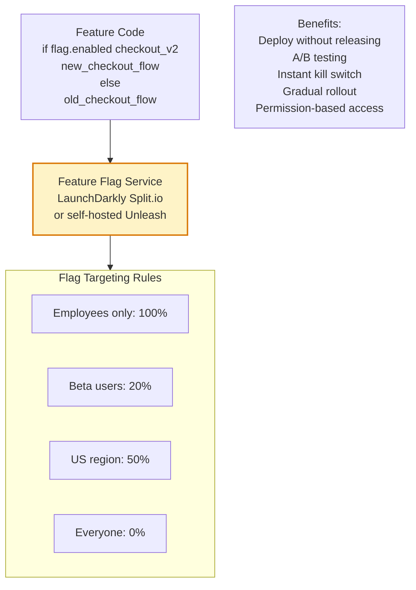

CI/CD (Continuous Integration / Continuous Delivery) pipelines automate the path from code commit to production deployment, providing fast feedback on code quality and enabling safe, frequent releases. Well-designed pipelines are the foundation of high-velocity software delivery.

## CI/CD Pipeline Stages

## GitHub Actions Pipeline

## Deployment Strategies

## Feature Flags

## Key Concepts

- **Continuous Integration (CI)**: Every code change is automatically built, tested, and validated. The goal: detect integration problems early when they are cheap to fix. CI requires: fast tests (under 10 minutes for PR builds), high test coverage, and a single main branch as the source of truth.

- **Continuous Delivery (CD)**: Every validated code change is automatically deployable to production at any time. In continuous deployment (a stricter form), every change that passes CI is automatically deployed to production without human approval.

- **Pipeline as Code**: CI/CD pipeline configuration is stored in the repository alongside the code it builds (e.g., `.github/workflows/`, `Jenkinsfile`, `.gitlab-ci.yml`). Changes to the pipeline go through code review and version control.

- **Build Matrix**: Running tests across multiple configurations simultaneously (Python 3.10, 3.11, 3.12; Ubuntu and macOS). Parallelizes testing to find compatibility issues without sequential overhead.

- **Rolling Deployment**: The default Kubernetes deployment strategy. New pods are started gradually while old pods are terminated, maintaining a minimum number of ready pods throughout. Requires the application to be backward-compatible (new code running alongside old code during the transition).

- **Feature Flags**: Decouple deployment from release. Code is deployed to production but hidden behind a flag. The flag is then gradually enabled for subsets of users (internal users, beta users, geographic segments) independent of code deployments. Enables instant rollback by disabling the flag without a code change.

- **Deployment Verification**: After deployment, automated checks verify the deployment succeeded: health endpoint responds, error rate hasn't increased, key metrics remain within SLO. If checks fail, automatic rollback triggers. This reduces MTTR for bad deployments.

## Trade-offs

| Strategy | Downtime | Rollback Speed | Resource Cost | Risk |
|----------|---------|--------------|--------------|------|
| Recreate | Yes | Fast | Low | High |
| Rolling | No | Medium (re-roll) | Low | Medium |
| Blue-Green | No | Instant | Double | Low |
| Canary | No | Instant (flag off) | Low | Lowest |

## When to Use

- **Rolling**: Default for stateless services — zero downtime with minimal resource overhead
- **Blue-Green**: Database schema migrations, major version upgrades where rollback must be instant
- **Canary**: High-risk changes to large user bases — algorithmic changes, pricing changes, major UX changes
- **Feature flags**: Always — for any change that can be wrapped in a flag, decouple deployment from release