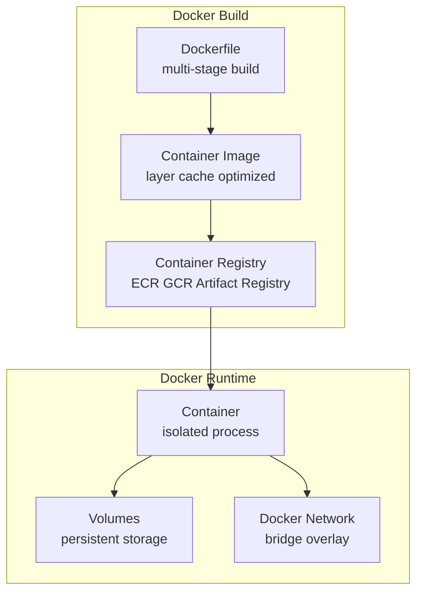
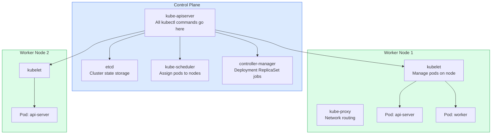
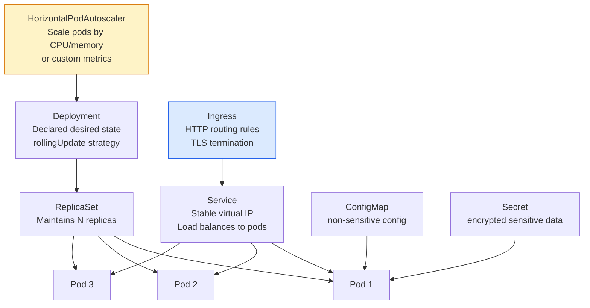
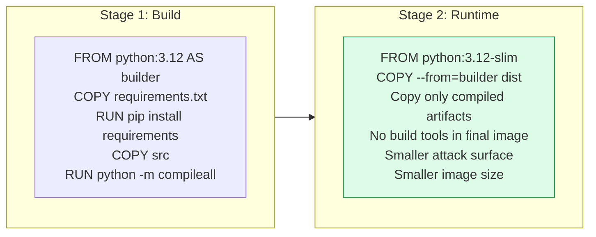

Containers package applications with their dependencies into portable, isolated units. Container orchestration (Kubernetes) manages the scheduling, scaling, networking, and lifecycle of containers at scale.

## Docker Architecture

## Kubernetes Architecture

## Kubernetes Object Hierarchy

## Multi-Stage Dockerfile

## Key Concepts

- **Container**: An isolated process running in a namespaced environment. Shares the host OS kernel (unlike VMs) but has isolated filesystem (overlay), process namespace, network namespace, and resource limits (cgroups). Docker is the most popular container runtime; containerd and CRI-O are used by Kubernetes directly.

- **Container Image**: An immutable, layered filesystem snapshot. Each Dockerfile instruction creates a layer. Layers are cached — unchanged layers are reused in subsequent builds, dramatically speeding up CI. Multi-stage builds keep final images small by discarding build-time dependencies.

- **Pod**: The smallest deployable unit in Kubernetes. A pod contains one or more containers that share a network namespace (same IP) and storage volumes. Sidecar containers (logging agent, service mesh proxy) run in the same pod as the application container.

- **Deployment**: A Kubernetes controller that manages the desired state for pods — how many replicas, which image version, and what update strategy. Deployments handle rolling updates, rollbacks, and scaling.

- **HorizontalPodAutoscaler (HPA)**: Automatically scales the number of pod replicas based on CPU utilization, memory utilization, or custom metrics (queue depth, RPS). Enables elastic scaling — the cluster responds to load changes automatically.

- **Kubernetes Service**: Provides a stable virtual IP and DNS name for a set of pods. Pods are ephemeral and their IPs change on restart; the Service provides a stable endpoint. Service types: ClusterIP (internal), NodePort (exposes on each node's port), LoadBalancer (provisions cloud LB), ExternalName (DNS alias).

- **Helm**: Kubernetes package manager. Charts are templates for Kubernetes objects with configurable values. Enables deploying complex multi-object applications with a single command and managing upgrades and rollbacks.

- **Resource Limits and Requests**: Pod resource requests (minimum guaranteed) and limits (maximum allowed) allow the Kubernetes scheduler to place pods appropriately and prevent one pod from starving others. Always set both — pods without limits can consume unbounded resources.

## Trade-offs

| Approach | Benefit | Cost |
|----------|---------|------|
| Kubernetes | Full orchestration, self-healing | High operational complexity |
| Docker Compose | Simple multi-container local dev | Not production-grade |
| ECS / Cloud Run | Managed orchestration | Less control, vendor lock-in |
| Serverless containers | No cluster to manage | Slower cold starts |

## When to Use

- **Kubernetes**: Any microservices deployment with 5+ services needing independent scaling
- **Managed Kubernetes (EKS/GKE/AKS)**: Almost always — managing the control plane yourself is significant operational overhead
- **HPA**: All stateless services — always configure autoscaling
- **Helm**: Package and version-manage all Kubernetes deployments