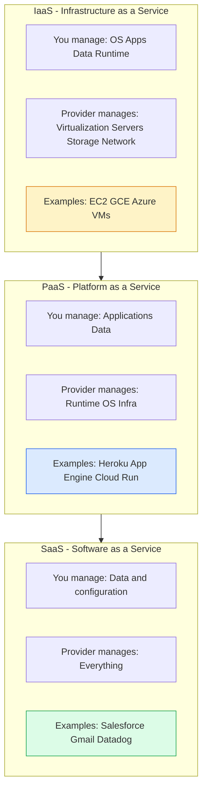
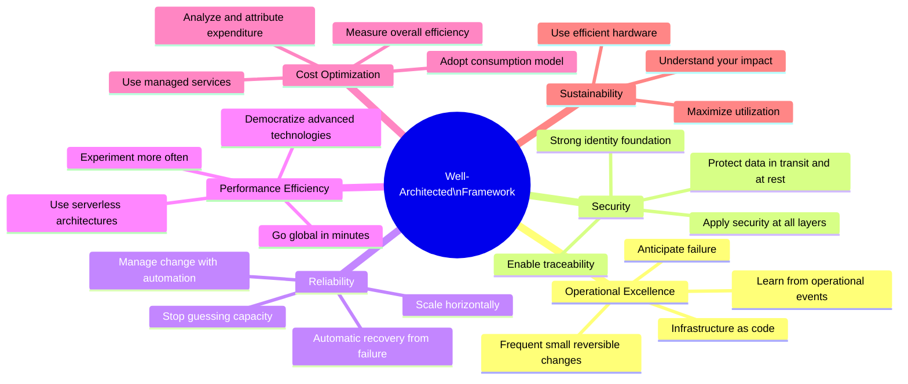
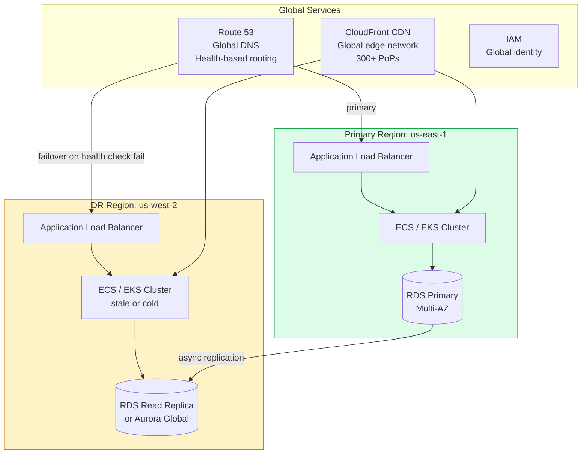

# Cloud Architecture

Cloud architecture leverages managed cloud services to build scalable, resilient, and cost-efficient systems without managing physical hardware. The cloud provider's shared responsibility model, global infrastructure, and broad service catalog enable capabilities that were previously only available to large enterprises.

## Cloud Service Models

## AWS Well-Architected Framework

## Multi-Region Architecture

## Key Concepts

- **IaaS (Infrastructure as a Service)**: Cloud provider offers virtualized compute, storage, and networking. Customer manages OS, runtime, and applications. Maximum control, maximum management responsibility. EC2 is the canonical example.

- **PaaS (Platform as a Service)**: Cloud provider manages the runtime environment; customers deploy applications. Lower operational overhead — no OS patching, no runtime management. Less control. Examples: Google App Engine, AWS Elastic Beanstalk, Cloud Run.

- **Serverless**: Cloud provider manages all infrastructure including scaling. Pay per invocation. Zero idle cost. Maximum operational simplicity for stateless event-driven workloads.

- **Shared Responsibility Model**: The cloud provider secures the infrastructure (physical datacenters, hypervisors, global network). The customer secures what they deploy (OS configuration, network security groups, IAM policies, application code, data encryption).

- **Availability Zones (AZs)**: Physically separate datacenters within a region, connected by low-latency high-bandwidth links. Deploying across multiple AZs provides resilience against single-facility failures. Most cloud services offer Multi-AZ deployment as a standard option.

- **Cost Optimization**: Cloud costs can grow unexpectedly. Strategies: right-size instances (don't over-provision), use Spot/Preemptible instances for fault-tolerant workloads (60-90% discount), use Reserved Instances for predictable base load (30-60% discount), implement lifecycle policies to delete old snapshots/logs, use Savings Plans for committed usage.

- **Cloud Native**: Designing systems that exploit cloud capabilities — auto-scaling, managed services, pay-per-use, global distribution — rather than lifting-and-shifting on-premises architectures to the cloud.

## Trade-offs

| Approach | Control | Operational Cost | Portability |
|----------|---------|----------------|------------|
| IaaS (EC2) | High | High | Medium |
| PaaS (Cloud Run) | Medium | Low | Medium |
| Serverless | Low | Very Low | Lower |
| On-premises | Highest | Highest | Full |

## When to Use

- **IaaS**: When you need specific hardware, custom OS configuration, or capabilities not available as managed services
- **PaaS**: Stateless web applications, API backends — significant reduction in operational overhead
- **Serverless**: Event-driven processing, variable/spiky workloads, rapid prototyping
- **Multi-region**: When latency to a single region is unacceptable for global users, or when disaster recovery requirements mandate geographic redundancy
