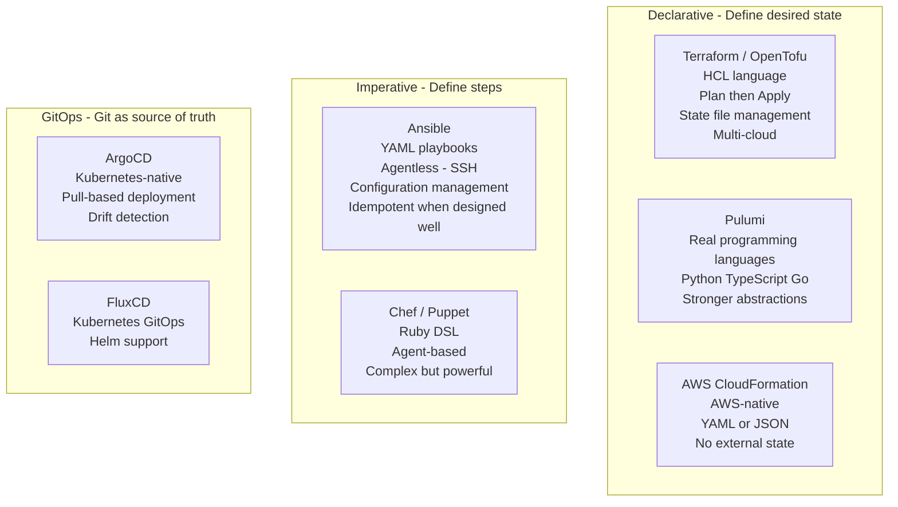
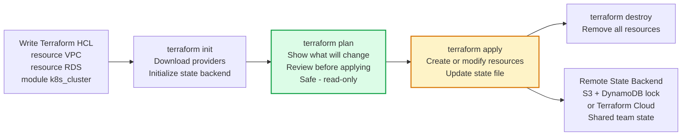
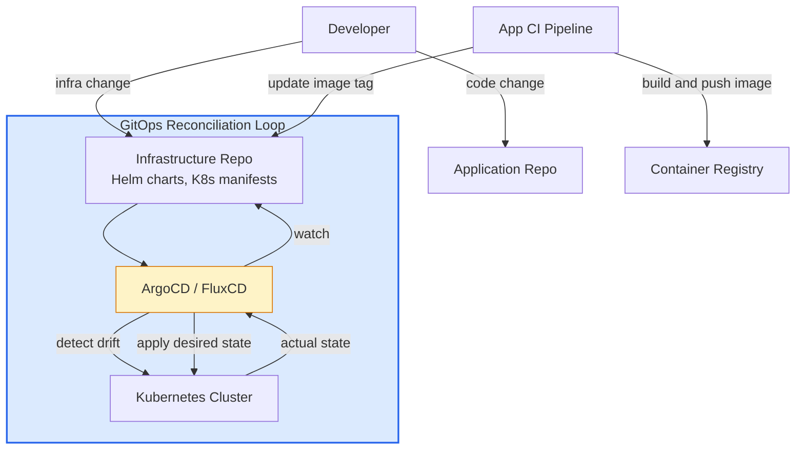

Infrastructure as Code manages and provisions computing infrastructure through machine-readable configuration files rather than manual processes. IaC enables version-controlled, repeatable, auditable infrastructure that can be treated with the same engineering discipline as application code.

## IaC Approaches

## Terraform Workflow

## GitOps Workflow

## Key Concepts

- **Infrastructure as Code (IaC)**: Managing infrastructure through version-controlled, machine-readable definitions. Benefits: reproducible environments (dev, staging, prod created from same code), auditable changes (who changed what and when via git history), disaster recovery (recreate entire infrastructure from code), peer review for infrastructure changes.

- **Declarative vs Imperative**: Declarative (Terraform, CloudFormation) specifies the desired end state — the tool figures out how to reach it. Imperative (Ansible, Chef) specifies the steps to execute. Declarative is preferred for infrastructure provisioning; imperative is preferred for configuration management.

- **Terraform State**: Terraform maintains a state file mapping resource definitions to real cloud resources. The state must be stored in a shared backend (S3 + DynamoDB for locking) when used by a team. State drift occurs when infrastructure is changed outside Terraform — `terraform plan` shows what needs to change to reconcile.

- **Terraform Modules**: Reusable, parameterized collections of Terraform resources. A `k8s_cluster` module encapsulates all resources needed to create a Kubernetes cluster with standard configuration. Modules are the primary abstraction mechanism in Terraform.

- **GitOps**: An operational framework where Git is the single source of truth for declarative infrastructure and application configuration. All changes go through pull requests. An automated agent (ArgoCD, FluxCD) continuously reconciles the cluster state with the git repository, automatically applying changes and detecting drift.

- **Drift Detection**: GitOps controllers continuously compare actual cluster state with the git repository. If someone applies changes directly to the cluster (bypassing git), the controller alerts and/or automatically reverts the change. Enforces that git is the only path to change production.

- **Immutable Infrastructure**: Instead of modifying running servers, replace them with new ones based on updated images. Avoids configuration drift and makes rollback simple — redeploy the previous image. Containers make this natural.

## Trade-offs

| Tool | Strength | Limitation |
|------|---------|-----------|
| Terraform | Multi-cloud, mature ecosystem | State management complexity |
| Pulumi | Real languages, strong abstractions | Smaller community |
| CloudFormation | AWS-native, no external state | AWS only, verbose |
| Ansible | Agentless, flexible | Not purely declarative |
| GitOps | Audit trail, drift detection | Requires Kubernetes |

## When to Use

- **Terraform**: Primary IaC for cloud infrastructure (VPCs, databases, Kubernetes clusters, IAM)
- **Ansible**: OS-level configuration management, application deployment to VMs, secrets distribution
- **GitOps (ArgoCD)**: Kubernetes application deployment — excellent for managing many services across multiple clusters
- **IaC for everything**: All production infrastructure should be in code — no manual console changes